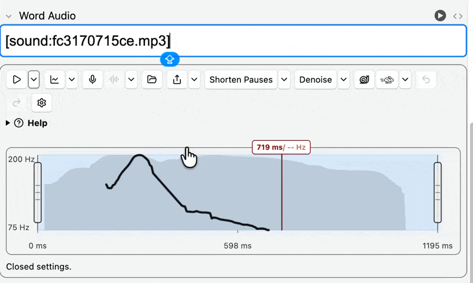
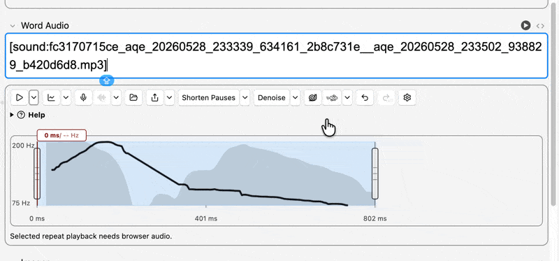
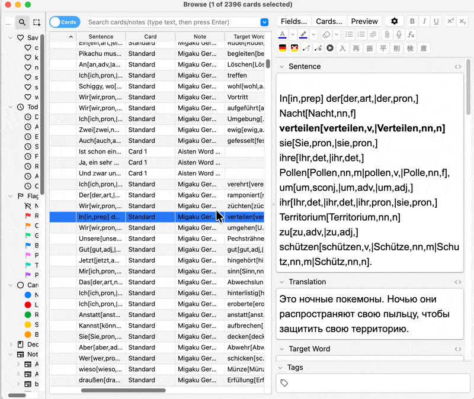
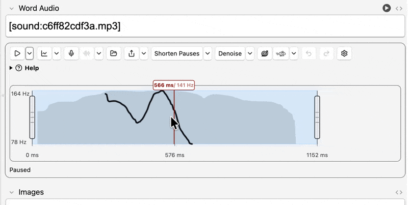
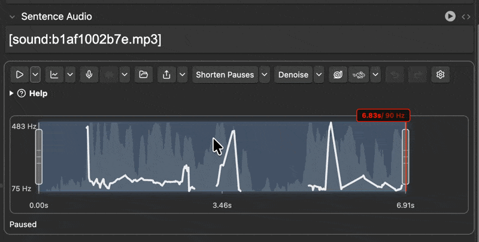

# Anki Audio Quick Editor

Anki desktop add-on for quickly editing audio references from the note editor. It is optimized for short sentence-mining clips: trim edges, adjust speed, shorten long pauses, and automatically apply each edit as a new MP3 while leaving original media untouched.

## Preview

<p>
  
  
</p>
<p>
  
  
</p>
<p>
  
</p>

## What It Includes

- Inline Anki editor controls for fields containing `[sound:...]` references
- Inline prosody visualization with pitch, intensity, and a draggable playback start cursor
- ffmpeg-backed MP3 rendering for each inline edit action
- Silencedetect/Silero pause removal with optional denoise preprocessing and retained debug artifacts
- Non-destructive save flow that writes a new media file and updates the field reference
- Settings dialog and inline editor controls backed by committed Svelte/TypeScript bundles
- Config defaults, JSON Schema validation, and deep-merge migration support
- Unit tests, architecture tests, and real-runtime e2e tests
- `scripts/dev.py` for setup, checks, builds, release, and e2e execution
- `.ankiaddon` packaging via `scripts/release.py`

## Requirements

- Anki 25.09 or later
- Python 3.13 as bundled by Anki
- Public release archives are thin. On first load, the add-on downloads the verified runtime pack for macOS arm64, macOS x86_64, or Windows x86_64.
- Optional advanced overrides: explicit `ffmpeg_path` and `deep_filter_path` settings still take precedence over managed runtime tools
- Optional: `praat-parselmouth` in Anki's Python for preferred pitch/intensity analysis; the add-on falls back to ffmpeg-decoded PCM without it
- Node.js 18+ for editing or rebuilding the settings/editor frontend bundles

## Quick Start

```bash
python3 scripts/dev.py setup
python3 scripts/dev.py check
python3 scripts/dev.py test-e2e
```

The local development add-on ID is `1000000002`.

## Development

- Runtime package: `addon/anki_audio_quick_editor/`
- Settings and editor frontend source: `settings_ui/`
- Build the committed frontend bundles: `python3 scripts/dev.py build`
- Open the settings dialog from Anki: `Tools -> Anki Audio Quick Editor -> Settings`
- Edit audio from Anki by focusing a field containing a supported sound reference such as `[sound:filename.m4a]`; edits are saved as new MP3 files.

## Release

Runtime packs and thin add-on archives are released separately. Build and publish
a runtime release only when native tools or model files change:

```bash
python3 scripts/dev.py release-assets verify --target all
python3 scripts/dev.py release-assets verify --target current --diagnostics
python3 scripts/dev.py release-runtime build --runtime-version 1.0 --target all
python3 scripts/dev.py release-runtime upload --metadata runtime_release.lock.json
python3 scripts/dev.py release-runtime verify --metadata runtime_release.lock.json
```

Normal public add-on releases are thin and consume the tracked
`runtime_release.lock.json` metadata:

```bash
python3 scripts/release.py --target all --verify-runtime-urls
python3 scripts/dev.py release-smoke dist/anki-audio-quick-editor-<version>.ankiaddon
```

This validates the repo, regenerates contracts and webview bundles, writes
runtime-pack metadata from `runtime_release.lock.json` into
`bin/runtime_manifest.json`, validates the thin add-on archive, verifies the
published runtime URLs when requested, and produces
`dist/anki-audio-quick-editor-<version>.ankiaddon`. Public AnkiWeb releases
should use `--target all`; `--target current` and single-platform targets are
for local/private validation.

`release-assets verify` checks presence and checksums by default. Add
`--diagnostics` when you also want current-host runtime probes before release
smoke or native acceptance.

Runtime releases use immutable tags named `runtime-vN`, such as `runtime-v1.0`.
Use `--embed-runtime` for local/offline validation builds that intentionally
include runtime payloads in the `.ankiaddon`.

## Similar projects

* [Onsei by Didier Marin](https://hub.2i2c.mybinder.org/user/itsupera-onsei-79jviu4s/voila/render/work/notebook.ipynb?token=s5dTPB1fQbux8BehMRju2g#:~:text=Onsei%3A%20Japanese%20pitch%20accent%20practice%20tool) works nicely on the web, he also has an anki plugin for comparing pitch
* [kotu.io by kezi](kotu.io) with [backup of its early version](https://kuuuube.github.io/minimal-pairs/) by kuuube - an amazing set of learning tools, inlcuding the famous minimal pairs trainer
* [migaku's pitch trainer](https://pitch-demo.migaku.io/)
* [pitchaccentapp by checkempty](https://pitchaccentapp.web.app/) - another web tool for pitch comparison
* [Praat](https://www.fon.hum.uva.nl/praat/) - an ancient tool for researchers. We all use algorithms they developed
* [YuTone](https://yutone.app/) - an app for chinese, somehow super fast, processes pitch in real time
* [Aomi Japanese](https://www.aomijapanese.jp/) records and compares your Japanese pitch accent
* [Tone perfect](https://toneperfect.app/) and [companion reading-feedback app](https://chromewebstore.google.com/detail/chinese-ai-pronunciation/ciginfkinhpfknohjbplmlhgmbomgokg) - chinese only,
* [Ka Chinese Tones](https://chinesetones.app/) - kotu-like tool for chinese tones
* [Aaron's Vietnamese toolset](https://ard.ninja/games/vietnamese/)
* [OJAD](https://www.gavo.t.u-tokyo.ac.jp/ojad/eng/pages/usage) some tools for Japanese pitch, including pitch of sentences
* [JPitch](https://www.jpitch.org/) - word pronunciation analysis for japanese, feedback on mora-by-mora level!
* [MandaTone](https://play.google.com/store/apps/details?hl=en&id=com.ruiyu.mandatone) - Chinese tones app
* [CanTone](https://play.google.com/store/apps/details?hl=en&id=com.cantone.cantone) - comparing your cantonese tones against model
* [Vietnamese Tones](https://apps.apple.com/ca/app/vietnamese-tones/id1549573747) ios app for recording your tones
* [Pho speak](https://phospeak.com/) big vietnamese course that includes pronunciation feedback
* [Cracking languages](https://www.crackinglanguage.com/) Tons of tools for tonal languages from a tonal polyglot
* [Syllable](https://play.google.com/store/apps/details?hl=en_AU&id=com.electricbamboo.syllable)
* [Thai language tones](https://apps.apple.com/us/app/thai-language-tones/id1064086189)
