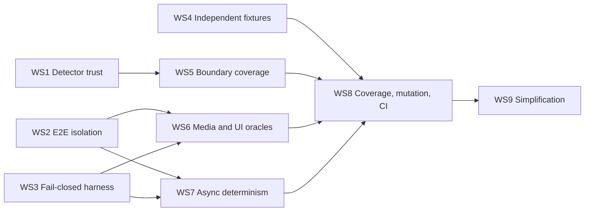

# Full Test Suite Audit Mitigation Plan

Date: 2026-07-12

Source audit: [`docs/reviews/2026-07-11-full-test-suite-audit.md`](../reviews/2026-07-11-full-test-suite-audit.md)

## Objective

Restore confidence in the test suite by eliminating false-green paths first, then strengthening high-risk product boundaries, and finally making the resulting gates mandatory and reproducible.

This plan treats test infrastructure as production-critical code. Test count and aggregate coverage are not success measures. The useful measures are independently derived oracles, deterministic isolation, demonstrated canary failures, and automated enforcement.

## Scope and constraints

- Covers findings F-01 through F-27.
- Preserves strong existing tests and fixtures unless a finding identifies a false oracle or duplicated coverage.
- Uses test-first changes: every false-green repair begins with a canary or regression test that fails for the documented reason.
- Keeps behavioral tests independent of the implementation that produces the result.
- Requires addressable-audio E2E fixtures whenever a claim depends on emitted audio, as defined in `docs/architecture/html-audio-observability.md`.
- Avoids combining broad harness changes with product behavior changes in the same pull request.
- Does not raise coverage thresholds until the missing behavioral tests exist and current baselines are recorded.

## Delivery strategy

Work is split into nine workstreams. WS1-WS4 are the false-green containment path and block confidence claims from later work. WS5-WS7 strengthen public behavior. WS8 makes the gates operational. WS9 removes misleading inventory and brittle test mechanics after the earlier safeguards exist.

## Global acceptance criteria

The mitigation is complete when all of the following are true:

1. Every P0 finding has a checked-in canary or regression test that was observed failing before its repair.
2. Architecture detectors have table-driven positive and negative tests and their generated catalogs are regenerated only from a tested detector.
3. Every E2E item starts from canonical migrated configuration and clean process-global state unless it carries a reviewed persistence marker.
4. Unexpected native playback, core import failures, Python errors, JavaScript console errors, unhandled rejections, and Qt critical messages fail closed with narrow allowlists.
5. Real media tests assert decoded audio semantics when the behavior is audible.
6. Public orchestration APIs for region deletion and runtime management cover rejection, failure, stale completion, cancellation, rollback, and concurrency.
7. Mutation collection succeeds and scheduled mutation reports identify killed, survived, timeout, and untested mutants by risk area.
8. Critical areas have per-file or per-area coverage floors; aggregate coverage remains informational.
9. Required PR, protected-branch, nightly, and release gates run automatically and publish enough state to reproduce failures.
10. Serial and parallel E2E runs pass under randomized ordering without skips or fail-open guards.

## WS1 — Make architecture detectors trustworthy

Findings: F-01, F-10. Priority: P0. Blocks architecture catalog or allowlist cleanup.

### Tests first

Create focused detector test modules using synthetic source strings. Each detector must have a table of violations and benign near-misses. At minimum cover:

- Python imports inside `if`, `try`/`except`/`finally`, `with`, `for`, `while`, `match`, nested functions, and nested classes;
- absolute and relative imports, aliases, `from` imports, and supported `import_module()` forms;
- side effects and private cross-module imports in every supported statement container;
- TypeScript imports, re-exports, default exports, dynamic imports, bracket access, comments, strings, and equivalent syntax variants;
- Rule 3, 26, 30, and 34 near-misses that currently confuse text/regex scanning;
- allowlisted ownership paths that are missing, empty, or do not contain the owned capability.

Add one repository-level violating canary for each rule family. The test should insert or analyze a deliberately forbidden edge and prove the rule fails. Do not leave mutations of production source in the working tree; use synthetic fixtures or temporary trees.

### Implementation

1. Extract Python detector logic from `tests/test_architecture/inspection.py` into pure functions accepting source text or an AST.
2. Define the explicitly supported dynamic-import syntax. Reject or report non-literal module arguments rather than silently omitting them.
3. Replace TypeScript regex/brace analysis with the existing TypeScript parser or dependency-cruiser. Keep source-text checks only for literal policy where syntax is irrelevant.
4. Change module contracts to report both `observed - allowed` and `allowed - observed`.
5. Introduce a narrow documented waiver format for intentionally unused permissions; require owner, reason, and removal condition.
6. Require privileged ownership paths to exist and prove they contain the relevant parsed symbol or dependency.
7. Recompute the dependency graph and classify every stale permission only after detector tests pass.
8. Regenerate architecture reports and the dated machine-readable archive.

### Verification

- Run the focused detector tests.
- Run `python3 scripts/dev.py graphs-archive`.
- Run `python3 scripts/dev.py check`.
- Review the graph diff separately from detector code; every newly observed dynamic edge must be either allowed intentionally or removed from production.

### Exit criteria

- F-01 and F-10 canaries fail on their prohibited syntax and pass on benign variants.
- No allowlisted dependency is silently unused.
- Rules, reports, and archives consume the corrected detector but no longer serve as its only oracle.

## WS2 — Establish deterministic E2E isolation

Findings: F-02, F-25, parts of F-19. Priority: P0.

### Tests first

Add harness self-tests or sentinel E2E items that deliberately mutate each state category, followed by an item that asserts the canonical baseline:

- add-on configuration and config version;
- support incidents and logging state;
- clipboard;
- theme;
- open dialogs and top-level windows;
- Reviewer/deck state;
- trigger/background jobs;
- Browser batch work and media-analysis jobs.

Run the sentinels in both orders and under at least two fixed random seeds. Add a same-session persistence marker test proving marked items are exempt only where intended.

### Implementation

1. Add a canonical test-config builder that calls the production default loader and `migrate_config()`; delete the hand-maintained partial dictionary.
2. Add a function-scoped autouse fixture that waits for frontend/backend idle, cancels permitted background work, restores the complete config, and invokes the same refresh path as Settings Save.
3. Add explicit markers for tests that intentionally retain state across a logical session. Validate markers during collection and keep their use rare.
4. Reset the remaining process-global state listed above, using concrete cleanup APIs rather than replacing objects wholesale.
5. Track top-level Qt/WebEngine windows and fail teardown if an unapproved window remains open.
6. Route temporary audio roots through `tmp_path`/session-owned fixtures and clean them after failure as well as success.
7. Catch only expected missing-tool exceptions during dependency probing.

### Verification

- Run the isolation sentinels repeatedly with fixed seeds and reversed ordering.
- Run the previously contaminated Reviewer/filtered-deck nodes in one process after Browser batch nodes.
- Run `python3 scripts/dev.py test-e2e-parallel` first, then canonical serial E2E.

### Exit criteria

- Parallel shard boundaries no longer change behavior.
- Every unmarked E2E item observes canonical migrated defaults.
- No dialogs, temporary roots, background work, or global state leak across item boundaries.

## WS3 — Make the E2E harness fail closed

Findings: F-03, F-19, F-27. Priority: P0.

### Tests first

- Add a sentinel that calls native `play_tags()` outside an approved context and must fail.
- Add approved native-seam tests that record start, stop, seek, pause, and toggle calls.
- Add sentinels for a core import exception, Python ERROR log, JS console error, unhandled rejection, and Qt critical message.
- Add click-helper tests for hidden, covered, offscreen, disabled, and wrong-hit-target elements.

### Implementation

1. Invert the native playback guard: strict is the default and cannot be disabled by ordinary test code.
2. Provide one marker/context for intentional native playback, with an operation log and explicit expected-call assertions.
3. Install per-test error collectors early enough to observe bootstrap failures. Use narrow, documented allowlists for expected platform noise.
4. Stop swallowing core import exceptions in fixture setup.
5. Harden synthetic clicks with visibility, non-zero geometry, scrolling, and `elementFromPoint()` validation.
6. Classify synthetic DOM-event tests as in-Anki component tests; reserve E2E/trusted-input labels for actual Qt/WebEngine input.
7. Replace unstable selectors and silent source rewriting with stable test IDs and asserted replacement/injection counts.

### Rollout

Run the playback subset once with strict mode and classify every failure. Fix product routing defects; add an intentional seam marker only where native playback is the subject of the test. Then enable strict mode suite-wide.

### Exit criteria

- No unexpected playback or error channel can be neutralized into a passing workflow.
- Approved native operations are asserted, not merely swallowed.
- Synthetic input helpers refuse interactions a user could not perform.

## WS4 — Replace circular and stale oracles

Findings: F-04, F-05, F-06, F-17. Priority: P0.

### Mid-render Undo

Add a renderer barrier with `started`, `release`, `worker_completed`, and `callback_observed` signals. Dispatch Undo directly while busy, prove the busy policy was exercised, release rendering, and assert exactly one documented outcome including file, history, status, and cleanup state. Remove assertions that accept both outcomes.

### Visualizer

Keep analyzer/window semantics in Python. Serialize representative analyzer payloads as fixtures. Move geometry, path, gap, and segmentation assertions to Vitest using shipped `pitchSegments`, `xForMs`, `yForPitch`, and renderer code. Delete `tests/prosody_visualizer_harness.py` only after parity tests land.

### Release validation

Create a minimal literal runtime-lock fixture with independently authored expected target, tool, support, and shared paths. Traverse raw lock JSON independently in tests. Add canaries deleting one required mapping, adding an unexpected member, changing executable metadata, and omitting shared support.

### DPDFNet dialog

Open the real Browser action, choose the operation, interact with the actual dialog, capture the emitted bridge/backend request, and assert the attenuation value. The assertion must not read the setup object supplied by the test.

### Verification and exit criteria

- Each old false oracle is demonstrated by a failing canary before replacement.
- No expected result is derived through the production selector or object being asserted.
- Run focused Python/Vitest/E2E tests, then `python3 scripts/dev.py check` and parallel E2E.

## WS5 — Cover high-risk public orchestration boundaries

Findings: F-11, F-12, F-13. Priority: P1.

### Region deletion

Write component tests through `delete_selection_with_request()` before changing implementation. Cover malformed requests, busy state, active-field mismatch, unresolved/changed media, whole-clip rejection, renderer selection, worker failure, replacement failure, stale completion, success, and cancellation/collection close where supported. Assert user status, busy-state release, persistence, temp cleanup, and unchanged media on every failure.

### Runtime management

Introduce phase-level fault injection for download, extraction, verification, promotion, and state write. Assert the previously ready runtime and state during and after every failure. Add cancellation after bytes arrive and during verification. Race two `ensure_runtime_async()` callers behind a barrier and prove one worker, consistent results, and deterministic notification ordering.

### Anki fakes

Replace the shared unrestricted `mw` tree with typed concrete fakes or autospecced objects. Unify task-manager semantics around a controllable scheduler/Future fake that preserves callback arguments and explicit completion. Assert resolved API members are callable and bind observed calls against installed Anki signatures. Add shared test doubles to type checking.

### Exit criteria

- Public entry points, not only private helpers, own the behavioral coverage.
- Rollback and stale-completion tests observe intermediate state, not only before/after snapshots.
- Async tests cannot pass when callbacks are lost.

## WS6 — Add independent media and trusted-UI oracles

Findings: F-14, F-15, F-19 and missing workflows 1-7. Priority: P1.

### Reusable media oracle library

Build test-only helpers around independently decoded output:

- ffprobe codec, channels, sample rate, duration, and decodability;
- PCM RMS/dB delta for volume;
- duration ratio for speed;
- tone-silence-tone fixture and retained/removed silence duration;
- pitch/frequency or spectral comparisons for pitch, hum, and denoise;
- archive entry decode, combined duration, inter-entry silence, and normalization;
- source immutability and absence of stale/overlapping/post-stop PCM.

Expected values must be literal tolerances or signal-derived mathematical expectations, not production command construction. Keep exact command tests only as unit-level adapter contracts.

### Workflow coverage

1. Convert editor processing and export cases from existence checks to semantic media checks.
2. Add Browser batch real workflows for each operation, multi-note/multi-field behavior, partial failure, cancellation, missing media, and collection close.
3. Separate codec concerns: one representative format for region/state behavior and a real no-driver readiness/playback matrix with explicit macOS/Windows expectations.
4. Add Reviewer transform semantic checks.
5. Add persistence coverage across profile/collection close-reopen and add-on restart.
6. Document recorder/device tests as a separate environment-dependent lane; keep deterministic fake-recorder tests in PR gates.
7. Add a small trusted-coordinate input smoke suite for critical editor, Browser, Settings, Reviewer, dialog, tooltip, and modal flows.

### Exit criteria

- A broken transform that still creates a valid filename fails the appropriate test.
- Codec claims are made only by tests that use actual WebEngine playback.
- Internal graph/test state is diagnostic evidence, never the sole user-visible oracle.

## WS7 — Make concurrency and frontend state tests deterministic

Findings: F-16, F-18, F-21, F-22. Priority: P1.

### Async primitives

Standardize controllable deferred promises, barriers, fake schedulers, and explicit signals for worker started/completed, callback observed, frontend idle, backend idle, and initialization settled. Timeouts remain safety bounds and must never be ignored as evidence that a rendezvous occurred.

Replace arbitrary event pumping, one-second quiet windows, ignored `wait()` results, and exact `Promise.resolve()` counts with those primitives or Svelte `tick()` plus state-specific `waitFor`.

### HTML-audio transition matrix

Define the reachable states and all 18 event types in a table. For each legal transition assert next state, effects, timer ownership/cancellation, generation/source identity, and invariants. For illegal or stale events assert a no-op plus no leaked effects. Explicitly cover `ResumeRequested`, `SourceCleared`, `MetadataTimeout`, and `RuntimeDisposed`, then add focused mutation testing for the reducer.

### Test contract

Exclude test instrumentation from product coverage. Put shipped test hooks behind one typed driver that fails clearly when unavailable. Gradually replace `*ForTest` reads with DOM, bridge, decoded media, or persistence assertions; retain narrowly scoped state reads only for diagnosis or otherwise unobservable scheduling state.

### Exit criteria

- Deliberately dropping a completion callback fails race tests.
- Reducer mutations in transition guards/effects are killed by focused tests.
- Frontend tests do not encode microtask depth as their synchronization contract.

## WS8 — Operationalize mutation, coverage, CI, and reruns

Findings: F-07, F-08, F-09, F-20. Priority: P1 after WS1-WS7 foundations.

### Mutation testing

1. Repair mutmut collection by retaining `pytest-randomly` with a fixed seed or using a dedicated config that does not conflict with `required_plugins`.
2. Replace stale/empty test selectors with the real split modules.
3. Define focused mutation groups: config/migration, architecture detectors, runtime manager, region delete, release validation, prosody, and HTML audio.
4. Add a cheap mutation collection smoke command to `scripts/dev.py check` or the deterministic PR job.
5. Run full focused groups on a schedule and publish killed, survived, timeout, suspicious, and untested counts plus diffs from the prior run.

### Coverage policy

Record current file and branch baselines after the new tests land. Introduce ratcheting floors by risk area rather than one universal threshold:

| Tier | Initial scope | Gate policy |
|---|---|---|
| Critical state/orchestration | runtime install/lookup/platform, region delete/worker, reviewer filters, HTML audio, playback controllers, triggers/presets | per-file line and branch floor; no decrease |
| Core behavior | audio processing, editor/Browser orchestration, settings state | per-area floor; no decrease |
| Thin/generated/instrumentation | entrypoints, generated contracts, test-only adapters | explicit exclusion or separate report |
| Tooling | `scripts/` release/dev code | separate report and threshold |

Set numeric floors from the post-WS5-WS7 measured baseline in the same pull request that publishes the baseline. Require a written reason and follow-up issue for any temporary waiver.

### CI topology

| Trigger | Required jobs | Artifacts |
|---|---|---|
| Pull request | lint, typecheck, Python/unit/API/architecture, frontend tests, coverage floors, mutation collection smoke | coverage, seed, test reports |
| macOS/Windows PR or protected branch | platform runtime tests and focused real-binary tests | logs, runtime diagnostics |
| Protected branch/nightly | parallel real-Anki E2E, trusted-input smoke, focused mutations | shard map, exact node IDs, seed, Anki/JS logs, media failures |
| Release | canonical serial E2E, runtime URL/archive validation, platform matrix | release validation report |

### Runner reliability

- Apply idle and absolute timeouts to serial and parallel collection/execution.
- Let the parent supervise process groups on POSIX and job objects on Windows; remove broad teardown swallowing and `os._exit` paths.
- Print exact failing node IDs, original random seed, shard composition, platform, and one-process rerun command.
- Derive shared-desktop isolation from pytest markers/capabilities and add a collection test that rejects unclassified clipboard/theme/device tests.

### Exit criteria

- A pull request cannot merge when deterministic gates fail.
- Nightly/release failures are reproducible from uploaded metadata.
- Coverage and mutation reports expose weak critical files instead of hiding them in aggregates.

## WS9 — Simplify the suite without losing fault detection

Findings: F-23 through F-27 and remaining F-21/F-22 cleanup. Priority: P2. Start only after relevant gates exist.

1. Remove imported test aliases and exact duplicate cases; parameterize genuinely identical Mandarin/Vietnamese bodies.
2. Rename zero-test wrapper/helper modules outside `test_*`; add a collection policy preventing accidental empty test modules.
3. Consolidate overlapping architecture rules only after detector equivalence is proven by canaries.
4. Replace private `_sync_*` dependency synchronization with a typed injected dependency seam or leaf-level patching. Retain one public-facade behavior test.
5. Replace representation assertions with behavior or boundary-contract assertions.
6. Fix narrow silent bypasses: asserted JavaScript injection count, field-scoped readiness, real tooltip provider interaction, stable Browser selector, one true modal smoke, runtime collected-skip reporting, and schema-wide config default invariant.
7. Standardize test classification markers (`unit`, `component`, `in_anki_component`, `e2e`, `trusted_input`, `external_runtime`, `shared_desktop`) and validate them at collection.

Exit criterion: collected count reflects independent fault detection, and deleting duplication does not reduce mutation kills or risk-area coverage.

## Proposed pull-request sequence

Keep each change reviewable and avoid mixing harness foundations with broad test rewrites:

1. Architecture detector characterization and canaries.
2. Architecture detector implementation, allowlist reconciliation, graph archive regeneration.
3. Canonical E2E config builder and reset sentinels.
4. Remaining E2E global cleanup and resource-leak enforcement.
5. Strict native playback guard and error-channel sentinels.
6. Deterministic async primitives plus mid-render Undo and stale-completion rewrites.
7. Independent visualizer, release, and DPDFNet oracles.
8. Public region-delete tests and fixes exposed by them.
9. Runtime rollback, cancellation, and single-flight tests and fixes.
10. Typed Anki/task-manager fakes.
11. Reusable media oracle library and editor real-processing conversions.
12. Browser/export/Reviewer semantic media coverage and codec separation.
13. HTML-audio transition matrix and focused reducer mutation group.
14. Mutation runner repair and collection smoke.
15. Risk-tier coverage floors.
16. PR CI deterministic gates and platform jobs.
17. Nightly/release E2E, mutation, artifact, and rerun improvements.
18. Trusted-input smoke layer.
19. Duplicate/empty-module cleanup, classification, and representation-test cleanup.

Each pull request should include:

- finding IDs addressed;
- the pre-fix failing canary/regression evidence;
- the narrow implementation change;
- focused test results;
- whether `python3 scripts/dev.py check` and E2E were run;
- new risks, waivers, and follow-up items.

## Tracking matrix

| Finding | Workstream | Primary proof |
|---|---|---|
| F-01 | WS1 | import/detector syntax canaries |
| F-02 | WS2 | randomized isolation sentinels, serial/parallel parity |
| F-03 | WS3 | unexpected native call fails by default |
| F-04 | WS4/WS7 | barrier proves Undo occurred while render was busy |
| F-05 | WS4 | shipped TypeScript renderer assertions |
| F-06 | WS4 | literal lock fixture and deletion canary |
| F-07 | WS8 | required CI status checks |
| F-08 | WS8 | mutation collection smoke and scheduled report |
| F-09 | WS8 | risk-tier per-file/per-area floors |
| F-10 | WS1 | AST detector near-miss/violation matrix |
| F-11 | WS5 | typed fake signature and controllable scheduler tests |
| F-12 | WS5 | public region-delete branch matrix |
| F-13 | WS5 | phase faults, cancellation, two-caller barrier |
| F-14 | WS6 | decoded semantic media assertions |
| F-15 | WS6 | real no-driver codec matrix |
| F-16 | WS7 | completed and callback-observed rendezvous |
| F-17 | WS4 | captured request from real dialog flow |
| F-18 | WS7 | state/event transition matrix and mutation kills |
| F-19 | WS3/WS6 | fail-closed errors and trusted-input smoke |
| F-20 | WS8 | portable supervision and exact rerun metadata |
| F-21 | WS7/WS9 | state-specific waits; no microtask-count contracts |
| F-22 | WS7/WS9 | typed driver and external behavioral oracles |
| F-23 | WS9 | collection diff with unchanged mutation protection |
| F-24 | WS9 | typed dependency seam and facade behavior test |
| F-25 | WS2 | resource cleanup sentinels |
| F-26 | WS9 | behavior/boundary assertions replace representation locks |
| F-27 | WS3/WS9 | narrow bypass regressions and collection report checks |

## Progress reporting

Maintain a short status table in the source audit or an issue tracker rather than editing completed evidence into this plan. For each finding record: owner, state, pull request, canary, focused command, full-check result, parallel E2E result, serial E2E result, and any temporary waiver with expiry.

Do not mark a finding complete merely because code changed. Completion requires its primary proof in the tracking matrix and the applicable workstream exit criteria.
