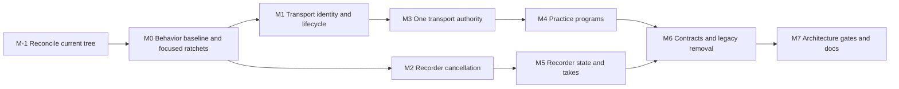

# Playback And Recording State Management Mitigation Plan

Date: 2026-07-16

Source audit: [`docs/reviews/2026-07-16-playback-recording-state-management-audit.md`](../reviews/2026-07-16-playback-recording-state-management-audit.md)

Status: implemented

## Implementation completion

- The frontend now has one identity-guarded HTML-audio transport authority and pure practice programs for repeat, chorusing, countdown, recording, and review sequencing.
- The backend recorder package owns its native handle, terminal-result suppression, artifact cleanup, source-mutation exclusion, and finalized-take metadata; the legacy optional recording/playback state bundle is retired.
- Generated lifecycle contracts carry the required runtime, field, source, attempt, program, recording, delivery, and backend-media identities. The legacy Python playback mirror, readiness handshake, global boundary/recovery dispatch, and manual playback controller paths are deleted.
- Rules 39 through 50 enforce the `SM-A01` through `SM-A12` ownership, identity, public-API, tombstone, cycle, and invariant-validator boundaries. The architecture archive and canonical documentation were regenerated from the implemented tree.
- Frontend state-management mutation coverage killed 1,206 of 1,284 covered mutants (93.93%); recorder mutation coverage killed 467 of 470 covered mutants (99.36%). The three recorder survivors are equivalent or presentation-only mutations in a redundant cancel reason, disposal branch selection with identical cleanup, and invariant-message delimiter text.
- The repository check passed every available local preflight, static-analysis, architecture, unit, Anki API, coverage, risk-floor, and release-smoke phase. Qodana was excluded because the project trial/license has expired and is no longer an executable quality gate.
- Full parallel E2E passed 238 tests across three shards with zero failures or errors. Full canonical serial E2E also passed, including independent PCM assertions for unsupported-source silence, recovered-source playback, repeat, seek, replacement, pause/resume, and stale-audio cleanup.

## Implementation baseline (M-1)

Reconciled on 2026-07-16 immediately before implementation:

- repository `HEAD`: `63ee2bc644a622f1e87d3e019100d65c72cbc684` (`plans`), with no dirty paths before the baseline run;
- the only commit after the plan's previously revalidated `24f175a` baseline contains planning documents, so no production playback, recording, bridge, test, or contract delta landed after that review;
- CodeGraph was initialized for this worktree and indexed 1,003 files, 14,544 symbols, and 36,657 edges;
- `python3 scripts/dev.py check` passed;
- Python branch coverage passed the 80% aggregate gate at 85.74% total coverage (88.56% statements and 72.64% branches), and all six existing risk-tier file floors passed;
- frontend coverage passed at 93.46% lines, 91.36% functions, and 85.88% branches. The existing HTML-audio machine/controller/progress floors were respectively 99.26%/95.52%/100% lines, with the audio-element adapter at 92.81% lines;
- `python3 scripts/dev.py test-e2e-parallel` passed after installing the verified managed runtime pack;
- `test_aac_full_repeat_stops_with_warning_when_browser_audio_rejects_after_graph` and `test_audible_transform_during_repeat_stops_old_audio_and_autoplays_new_source` passed alone, together, and together under fixed hash seeds 1, 7, and 19;
- the largest hand-maintained migration hotspots are `html-audio-session-controller.ts` (496 lines), `html-audio-session-machine.ts` (420), `playback-controller.ts` (383), and `audio_recording.py` (358). They remain explicit M3/M4/M5 split targets;
- dependency-cruiser is installed but is not wired into `settings_ui/package.json` or `scripts/dev.py check`. Its current configuration discovers 228 frontend modules and 843 dependency edges, with 77 edges participating in legacy cycles;
- the existing `no-pycmd-outside-bridge` dependency-cruiser entry has no `to` constraint and therefore reports 823 unrelated dependency violations if enabled. M0 must remove that invalid pseudo-global rule and leave raw-global enforcement to ESLint/architecture tests before wiring dependency-cruiser into QC;
- repository architecture Rules 37 and 38 are the current highest numbered rules. Rule 37 is the native-editor-playback tombstone. Rule 38 is the temporary frontend playback ownership ratchet and does not yet reject unused allowances.

The stable capability-to-repository mapping established by this checkpoint is:

| Capability | Repository rule |
|---|---|
| SM-A01 | Rule 39 — frontend state-management package boundaries |
| SM-A02 | Rule 40 — HTML audio/readiness/clock capability ownership |
| SM-A03 | Rule 41 — transport writer and projection ownership |
| SM-A04 | Rule 42 — practice-program purity |
| SM-A05 | Rule 43 — DOM projection/cache-only state |
| SM-A06 | Rule 44 — exhaustive async transport identity |
| SM-A07 | Rule 45 — recorder package and side-effect ownership |
| SM-A08 | Rule 46 — active recorder handle ownership and teardown |
| SM-A09 | Rule 47 — generated lifecycle bridge contracts |
| SM-A10 | Rule 48 — deleted playback mirror/handshake tombstones |
| SM-A11 | Rule 49 — public APIs, private internals, and cycles |
| SM-A12 | Rule 50 — invariant-validator wiring |

Reconciliation classification:

| Classification | Current-tree result |
|---|---|
| Already solved/retained asset | typed HTML-audio reducer, high reducer/controller coverage, independent PCM oracle, Rule 37 native-playback tombstone, generated-contract pipeline, generic bridge transport, and typed unsupported-codec classification/recovery UI |
| Still present | ordinal-keyed per-field session authority, filename-correlated callbacks, nested effect dispatch, wall-time boundary authority, graph-duration readiness, DOM `__aqe*` behavior, global source-boundary/recovery handlers, visualizer-owned countdown timer, droppable recorder handle, optional recording/playback bundle, backend playback mirror/readiness handshake, and unwired frontend dependency policy |
| Newly introduced after review | none; the tree advanced only by the plan commit |

No material model change was discovered at M-1. The identities, state vocabularies, cross-domain arbitration, and milestone order below remain the implementation contract.

Revalidated against repository `HEAD` `24f175a14dcc4171c2e0abbc1405441fa94e45b7` and the working tree inspected on 2026-07-16. The final pass includes commit `24f175a` (`Offer explicit MP3 recovery for unsupported browser audio`), which landed during this review. The source audit was written against `8f25fb39c0c0a3808ee950eb21f2edeca3a02b35` plus an earlier working tree. Because playback work is actively changing, M-1 below is a mandatory implementation-time reconciliation gate; this document is not evidence that the tree is frozen at any of these commits.

## Objective

Prepare the editor for advanced playback and recording modes by removing split state authority, making asynchronous media work attempt-safe, giving every external side effect an explicit lifecycle, and separating media transport from mode sequencing.

The mitigation is complete when the existing behavior runs through three narrow models:

1. one frontend transport machine owns audible playback;
2. one backend recorder machine owns microphone capture and finalization;
3. pure practice programs decide what pass, pause, prompt, recording, or review action comes next.

This is an incremental replacement plan. It does not require a new state-management dependency, a second audio engine, or a big-bang rewrite.

## Decisions fixed by this plan

These decisions should not be reopened inside individual implementation pull requests unless new product requirements invalidate them:

- At most one audible transport is active per editor runtime.
- The `HTMLAudioElement` is the only source and learner-take playback engine.
- Python does not own or mirror frontend HTML playback lifecycle state.
- Field, control, and visualizer stores may project transport state but may not drive transport decisions from those projections.
- Selection, viewport, and the stopped/edit cursor remain field/view state. A `PlaybackPass` snapshots its range, and the active media position belongs to transport until an explicit stop/completion policy commits it back to the field cursor.
- Repeat, chorusing, and future prompt/record/review behavior are practice programs, not transport states or boundary callbacks.
- The existing recording countdown is also program/coordinator behavior; it must not remain a timer attached to a visualizer DOM element.
- Learner takes are transport sources. Their playback status does not belong in recorder state.
- Media filename is display/content metadata, not source or operation identity.
- One active transport does not imply one physical audio element. The first migration may select among the existing per-field elements through one port/coordinator; replacing them with one detached shared element is a separate measured decision.
- Graph duration is a visualization coordinate, not proof that browser media metadata is ready. Media duration and graph duration remain explicitly distinct.
- No compatibility path may cause audio, recording, timers, or callbacks to run twice.

## Assumptions and non-goals

Assumptions:

- The next advanced modes may combine playback, timed waits, recording, and review, but do not require simultaneous audio lanes.
- Current source, selection, repeat, chorusing, post-edit autoplay, and learner-recording behavior must remain user-visible compatible during migration.
- The existing typed HTML-audio reducer and acoustic test infrastructure are assets to evolve rather than replace.
- `settings_ui/src/editor-inline/runtime.ts` is the existing frontend composition root to evolve; the migration must not create a second parallel runtime root.

Non-goals:

- Do not design a generic workflow DSL.
- Do not add multi-lane mixing, background playback, take history, or persistence unless the first requested advanced mode requires it.
- Do not add an application-wide cross-WebView transport bus solely for this refactor. The application recorder service serializes microphone ownership and X-01 quiesces the owning editor workflow. If product requirements later require stopping unrelated playback in every open editor during capture, add an explicit runtime-registration/broadcast protocol with its own acknowledgement tests.
- Do not move all editor state into one global store.
- Do not rewrite graph, selection, control-history, or audio-processing state except where transport ownership currently leaks into them.
- Do not raise coverage percentages before behavioral gaps are covered.

## Critical-review corrections to the original draft

The code re-read changed the plan in several important ways:

1. Repository architecture Rules 37 and 38 already exist. This plan therefore uses stable capability IDs `SM-A01` through `SM-A12`; implementation assigns repository rule numbers only after M-1 inventories the current tree. Existing Rule 37 remains the native-editor-playback tombstone. Existing Rule 38 is a temporary frontend ownership ratchet that must be corrected rather than duplicated: its allowlist names files that do not exist and must fail when an allowance is unused.
2. Identity is a tuple, not a filename plus a counter. `EditorRuntimeId` prevents callbacks crossing WebView remounts, `FieldInstanceId` prevents field ord reuse across notes, `SourceInstanceId` distinguishes actual frontend media bindings including same-filename replacement, `PlaybackAttemptId` owns asynchronous work for one accepted start/resume/seek/pass, and `ProgramRunId` owns multi-pass sequencing. Re-observing the same bound source must not allocate a new source instance. Python separately owns an editor/note target and monotonic `BackendMediaGeneration`, incremented on authoritative source binding/replacement even when the filename is unchanged; it is not reused as a frontend source ID.
3. The current controller's effect-loop early break prevents `Play` from running after a synchronous `SeekFailed`. A FIFO queue must remove arbitrary nested dispatch without blindly completing invalidated effects. Each effect executes only while its transition/attempt token is current, or seek-and-play becomes one port command with one result.
4. `audio-readiness.ts`, `audio-clock.ts`, metadata/HEAD probes, and graph-duration shortcuts are part of transport state management. Their DOM flags, callbacks, and recovery paths must move with the transport rather than being left as a view concern.
5. Post-edit autoplay crosses an Anki WebView replacement. A transient one-shot `PendingEditorIntent` must survive on the Python side until a matching frontend runtime sends a terminal consumption receipt (or it expires); deleting all backend pending state and sending an ephemeral event would lose legitimate autoplay. This is retryable delivery state, not a backend playback mirror.
6. Contract IDs and terminal receipts are required only for replayable lifecycle commands/deliveries. They are not mandatory on every ordinary bridge message. Existing `settings_ui/src/lib/bridge-transport.ts` is the framing to reuse.
7. A custom type-aware architecture scanner is not a prerequisite for fixing P0 lifecycle defects. Prefer compiler-enforced encapsulation, dependency-cruiser, scoped ESLint rules, and existing Python `ModuleContract`/AST checks. Add a small custom AST/type check only for a remaining capability that simpler enforcement demonstrably cannot catch.
8. Python worker threads used by analysis cannot be forcibly cancelled. Cancellation invalidates publication, releases service ownership, and cleans attempt-owned artifacts when a late worker returns; the plan must not promise physical thread cancellation.
9. Commit `24f175a` adds useful typed unsupported-codec recovery, but the action is currently embedded in control-status projection, dispatched through a window-global custom event, and source-bound in Python by field plus filename. The target keeps the typed recovery proposal while moving authority to the current failed transport snapshot and editor command coordinator. A recovery command carries current failure/source/media-generation identity; same-filename replacement, duplicate clicks, remount, and late conversion completion cannot mutate the wrong source.

## Revalidated implementation map

This is the code reality the milestones must remove or preserve; M-1 refreshes it if the tree advances again.

| Current implementation fact | Consequence for this plan |
|---|---|
| `html-audio-session-controller.ts` stores sessions/frames/clocks/metadata/repeat timers in field-ordinal maps, exposes a global `sourceBoundaryHandler`, and breaks an effect loop when nested dispatch replaces state | M1 must introduce runtime/field/source/attempt identity and guarded effect batches; M3/M4 must remove per-field independent authority and the global boundary path without regressing synchronous seek failure |
| `html-audio-session-audio-element.ts` locates DOM audio by ordinal, installs learner handlers during configure/play, and correlates play completion mainly by filename | SM-A02/M1 must give one active port stable handler ownership and identity-check every promise/media event; a shared physical element is optional |
| `html-audio-session-progress.ts` advances with the maximum of media time and elapsed wall time | T-06 requires wall time to remain paint interpolation only; acoustic boundary tests must fail if stalled media completes a pass |
| `source-playback-controller.ts` can dispatch `MetadataLoaded` from graph/analyzer duration | M1 separates media readiness/duration from graph duration and identities all media/HEAD/recovery responses |
| `audio-readiness.ts` and `audio-clock.ts` store readiness, fallback, handler, and failure behavior on `VisualizerElement.__aqe*` fields | These are transport-owned state/resources under SM-A02/SM-A05, not harmless render caches |
| commit `24f175a` stores media error/status on additional `VisualizerElement.__aqe*` fields and routes `PlaybackRecoveryAction` from status projection through `PLAYBACK_RECOVERY_REQUESTED_EVENT`; Python conversion rechecks field and filename but has no same-filename media-generation identity, and its local blocking check covers processing rather than active capture | Preserve the recovery UX/error classification, but make a current failed snapshot expose an identity-bearing proposal, route clicks directly to the command coordinator, dispose the global-event compatibility path, and revalidate backend note/field/media generation plus recorder/source-mutation exclusion |
| `editor-inline/runtime.ts` already initializes/disposes window contracts, readiness, post-edit flow, fields, controllers, stores, and visualizer runtime | Evolve it as the sole composition root and add X-03 teardown there; do not introduce another global root |
| `recording-actions-lifecycle.ts` stores the record countdown on `visualizer.__aqeRecordCountdownTimer` and calls `window.__aqeStopEditorPlayback` before sending record | M4 must migrate current `RecordOnce` sequencing and countdown cancellation, not merely reserve a future `StartRecording` command |
| `clear_learner_recording_state()` can drop the controller reference without stopping the native recorder; Qt uses delayed stop and background finalization, while the macOS helper has a different end contract | M2 needs adapter-specific cancel/dispose semantics and exact-once completion before M5 reshapes state |
| recorder analysis/persistence uses background work that may outlive teardown, and `recording_result_from_path` derives duration from elapsed monotonic time | M5 uses identity-based result suppression, owned-artifact cleanup on late return, and finalized media metadata |
| `EditorSession.assert_invariants()` uses Python `assert` and includes the stale backend `PlaybackState` representation | Playback-related assertions are retired with the mirror; recorder/delivery validators return explicit typed violations and remain active under optimized Python |
| Python post-edit state currently survives WebView injection/reload and coordinates readiness/start; frontend bridge code also has window queues/pull callbacks | M6 preserves only typed retryable bootstrap delivery, moves readiness/start decisions frontend-local, and reuses the existing generic bridge transport |
| repository Rules 37/38 already exist; Rule 38's allowlist includes nonexistent planned modules; `.dependency-cruiser.js` has only broad boundaries and is not in the normal frontend/QC scripts; `graphs_svelte.py` parses imports separately with regex | M-1 repairs/rebaselines existing guards. M0 wires focused import rules into QC. A new generic scanner/report integration is deferred unless a concrete bypass requires it |

## Findings-to-work mapping

| Audit finding | Mitigation work | Completion evidence |
|---|---|---|
| P0-1 split playback authority | M3 authoritative transport; M6 remove Python mirror | architecture rule proves one writer; legacy state deleted |
| P0-2 modes bypass reducer | M4 practice programs | no global boundary callback; transition tables cover repeat/chorusing |
| P0-3 no attempt identity | M1 source/attempt identity | same-filename and out-of-order callback tests pass |
| P0-4 learner handler leaks | M1 stable audio port lifecycle | listener-count and disposal tests pass |
| P0-5 recorder cannot cancel | M2 recorder cancellation; M5 recorder model | teardown stops capture and consumes callbacks exactly once |
| P1-1 duplicate clocks/boundaries | M3/M4 one media clock and one boundary decision | legacy controller/manual audible fallback deleted |
| P1-2 optional recording state bundle | M5 recorder variants and learner takes | invalid states are unrepresentable; playback fields removed |
| P1-3 ad hoc bridge | M6 generated lifecycle messages over existing bridge transport | lifecycle variants validate in Python and TypeScript without forcing IDs onto simple messages |
| P1-4 DOM behavioral state | M1/M3/M4/M7 typed state and private handles | readiness/clock/countdown state removed from `__aqe*`; architecture canaries reject reintroduction |
| P1-5 post-edit handshake | M6 retryable bootstrap intent | backend readiness/start protocol and global suppression removed without losing delivery across remount |
| P1-6 migration-shaped modules | M3-M7 responsibility-based extraction | orchestration files are cohesive and below soft size limit |
| P1-7 recovery action is projection/global-event/filename bound | M1 failure identity; M3 command coordinator; M6 generated source-mutation command | stale/duplicate recovery canaries and same-filename acoustic replacement pass; global event removed |
| P2-1 stale documentation | M7 documentation maintenance | architecture archive and canonical docs agree with code |
| P2-2 shallow architecture guards | M7 structural ownership rules | direct and indirect violating canaries fail |

## Target invariants

The following invariants are more important than the exact file layout.

### Transport invariants

1. One root transport coordinator owns the active runtime/field/source identities, playback attempt, pass snapshot, active media position, lifecycle status, media readiness, and transport resources. The field store owns the stopped/edit cursor; the practice runtime owns gap/countdown timers; the recorder service owns capture/finalization timers.
2. Each frontend runtime and mounted field receive new `EditorRuntimeId` and `FieldInstanceId` values. Field ord is locator metadata, not identity.
3. An authoritative source bind allocates a new `SourceInstanceId` when the media element is actually rebound or a backend source-change delivery declares replacement. Same-filename replacement gets a new ID; repeated scans/configuration of the same binding reuse the current ID.
4. Every accepted start, resume, seek/restart, or repeated/program pass receives a new `PlaybackAttemptId` before attempt-owned metadata/seek/timer/probe/`audio.play()` work begins. Background source loading may remain source-scoped until a start adopts its facts.
5. A multi-pass practice run carries a separate `ProgramRunId`; it never substitutes for a playback-attempt ID.
6. Source callbacks carry runtime, field-instance, and source identity. Play promises, progress frames, media events, and transport timers also carry playback-attempt identity; program timers additionally carry program-run identity.
7. Events with non-current identity are logged and ignored without publishing projections or starting follow-up work.
8. Media `currentTime` is the boundary authority. Wall time may interpolate paint but cannot complete a pass.
9. `mediaDurationMs`, `graphDurationMs`, and expected/probed duration are distinct values. A graph render cannot transition browser media from loading to ready.
10. Audio-element handlers are installed once per port and removed by an idempotent disposer. There is one active port/attempt, whether the adapter uses one shared element or selects an existing per-field element.
11. Reducer events are serialized. An event emitted by an effect is queued; remaining effects are guarded by the transition/attempt token and are explicitly cancelled if an earlier effect invalidates it.
12. Stopping, replacing, or disposing transport invalidates identities first, cancels source/attempt-owned frames, timers, listeners, and abortable probes, and makes non-cancellable play-promise callbacks stale before publishing the terminal projection. The plan does not claim that a JavaScript promise itself can be cancelled.
13. Stop, completion, pause, source change, and program cancellation use an explicit policy for committing active media/timeline position back to the field edit cursor; projections never decide that policy.
14. Each accepted transport failure receives a `TransportFailureId`. A recovery proposal is read-only data on that failed snapshot and is actionable only while runtime/field/source/failure identities still match; the status renderer may display it but cannot own or reconstruct it.

#### Minimal transport state vocabulary

The target transport is deliberately smaller than the current mode-shaped session. Its production state is a closed union with these concepts:

| State | Required facts | Forbidden facts/resources |
|---|---|---|
| `empty` | runtime identity and at most one stable port handler set | source, attempt, pass, source/attempt timers |
| `loading` | field/source identity, typed readiness, and an explicit `no_start` or `start(attempt, pass)` intent variant | media duration claimed ready, active progress frame, program timer |
| `ready` | field/source identity, media duration, current media position | active attempt, pass, progress frame, repeat/post-edit/countdown state |
| `starting` | field/source/attempt identity, immutable pass, validated duration/position | second attempt, program policy, wall-clock boundary |
| `playing` | field/source/attempt identity, immutable pass, current media position, one progress resource | repeat count, chorusing markers, recording/countdown state |
| `paused` | field/source/attempt identity, immutable pass, paused media position | live progress frame or wait timer; resume allocates a new attempt before side effects |
| `failed` | source identity, `TransportFailureId`, typed source-or-attempt failure scope, safe position, and an explicit recovery lifecycle (`none`, `available(proposal)`, or `claimed`) | audible audio or live source/attempt resources other than the stable runtime-owned port handlers |

`repeat_waiting` and `post_edit_waiting` are not transport states in the target design. Waits live in practice runtime; post-edit delivery lives in the bridge/bootstrap adapter. A completed pass returns transport to `ready` and emits `PassCompleted`; only the active practice program can request another pass.

The public transport command surface stays small: bind/replace source, play immutable pass, seek/restart within that pass, pause, resume, stop, and dispose. Media/probe callbacks enter as typed facts. Recovery is a cross-domain editor command referencing the current failed snapshot, not a transport side effect hidden in the status renderer; the coordinator atomically claims the current proposal through the controller before sending any bridge effect. DOM audio operations, resource registration, and snapshot publication are effects; none is encoded as another store's status flag.

### Recorder invariants

1. One add-on/application-runtime-scoped recorder service owns the active external recorder handle. `EditorSession` values hold projections/takes, not per-editor hardware owners.
2. A `RecordingAttemptId` identifies start, stop, cancel, persistence, and analysis callbacks.
3. Note switch, source replacement, editor close, collection close, application shutdown, and explicit user cancellation stop the external capture before state is cleared.
4. `cancel(reason)` and `dispose()` are idempotent and resolve an attempt at most once.
5. Late callbacks from a stopped, cancelled, disposed, or replaced attempt cannot publish media, overlay, analysis, or errors into current state.
6. Capture lifecycle state and finalized `LearnerTake` data are separate types.
7. Final duration/format comes from the finalized media probe/header, not only elapsed monotonic time.
8. At most one recording attempt across editor sessions owns the microphone. A second editor is rejected as busy; closing a non-owning editor cannot cancel the owner, while closing the owning editor must cancel it.

### Practice-program invariants

1. A program is a pure reducer from program state plus facts to program state plus commands.
2. Programs do not read DOM, call audio, call Python, install timers, or mutate selection directly.
3. Transport reports `PassCompleted`, `Stopped`, `Failed`, and cancellation facts; recorder reports lifecycle facts.
4. Programs emit explicit commands such as `Play`, `Wait`, `UpdateSelectionProjection`, `StartRecording`, `Complete`, or `Fail`.
5. `Once`, `Repeat`, current chorusing behavior, and the current recording countdown/record-once sequence exist before any advanced mode is added.
6. A pass snapshots its selection/range. Later selection changes arrive as explicit user/program facts rather than being read from mutable field state at a boundary.
7. Learner-take media position is local to the take; its timeline projection uses the take's explicit anchor. Generic `cursorMs` cannot ambiguously mean both coordinates.

### Cross-domain arbitration and failure policy

The editor command coordinator applies one explicit policy before commands reach domain controllers:

| Incoming action | Current active work | Required policy |
|---|---|---|
| start recording | playback/program | cancel the current program, stop and quiesce transport, then start capture only if runtime/field/source still match |
| start playback/program | capture/stop/finalization | reject as busy; a future program may request an explicit recorder cancellation transition before retrying |
| process, transform, undo, or replace source | playback/program | cancel the program, stop and quiesce transport, then send the Python mutation |
| process, transform, undo, or replace source | capture/stop/finalization | reject as busy rather than silently destroying a take |
| note/source/runtime disposal | any | invalidate all domain identities first, then best-effort stop/cancel/dispose every owned resource; no follow-up program command may run |
| new user program | another program | cancel the old `ProgramRunId` and its timers/commands before accepting the new run |

Domain failures are typed facts, not boolean flags reconstructed from stores or DOM. Transport load/decode/seek/play errors, recorder permission/device/finalization/probe errors, bridge validation/expiry errors, and invariant violations carry their domain IDs and operation identities. A practice program decides whether a recoverable fact changes pass/source or terminates; no adapter silently restarts a newer attempt. A bounded media-load retry is an explicit identity-bearing transport effect with exhaustion/stale-completion tests. User-requested format conversion is instead a source-mutating editor command guarded by T-10/X-02 and followed by normal source replacement.

## Architecture and invariant enforcement model

The target architecture must be executable policy, not only a directory convention. Each invariant below is assigned to the cheapest proof mechanism that can actually establish it.

| Enforcement layer | What it can prove | Repository mechanism |
|---|---|---|
| Import graph | legal dependency direction, no cycles, no adapter-to-domain inversion | dependency-cruiser for TypeScript; `ModuleContract` dependency validation for Python |
| Syntax/capability ownership | only named modules access DOM audio, timers, recorder handles, mutable projections, or raw bridge globals | encapsulated APIs plus scoped ESLint first; targeted TypeScript AST only where needed; Python `ast` detectors and side-effect capabilities |
| Type/model checks | valid state variants, exhaustive event identity policy, read-only public snapshots | TypeScript discriminated unions/typecheck; Python tagged dataclasses/unions and mypy |
| Reducer/service invariants | state facts are internally consistent after every accepted event | pure validators called by transition/controller tests and service code |
| Resource invariants | live audio/recorder/timer/listener handles agree with state and are disposed exactly once | controller/service assertions plus fake-port integration tests |
| Behavioral oracles | correct emitted audio, silence, capture cancellation, and remount behavior | real-Anki E2E, independent PCM capture, and opt-in recorder hardware lane |

No single layer substitutes for the others. In particular, coverage does not prove ownership, an import rule does not prove cleanup, and a state-only E2E assertion does not prove emitted-audio behavior.

### Detector quality requirements

Any custom architecture detector added after simpler import/API restrictions prove insufficient must follow these rules:

1. Structural rules parse syntax. Do not use regex, line scanning, or selected symbol spellings where the TypeScript compiler or Python `ast` can identify imports, exports, assignments, calls, member access, and aliases.
2. Each detector has table-driven unit fixtures for prohibited cases and benign near-misses before it scans production code.
3. Fixtures cover the syntax forms the detector claims to recognize, including relevant aliases/re-exports/member-access forms and benign comments/strings; do not claim helper-indirection or type-aware coverage without a test proving it.
4. Python fixtures cover nested statement containers, function-local imports, aliases, relative imports, supported dynamic imports, decorators, context managers, and `TYPE_CHECKING` imports.
5. A parse failure is an architecture-test failure, not a skipped file.
6. Every detector has at least one violating and one allowed canary run by the same implementation as the repository scan. The canary may be a synthetic fixture; production source does not need to be mutated.
7. Allowances are exact and bidirectional: unexpected use fails, and an unused allowance also fails so stale permissions cannot accumulate.
8. Generated files, vendored code, and test adapters are excluded by explicit rooted paths. Production exclusions cannot use broad filename fragments.
9. Detector unit tests and repository scans use the same implementation. Exact tombstones for a deliberately deleted symbol/API may remain simple source checks; general capability ownership may not be reduced to a spelling list.
10. Architecture results identify rule ID, source file, syntax location, observed capability/dependency, expected owner, and removal milestone for any temporary waiver.

The existing Python detector tests and exact unused-dependency checks are the model to preserve. Improve Rule 33/34-style source checks only as the relevant owner moves; do not delay transport cleanup to build a general detector platform.

### Frontend module boundaries

The final filenames may vary, but their public dependency direction must match this table.

| Module area | May depend on | Must not depend on or access |
|---|---|---|
| `transport/model` and `transport/reducer` | shared identity/error/value types | DOM, Svelte, field/control stores, bridge, timers, logger transports, practice runtime, recorder adapters |
| `transport/html-audio-port` | transport port/model types, media-readiness/error values, and scoped logging | field/control stores, practice programs, bridge, Python command shapes, recorder state |
| `transport/controller` | transport model/reducer, audio and scheduler ports, snapshot publisher interface | DOM directly, field/control implementations, bridge globals, practice program implementation |
| `transport/projection` | read-only transport snapshots and narrow field/control projection ports | transport reducer internals, audio element, timers, bridge |
| `practice/programs` | pure transport/recorder fact and command value types | DOM, Svelte, bridge, stores, controller implementations, clocks, randomness, logging side effects |
| `practice/runtime` | program reducers plus public transport/recorder command ports and scheduler port | DOM/audio implementation, Python bridge implementation, mutable field/control internals |
| editor command coordinator | public transport/recorder/practice commands and source-mutation bridge port | reducer internals, raw audio element, native recorder handle, behavioral DOM state |
| recorder frontend projection | generated recorder/take snapshots and view projection ports | recorder lifecycle mutation, audio element, raw bridge payloads |
| bridge adapter | generated envelopes/validators and public editor-runtime commands | transport/recorder state storage, mode decisions, timers, DOM audio |
| existing `editor-inline/runtime.ts` composition root | public controllers, adapters, stores, and bridge registration | direct reducer-state mutation or direct media/recorder side effects |
| Svelte/view/render code | read-only snapshots, view actions, render caches | reducer internals, audio/recorder ports, raw bridge, behavioral DOM state |

Required dependency direction:

```text
view/actions -> editor command coordinator -> practice/runtime and public transport/recorder ports
practice programs -> pure transport/recorder contracts
transport controller -> transport reducer + audio/scheduler ports
transport projection -> read-only transport snapshot + narrow view projection ports
bridge adapter -> generated contracts + editor runtime public commands
editor-inline/runtime.ts -> constructs and disposes adapters/controllers/coordinators
```

Forbidden reverse edges include transport importing practice, reducers importing controllers, ports importing stores, projections importing reducers, and domain modules importing bridge/view adapters.

Dependency-cruiser must enforce these package directions, `no-circular`, and `no-deep-import-across-boundary`. Public `index.ts`/API modules are the only cross-package entry points; tests may import internals only from an explicit test pattern.

### Backend module boundaries

Extend the existing Python `ModuleContract` catalog rather than introduce a separate import policy.

| Module area | May depend on | Must not depend on or own |
|---|---|---|
| recorder model/reducer | import-safe value types | Qt/Anki, filesystem, subprocesses, editor session, bridge, analysis implementation |
| recorder ports | protocols and recorder value types | native adapter implementation, editor/session state, bridge |
| recorder service | model/reducer, ports, persistence/probe/analysis interfaces, logger | Qt classes directly, WebView eval, editor DOM, transport playback state |
| native recorder adapter | recorder ports/types and platform APIs | editor session state, bridge commands, learner playback state |
| fake recorder adapter | recorder ports/types and deterministic scheduler/test controls | production editor global state |
| recorder bridge adapter | generated contracts, recorder service public API | native adapter construction, active handle storage, dict/`Any` behavioral payloads |
| add-on application composition root | recorder factory and one shared recorder service; editor runtimes receive its public reference | recorder reducer mutation or active handle access after construction |
| source-mutation command coordinator/guard | current editor/note/field/media target, processing service, recorder public snapshot/query | frontend playback mirror, native recorder handle, clearing recorder state to make a mutation appear safe |
| processing/edit result adapter | generated source-change/bootstrap intent values | frontend transport flags, playback-readiness decisions |

Add more precise contract layers/capabilities only where they improve enforcement. At minimum, extend `SideEffect`/inspection with recorder capture ownership, timer scheduling, media persistence, and analysis/background-job dispatch. Each capability must be detected from Python AST call targets with detector fixtures.

The only modules permitted to import Qt/Anki recording APIs are native adapters and the application composition factory. Only the application-scoped recorder service may retain an active `RecordingController`; editor runtimes receive a public service reference and target commands, never construct their own hardware owner. Editor session state must not contain an external recorder handle after M5. Python may retain a typed, expiring one-shot `PendingEditorIntent` until a matching WebView runtime sends its terminal consumption receipt, but that value contains no playback lifecycle state and cannot decide when media is ready or start audio itself.

### Proposed executable architecture capabilities

Repository numbering cannot be fixed in this plan: Rules 37 and 38 are already present in the current tree. Use the stable IDs below in design and implementation work, then map them to the next available repository test names during M-1. Existing Rule 37 remains an exact native-editor-playback tombstone. Existing Rule 38 should be strengthened toward `SM-A02` and must reject unused/nonexistent allowlist entries.

#### SM-A01 — Frontend state-management package boundaries

Enforce with dependency-cruiser:

- the frontend dependency directions above;
- no cycles within or across `transport`, `practice`, bridge, stores, and views;
- no deep imports into another package's internals;
- no transport-to-practice or reducer-to-controller edges;
- no bridge/view/store import from pure model/reducer/program files.
- view/status recovery actions call the public editor command coordinator and cannot dispatch a process-wide behavioral event or call conversion/bridge code directly.

Canaries must cover direct imports, type-only imports, re-exports, dynamic imports, path aliases, index-module imports, and a benign public-API import.

#### SM-A02 — HTML audio, media-readiness, and media-clock capability ownership

Encapsulation plus dependency-cruiser/scoped ESLint permits only `transport/html-audio-port` to:

- obtain/create the playback `HTMLAudioElement`;
- call `play()`, `pause()`, `load()`, or mutate `src`, `currentTime`, `playbackRate`, or volume for the transport element;
- register/remove playback-element media handlers;
- read transport media `currentTime`, `duration`, `readyState`, `paused`, `ended`, or `error`;
- perform raw media/HEAD/metadata probing and translate results into typed, identity-bearing facts. The transport model/controller—not the DOM port—retains readiness/failure/recovery state.

Only the audio port and scheduler/controller port may allocate transport animation frames or timers. Practice programs and projections may not access `window`, `document`, `performance`, `Date.now`, `requestAnimationFrame`, or timer globals.

Make the port API narrow enough that ordinary imports and restricted globals catch most violations. Add a targeted AST check only if a violating canary demonstrates that alias/member indirection can bypass those restrictions. The production scan may allow unrelated UI timers only through a named capability list; it must not ban all timers by string.

#### SM-A03 — Transport state write and projection ownership

- Only the transport controller may retain current `TransportState` and call the transition reducer in production.
- Reducer/model internals are not exported from the transport public API.
- Only `transport/projection` may write transient playback/pass/media-position view projections. Only a separate narrow `commitTransportPosition(action)` projection port may update the persistent field edit cursor from an explicit controller/program commit action.
- All other consumers receive a frozen/read-only `TransportSnapshot` and command interface.
- A displayed recovery proposal is copied from the current failed snapshot with its failure/source identities; control status never becomes its owner.
- No consumer may reconstruct transport lifecycle from dataset fields, recording state, graph state, or audio-element properties.

Enforce imports/exports with dependency-cruiser and make `applyTransportProjection(snapshot)` plus `commitTransportPosition(action)` the only transport projection/commit writers. Prefer making generic playback setters private/removing them to scanning call spellings.

#### SM-A04 — Practice-program purity

Practice program modules:

- import only pure value types and program helpers;
- have no DOM, Svelte, bridge, store, audio/recorder adapter, timer, clock, random, filesystem, or logging side effects;
- export pure transition functions and readonly state/command types;
- cannot retain mutable module-level run state.

Enforce import purity with dependency-cruiser and scoped ESLint restrictions on globals/module mutation. Add custom AST enforcement only for a demonstrated gap. Vitest canaries exercise forbidden imports, global reads, mutable module variables, and valid pure helpers.

#### SM-A05 — DOM is projection/cache only

Use typed render/cache interfaces plus existing architectural ratchets to reject behavioral state written to or read from:

- `dataset` fields designated as state projections outside named projection/test adapters;
- `VisualizerElement.__aqe*` or bracket-equivalent properties;
- `Object.assign`, `Object.defineProperty`, or destructuring paths that create/read those properties;
- arbitrary element properties typed as transport, program, recorder, timer, listener, generation, attempt, or state handles.

Allow only Anki DOM discovery, accessibility/view projection, and named render caches. Render-cache types must not contain transport/program/recorder states, IDs, timer handles, callbacks, or external resources.

This explicitly includes removal of `VisualizerElement.__aqeAudioClockAvailable`, `__aqeHtmlAudioFailureReason`, `__aqeHtmlAudioMediaErrorCode`, `__aqeHtmlAudioMediaResponseStatus`, `__aqeAudioClockFallback`, `__aqeClockHandlersInstalled`, `__aqeRecordCountdownTimer`, and equivalent behavioral fields. If scoped ESLint and removal of their declarations do not make reintroduction fail, add a focused AST detector for element-property storage rather than a general-purpose type-aware scanner.

#### SM-A06 — Async event identity is exhaustive

Maintain a compile-time exhaustive identity policy:

```typescript
const TRANSPORT_EVENT_IDENTITY = {
  // every TransportEvent["type"] maps to "runtime", "source", "attempt", or "program"
} satisfies Record<TransportEvent["type"], TransportIdentityScope>;
```

The controller must pass every event through one guard derived from this policy before transition dispatch. Architecture/type tests fail when an event variant is added without an identity scope. Reducer tables prove stale runtime/source/attempt tokens are no-ops for every asynchronous variant.

Do not enforce identity by checking selected event names or fields in source strings.

#### SM-A07 — Recorder package boundaries and side-effect ownership

Use Python `ModuleContract` exact dependencies plus AST side-effect capabilities to enforce:

- recorder model/reducer import safety and purity;
- native capture APIs only in native adapters;
- persistence/probe/analysis dispatch only through recorder service ports;
- bridge adapters cannot construct native recorders or retain handles;
- editor session/composition cannot mutate reducer state directly.

Synthetic detector tests must cover imported aliases, instance methods, factory-returned ports, nested callbacks, and benign protocol typing imports.

#### SM-A08 — Active recorder handle ownership and teardown

Static enforcement:

- only recorder service may declare/store an active `RecordingController` field;
- no `learner_recording_controller` or equivalent external-handle field remains in `EditorSession` after M5;
- adapters return controllers to the composition/service boundary but never publish them through snapshots or bridge payloads.

Runtime enforcement:

- active handle presence agrees with recorder state;
- every reset/dispose path reaches `cancel`/`dispose` before the handle is released;
- accepted terminal callbacks consume the attempt and handle exactly once.

This rule requires AST/module checks plus fake/native adapter lifecycle tests; the static detector alone is not sufficient.

#### SM-A09 — Generated lifecycle bridge contracts

- raw `pycmd` and `window.on*` remain confined to bridge transport/registration adapters;
- state-management bridge adapters accept/emit generated envelope types and validators only;
- no mutable `window.__aqe*` queue/callback contains transport, program, recorder, take, or post-edit state;
- Python bridge handlers decode generated types rather than `Any`/unvalidated dict payloads;
- lifecycle commands/events carry only the identity required by their generated variant; ordinary non-replayable bridge messages do not acquire command registries merely for uniformity;
- source-mutating recovery commands carry editor/note/field/backend-media target plus frontend failure/source context for diagnostics; backend execution revalidates the authoritative target instead of trusting filename alone.

Extend the existing ESLint bridge restriction and contract-generation tests. Add TypeScript/Python AST canaries for raw JSON/dict bypass and generated-type near-misses. Runtime contract tests cover malformed, stale, duplicate, and version-mismatched envelopes.

#### SM-A10 — Legacy playback mirror and readiness handshake stay deleted

After M6, tombstone tests prevent reintroduction of:

- Python `PlaybackState` and learner playback lifecycle fields;
- frontend pause/resume mirroring to Python;
- pending post-edit ready/start ping-pong and process-global duplicate-suppression state, while preserving the typed one-shot bootstrap intent required to cross WebView replacement;
- `playback-controller` manual audible clock/boundary implementation;
- global `sourceBoundaryHandler` callbacks;
- global `PLAYBACK_RECOVERY_REQUESTED_EVENT`/installed-handler routing after the command coordinator owns recovery.

Use module/symbol absence and forbidden dependency checks for intentionally removed concepts. Tombstone tests are appropriate here because the prohibited design has a precise deleted surface; they do not replace the more general ownership rules above.

#### SM-A11 — Public APIs, private internals, and cycles

- no cross-package deep imports or underscore/private imports;
- no re-export of reducer internals, mutable stores, active handles, raw audio elements, or native adapters from public API modules;
- no TypeScript or Python dependency cycles in the state-management packages;
- exact dependency allowances fail when unused.

Extend existing Rule 35 and Python cycle checks; add frontend `no-circular`, public-entry, and deep-import rules to dependency-cruiser. The repository currently has only broad top-level dependency-cruiser rules, and that command is not part of `settings_ui/package.json` or the normal QC gate, so activation must be verified rather than assumed.

#### SM-A12 — Invariant validation cannot be bypassed

- production state transitions are exposed only through controller/service dispatch APIs;
- every accepted reducer transition runs its pure state validator before effects;
- every effect batch runs the relevant resource validator before snapshot publication;
- test builds configure invariant failures to throw immediately;
- shipped code reports a structured invariant failure and executes fail-safe cleanup rather than continuing side effects in an invalid state.

Architecture tests verify the controller/service wiring to the validators, while mutation tests remove validator calls or invert their conditions and must be killed. Direct reducer unit tests may call reducers without the production wrapper.

### Runtime invariant catalog

Implement validators as pure functions returning typed violations. Do not depend on JavaScript `console.assert` or Python `assert`, because either can be disabled or ignored. Tests convert any violation to an immediate failure.

| ID | Invariant | Enforcement point | Failure action in shipped code |
|---|---|---|---|
| T-01 | zero or one active transport; active field/source is unique | root transport controller after every transition | stop audio, clear attempt resources, publish failed snapshot |
| T-02 | state kind agrees with required source, media readiness/duration, pass, media position, and attempt fields | pure transport validator before effects | reject transition, log typed violation, fail current attempt |
| T-03 | every async event identity matches current runtime/source/attempt scope | event ingress guard | log stale event at debug level and ignore without effects |
| T-04 | live source/attempt frame/timer/listener/abortable-probe registries are empty in terminal states; non-cancellable play-promise tokens are invalidated and cannot publish | resource validator after effects and on dispose | cancel real handles, invalidate callback tokens, pause/clear audio, fail attempt |
| T-05 | audio port has one stable handler set and one disposer | audio-port construction/disposal tests and resource validator | remove all known handlers and dispose port |
| T-06 | media boundary is derived from media time within pass/duration bounds, never wall time | reducer/controller boundary guard | ignore invalid boundary and log invariant failure |
| T-07 | published snapshot sequence never regresses and projections match the latest snapshot | projection adapter and integration tests | reject stale projection and synchronously reapply the controller's current snapshot |
| T-08 | media, graph, expected, and take-local/timeline coordinates are never substituted implicitly | typed value constructors and source/pass adapters | reject the command/fact and log the mismatched coordinate kind |
| T-09 | an effect may run only while its originating transition and attempt are current | effect runner before every effect/compound port command | cancel the remaining batch and consume the queued failure/replacement event |
| T-10 | a recovery proposal/request matches the current failed runtime/field/source/failure identity and executes at most once | failed-snapshot constructor and editor command coordinator | reject stale/duplicate recovery without bridge effects and clear stale projection |
| P-01 | one active program run owns all pending program timers/commands | practice runtime after every program transition | cancel run timers, stop transport, cancel any program-owned pending/capture operation through the coordinator, mark program failed |
| P-02 | a program command is valid for current transport/recorder facts | pure program validator before command effects | reject command and fail program without starting effects |
| P-03 | a stale program-run/timer fact cannot advance a newer run | program event ingress guard | ignore and log stale fact |
| P-04 | record countdown completion can start capture only for the current runtime/field/source/program and after transport is stopped | practice/runtime command coordinator at countdown expiry | cancel countdown, do not send the recorder command, publish a typed cancellation |
| R-01 | the application service has zero or one active recorder handle, and its presence matches a handle-owning state, attempt, and owning editor target | recorder service after every transition/effect | cancel/dispose handle, fail attempt, suppress publication |
| R-02 | an attempt has at most one accepted terminal result | recorder callback ingress | ignore duplicate/late callback and log identity |
| R-03 | persistence/probe/analysis jobs belong to the current attempt/take | job callback ingress | suppress stale publication and clean only attempt-owned unpublished artifacts when the job returns |
| R-04 | finalized take has media path/name, probed format/duration, backend origin target/media generation, timeline anchor, and no live capture handle | take constructor/service validator | reject take, clean only owned invalid media, publish typed failure |
| R-05 | every native adapter reaches exactly one terminal callback and implements its platform-specific stop/disconnect/timer/output cleanup contract | adapter terminal guard and operation-log tests | finish best-effort cleanup and suppress every later callback |
| B-01 | every lifecycle-bearing generated envelope has the current editor/runtime context, schema version, and variant-required identity/delivery ID | generated decoder/bridge ingress | reject envelope and emit structured diagnostic only |
| B-02 | a replayable delivery/command cannot execute effects twice after duplicate delivery or remount | consumption set scoped to the delivery lifetime, only for variants that carry IDs | acknowledge or ignore duplicate without effects |
| B-03 | a pending post-edit intent is delivered at least once until a terminal consumption receipt, executes at most once per frontend runtime/delivery ID, and expires on target mismatch/timeout | Python bootstrap adapter plus frontend consume/receipt guard | retry only in a matching runtime or discard; never start playback in the wrong runtime |
| X-01 | playback and microphone capture in the owning editor workflow are not simultaneously active unless a future explicitly designed duplex capability says otherwise | editor practice/runtime coordinator plus application recorder ownership check | current record flow stops/quiesces its transport before capture; playback requested by that workflow during capture is rejected unless an explicit program transition cancels capture |
| X-02 | a source-mutating processing/undo/recovery command starts only after frontend transport is stopped and backend capture is absent or cancelled by explicit policy | frontend editor command coordinator before bridge send and Python source-mutation guard immediately before work starts | reject/defer the mutation and surface a typed busy/cancellation result without clearing recorder state |
| X-03 | note/runtime disposal invalidates frontend and backend operation identities before a new session can publish snapshots | composition-root and editor-session teardown | suppress stale publication and perform owned resource cleanup |

Invariant failure paths must themselves be idempotent. A failure while performing fail-safe cleanup is logged once and must not recursively dispatch the same invariant transition.

State validators run immediately after reduction and before effects. Resource validators run after an effect batch, on every terminal transition, and during disposal; they do not run on every paint frame. In tests, violations throw typed failures. In shipped code, violations emit a stable invariant ID with runtime/source/attempt context, perform best-effort stop/cancel/cleanup, and publish one failed snapshot without throwing an unhandled exception into the WebView or Anki event loop.

### Invariant test requirements

For every invariant ID:

1. a direct validator test covers valid state and the smallest invalid counterexample;
2. a transition/service test proves the enforcement point invokes the validator;
3. a bypass canary or mutation proves removing the guard makes a test fail;
4. a cleanup assertion proves invariant failure cannot leave audible audio, live capture, timers, handlers, or pending publication;
5. telemetry tests assert the invariant ID and identities are logged without depending on exact counter values;
6. any audible failure/cleanup claim has an addressable PCM assertion;
7. recorder external-side-effect claims use a fake-port operation log, plus the opt-in hardware lane where applicable.

### Observability contract

- Transport, program, recorder, source-mutation/recovery, and bootstrap-delivery logs use stable event names and include only the identities relevant to that domain (`runtime`, `field`, `source`, `attempt`/`failure`, `program`, `recording`, or `delivery`).
- Accepted transition, rejected/stale event, effect start/result, cancellation/cleanup, and invariant violation are distinguishable outcomes. Expected stale callbacks log at debug level; invariant/resource failures log their stable invariant ID at warning/error level.
- Projection/render code does not emit a second lifecycle narrative. Logs come from the authoritative controller/service/bridge boundary so user reports can be reconstructed without reconciling conflicting stores.
- Recovery logs distinguish proposal offered, stale/duplicate click rejected, backend target rejected, conversion started/completed, and source replacement consumed.
- Tests assert stable event/invariant IDs and correlation fields, not timestamps, counter values, localized text, or entire serialized state objects.

### Progressive activation and waiver policy

Architecture rules become mandatory when their new owner exists, not only at M7:

| Milestone | Rules activated |
|---|---|
| M-1 | inventory existing repository Rules 37/38, repair stale allowlists, record the real dependency/test baseline |
| M0 | behavior fixtures plus the minimum boundary/cycle ratchets needed by M1/M2; custom detector fixtures only for detectors actually selected |
| M1 | SM-A02 audio/readiness capability, SM-A06 event identity, transport portions of SM-A12, T-02 through T-09, and failed-snapshot identity for T-10 |
| M2 | recorder cancellation capability checks and initial R-01/R-02 resource invariants |
| M3 | SM-A01 transport boundaries, SM-A03 transport writer/projection ownership, T-01/T-07/T-08 and frontend T-10 enforcement, relevant SM-A05 DOM bans, and the recovery-event tombstone portion of SM-A10 |
| M4 | SM-A04 practice purity, P-01 through P-04, removal portion of SM-A10 for global boundary/countdown callbacks |
| M5 | SM-A07/SM-A08 recorder boundaries/handle ownership, R-01 through R-05, recorder portion of SM-A12 |
| M6 | SM-A09 generated lifecycle bridge/recovery mutation target, backend half of T-10, full SM-A10 tombstones, B-01 through B-03, X-01 through X-03 |
| M7 | SM-A11 final public API/deep-import checks, removal of all migration waivers, archive/report integration |

Temporary allowances must contain exact source, target/capability, owner, reason, and required removal milestone. Unused allowances fail. Prefer each tool's existing exact allowlist/config format; do not build a shared waiver subsystem unless multiple real rules cannot express the same need locally. No allowance is permitted after its milestone, and none is permitted at any time for:

- a second audible effect owner;
- direct audio-element access outside the audio port after M1;
- dropping a live recorder without cancellation after M2;
- behavioral DOM state newly introduced during migration;
- unvalidated bridge state newly introduced during migration.

### Architecture tooling integration

Use existing dependencies and the least powerful reliable enforcement for each rule:

- extend `.dependency-cruiser.js` with frontend state-management boundaries, `no-circular`, and public-entry rules;
- use TypeScript public/private APIs and scoped ESLint restrictions for pure-module imports, restricted globals, raw bridge access, and prohibited DOM storage;
- add a small TypeScript AST/type-aware detector only for a concrete bypass canary that the compiler, dependency-cruiser, and ESLint cannot catch; its fixtures and repository scan must share one implementation;
- extend Python `ModuleContract`, `SideEffect`, and `inspection.py` for recorder packages/capabilities, with fixtures in `test_inspection_detectors.py`;
- map `SM-A01` through `SM-A12` to current/next available repository rule tests under the appropriate frontend suite and `tests/test_architecture/`;
- add a frontend architecture command to `settings_ui/package.json` and make `scripts/dev.py check` invoke it;
- keep `scripts/graphs_svelte.py` and architecture archives as documentation outputs until they consume the same real dependency graph; its current regex import parser is not an enforcement engine;
- include rule violations and active waivers in generated reports only after that shared-data path exists; do not make report integration block M1/M2 lifecycle fixes;
- do not add a second hand-written shell/regex check for a capability already parsed by these detectors.

## Delivery strategy

The work has a mandatory M-1 reconciliation checkpoint followed by eight delivery milestones. M0-M2 make the current implementation safe to change. M3-M4 establish the new playback architecture. M5 establishes the recording architecture. M6 removes cross-layer compatibility state. M7 locks in the boundaries and updates documentation.



M1 and M2 may be developed independently after M0. The complete custom architecture-tooling platform is not a prerequisite for either: only the focused ratchets that protect the ownership being changed must land first. Do not begin M3 by moving files before M1 establishes identity and cleanup semantics.

## Change discipline

- Each pull request begins with a failing regression/canary for the behavior it changes.
- Keep compatibility adapters at module boundaries; do not duplicate state transitions inside old and new implementations.
- Never run legacy and new audio/recorder side effects in parallel for comparison. Compare pure transition/projection results only.
- Delete an old path in the same milestone that removes its final caller.
- Avoid broad renames while behavior is changing. Rename/extract only after ownership moves.
- Each pull request runs focused tests and `python3 scripts/dev.py check`.
- Each completed milestone runs `python3 scripts/dev.py test-e2e-parallel`; audible changes also run the addressable PCM subset.
- M3, M4, M5, and M6 additionally run canonical serial E2E before being considered complete.
- A transient full-suite failure remains a failure until its order/timing cause is understood or its oracle is repaired with a regression test.

## M-1 — Reconcile the plan with the implementation baseline

Priority: blocking pre-work checkpoint. This is not a refactor pull request.

The source audit and this critical review observed different repository commits and working-tree states. Immediately before implementation:

1. record the current commit, dirty-tree paths, CodeGraph status, frontend dependency graph, file-size hotspots, coverage report, and green/red results for `check`, parallel E2E, and the relevant acoustic nodes;
2. diff current playback/recording/bridge architecture against this plan and classify every delta as already solved, still present, or newly introduced;
3. inventory the current numbered architecture rules and update the `SM-Axx` mapping without renumbering or duplicating existing tests;
4. repair current Rule 38's nonexistent/stale allowlist paths and make unused allowances fail;
5. confirm whether dependency-cruiser is executable and wired into the frontend/QC scripts; record current cycles before making `no-circular` mandatory;
6. identify overlapping in-flight edits and split work so no migration PR overwrites unrelated/user changes.

Exit criteria: the implementation issue/PR description contains the refreshed baseline and an explicit delta against this plan. Any material model change discovered here updates this document before production ownership moves.

## M0 — Establish a trustworthy baseline

Priority: P0. No production state-ownership movement; behavior tests and focused architecture ratchets only.

### Tests first

Add deterministic canaries for the gaps identified by the audit:

#### Transport lifecycle

- redundant observation/configuration of the current bound source preserves its source identity and does not invalidate valid work;
- same filename with an explicit new source instance rejects stale metadata, media error, play resolution/rejection, ended, progress-frame, and timer events;
- field ord reuse after note/WebView remount rejects callbacks from the old runtime/field instance;
- two play attempts for one source resolve and reject in both orders;
- source replacement while `audio.play()` is pending cannot restart the old source;
- buffering/stalled `currentTime` cannot trigger a pass boundary from wall time;
- graph/analyzer duration cannot satisfy HTML-media metadata readiness, and stale metadata/HEAD/recovery responses cannot update a newer source;
- synchronous seek failure prevents the later play effect while an unrelated effect-emitted event is processed only after the current guarded batch;
- unsupported-codec recovery is offered for the intended error classes but not missing media/already-MP3 cases; a click after same-filename replacement, note/remount change, or a newer failure is rejected, and duplicate clicks start at most one conversion;
- installing/remounting the current global recovery handler does not multiply listeners; this canary remains until M3 deletes the custom-event path;
- dispose/remount in `loading`, `starting`, `playing`, `paused`, and repeat-waiting leaves zero active frames, timers, and handlers;
- installing/configuring learner playback repeatedly does not increase handler count.

Commit `24f175a` already adds recovery reducer/integration cases, Python stale-field/stale-filename conversion tests, and an audible conversion workflow. M0 records those as baseline rather than duplicating them, then fills the uncovered same-filename media-generation, failure-ID, duplicate-click, remount, global-listener disposal, and direct-backend-during-capture cases.

#### Recorder lifecycle

- cancelling before native start acknowledgement;
- cancelling while recording;
- cancelling during stop padding/finalization;
- cancelling during persistence and analysis;
- double stop, double cancel, and stop-after-cancel;
- note/source/editor teardown calls the fake recorder's cancellation path before state reset;
- two editor sessions racing to record create one handle/attempt; owner versus non-owner editor teardown has the specified effect;
- direct processing/undo/recovery commands during capture/stop/finalization are rejected by Python without clearing or losing the recorder handle;
- late success/failure after cancellation is ignored.

#### Practice behavior

- table current once/repeat/selected-repeat/chorusing behavior, including gaps, pass counts, marker changes, user stop, source change, and terminal cursor/selection state;
- table current recording countdown, cancellation, source/note change at expiry, and the required stop-playback-before-record ordering;
- record cursor commit policy for stop, pause, completion, repeat wait, source change, and user seek, and distinguish take-local media position from editor timeline position;
- record which facts are audible and require PCM assertions rather than only state assertions.

#### E2E reliability

Reproduce and classify the audit's two non-green parallel tests:

- `test_aac_full_repeat_stops_with_warning_when_browser_audio_rejects_after_graph`;
- `test_audible_transform_during_repeat_stops_old_audio_and_autoplays_new_source`.

Run each repeatedly alone, after its original preceding tests, and under multiple fixed seeds. If the AAC status predicate times out while its last observed value already satisfies the predicate, add a focused helper/harness test before changing product code. If PCM segmentation is unstable, preserve the capture and determine whether emitted audio or the oracle is nondeterministic.

#### Architecture detector foundation

- repair/rebaseline existing Rules 37/38 and add canaries for their actual current scope;
- enable dependency-cruiser in a focused frontend architecture command, record current cycles, and add only the import boundaries needed by M1/M2;
- add scoped ESLint canaries for restricted audio/readiness globals and pure-module imports where those rules already have an owner;
- use rule-local exact temporary allowances only where current code prevents immediate activation, require a removal milestone, and test that unused/broad allowances fail; do not build a generic waiver registry in M0;
- add Python detector fixtures for the recorder capability forms that M2/M5 will enforce;
- for any custom detector selected in M0, prove claimed syntax coverage and fail-closed parsing with actionable diagnostics.

### Implementation

- add reusable deferred-promise, controllable media clock, timer registry, and callback-recorder fixtures;
- add listener-count and external-recorder spy capabilities to test ports;
- add the focused frontend architecture command and `scripts/dev.py check` integration;
- do not extend the architecture report/archive or build a generic TypeScript scanner unless a selected enforcement rule requires it;
- add no production abstraction unless a failing test cannot be expressed through an existing seam.

### Exit criteria

- Every P0 race has a test that fails for the documented reason against the old lifecycle seam or a checked-in detector canary proving the gap.
- The two transient E2E failures have an evidence-backed classification and regression coverage.
- Existing Rule 37/38 repairs, selected detector/ESLint/dependency canaries, cycle baseline, and exact-allowance validation pass through the same command used by the QC gate.
- Existing green behavior is recorded without weakening acoustic or state assertions.

## M1 — Add transport identity, serialization, and exact cleanup

Priority: P0. Depends on M0.

### Tests first

Make the M0 stale-attempt, readiness/probe/recovery, listener-count, and disposal tests target the proposed APIs. Add reducer tables proving identity mismatch is a no-op for every asynchronous event variant. Activate SM-A02, SM-A06, the transport portion of SM-A12, T-02 through T-09, and the failed-snapshot half of T-10 as their owners are introduced.

### Model changes

Introduce narrow opaque types:

```typescript
type EditorRuntimeId = number & { readonly __editorRuntimeId: unique symbol };
type FieldInstanceId = number & { readonly __fieldInstanceId: unique symbol };
type SourceInstanceId = number & { readonly __sourceInstanceId: unique symbol };
type PlaybackAttemptId = number & { readonly __playbackAttemptId: unique symbol };
type TransportFailureId = number & { readonly __transportFailureId: unique symbol };
```

Keep allocation private to the transport controller. Exact numeric values are diagnostic only.

`EditorRuntimeId` is allocated by the existing `editor-inline/runtime.ts` initialization. Each field mount gets a `FieldInstanceId`, even when Anki reuses the same ordinal. The controller allocates a `SourceInstanceId` only through an authoritative `bindSource` operation. Redundant scans with the same field instance and media binding reuse it; a declared edit/replacement allocates a new value even if filename and URL text are unchanged. Python allocates `BackendMediaGeneration` on authoritative editor source binding/replacement and sends it only where cross-layer target validation needs it; delivery IDs/media generations are not reused as frontend source IDs.

Use event-specific identity rather than one optional envelope:

- source events: runtime, field instance, and source instance;
- play, seek, media, progress, probe, and boundary events: runtime/field/source plus `attemptId`;
- recovery requests: runtime/field/source plus current `failureId` and backend media generation for the later mutation command;
- program timers: runtime/field/source, `attemptId`, and later `programRunId`;
- controller disposal: editor-runtime identity rather than source filename or field ord.

### Media, pass, and coordinate model

- Field state may retain a pure `SourceDescriptor` (field instance, source reference/backend media generation, and graph metadata). It does not retain HTML-media readiness or a transport session. The coordinator creates/adopts a `SourceInstanceId` when that descriptor becomes the active audio binding; inactive field scans cannot emit transport events.
- An explicit same-filename replacement must also force the port/browser to load the new bytes (for example through a validated media-generation/cache key and `load()`), not merely allocate a new ID. Addressable PCM proves old cached audio cannot survive replacement.
- `mediaDurationMs` comes from browser metadata or a validated media probe and gates transport readiness/bounds.
- `graphDurationMs` aligns visualization data and may be compared with media duration for diagnostics; it cannot synthesize `MetadataLoaded`.
- expected duration is a validation hint, not either authority.
- `PlaybackPass` snapshots a source instance and immutable media range when a command is accepted.
- transport state uses `MediaPositionMs`. Field editing uses `TimelinePositionMs`. Learner takes carry an explicit timeline anchor so conversion is named and testable.
- the M0 cursor policy table becomes a typed projection/commit policy; no controller reads a projected field cursor to infer transport position while an attempt is active.

### Controller changes

1. Replace direct/nested reducer dispatch with a small FIFO event queue.
2. Tag each effect batch with its transition/attempt token. Before each effect, verify the token is current; a synchronous failure/replacement cancels the remainder before queued events are consumed. Where ordering is inseparable, expose one compound `seekAndPlay` port command with one result.
3. Add separate source- and attempt-scoped cleanup registries for animation frames, transport timers, metadata listeners, abortable probes, and invalidation tokens for non-cancellable promise callbacks. The existing repeat-wait timer remains an explicitly tracked compatibility resource until M4 moves it to practice runtime; no new program/countdown timer enters transport.
4. Move all `HTMLAudioElement` reads/writes and handler installation behind one `HtmlAudioPort`.
5. Move `audio-readiness.ts`, `audio-clock.ts`, media/HEAD probing, media-error recovery, and DOM-held readiness/fallback flags behind the port/controller and identity-check every result.
6. Construct `failed` snapshots with `TransportFailureId`, typed media error/status, and an explicit recovery proposal variant; project that proposal into status UI without letting the status store author it.
7. Install stable handlers once; remove duplicate `addEventListener` plus `on*` assignments.
8. Make port/controller disposal idempotent and assert zero live handles afterward.
9. Add runtime, field, source, attempt/failure, and media-error identities to transition and media telemetry.

### Compatibility boundary

Keep current public actions and state projections temporarily. They call the identity-aware controller and receive projections; they do not allocate identities or decide whether callbacks are current.

### Deletion gate

- remove `installLearnerAudioHandlers()`/`clearLearnerAudioHandler()` lifecycle duplication;
- remove source-filename-only acceptance guards;
- remove DOM-owned readiness/clock fallback flags and handler-installed markers;
- remove the effect-loop object-identity break only after the explicit batch-token/compound-command rule preserves the seek-failure safety behavior.

### Exit criteria

- All asynchronous audio work is identity checked.
- One active audio port owns listeners, direct element access, readiness, probing, and recovery decisions.
- All M0 transport canaries pass.
- Focused frontend coverage for the reducer and controller remains at or above the audited baseline.
- Parallel E2E and the playback/acoustic subsets pass.

## M2 — Make recorder cancellation real

Priority: P0. Depends on M0 and may proceed independently of M1.

### Tests first

Convert M0 recorder lifecycle cases into protocol-level tests that assert the external backend was actually stopped/disconnected, not merely that stale state was ignored. Activate the cancellation capability subset of SM-A07/SM-A08 and R-01/R-02 before production teardown changes.

Test native and fake implementations for:

- cancellation before and after start acknowledgement;
- cancellation while a delayed stop/finalization callback is pending;
- repeated `cancel()` and `dispose()`;
- stop after cancel and cancel after stop;
- one terminal callback maximum;
- output/partial-file policy for each cancellation phase;
- no media or analysis publication after teardown;
- adapter-specific operation ordering: stop timer, signal disconnect, native stop/end call, completion suppression, and owned-file cleanup.

### Protocol changes

Extend the recorder port with the minimum lifecycle contract:

```python
class RecordingController(Protocol):
    def start(...) -> None: ...
    def stop(...) -> None: ...
    def cancel(self, reason: RecordingCancelReason) -> None: ...
    def dispose(self) -> None: ...
```

If native cancellation is asynchronous, expose one completion callback/future and represent `cancelling` explicitly in M5. Do not fake synchronous completion in the service.

Define adapter semantics before implementation:

| Adapter | Required cancel/dispose behavior |
|---|---|
| Qt `QAudioSource` | cancel the delayed-stop timer, disconnect/disable `readyRead`, stop the audio source, prevent another finalization start, and resolve exactly once; if a background WAV write already started, invalidate publication and clean the attempt-owned unpublished file when it returns |
| macOS WAV helper | call the matching end operation at most once, suppress the normal success callback, and delete/discard only the attempt-owned partial output |
| fake recorder | record the same logical operations and allow deterministic delayed/late completions for tests |

Never delete existing Anki media or a user-owned path during cancellation. Cleanup applies only to attempt-owned transient or not-yet-published output. Once media has been published into Anki media, retention/removal is an explicit product policy, not a generic stale-callback cleanup.

### Service and teardown changes

1. Retain the recorder handle until cancellation/stop cleanup completes.
2. Consume the active attempt on the first accepted terminal callback.
3. Cancel before `clear_learner_recording_state()` on note, source, editor, collection, and application teardown.
4. Disconnect Qt read callbacks and timers, stop `QAudioSource`, and define whether partial WAV data is deleted or quarantined.
5. End the macOS helper exactly once and discard its owned partial output on cancellation.
6. Treat analysis/persistence threads as non-cancellable unless the actual task infrastructure proves otherwise: cancellation invalidates callbacks and service ownership; a late worker performs safe owned-artifact cleanup and cannot publish.
7. Ensure fake recorders implement the same lifecycle semantics.

### Exit criteria

- No teardown path can drop a live recorder handle.
- Generation checks remain as stale-result defense but are no longer the mechanism that stops capture.
- Recorder cancellation tests pass on fake and platform adapters.
- Real-Anki fake-recorder teardown E2E passes.

## M3 — Establish one authoritative transport

Priority: P0/P1. Depends on M1.

This milestone changes ownership without changing repeat/chorusing policy yet.

### Tests first

- architecture canary: transport lifecycle state cannot be written outside the reducer/controller;
- architecture canary: `HTMLAudioElement` cannot be accessed outside `HtmlAudioPort` and approved test adapters;
- one-active-transport integration tests for two fields, including the same filename in both fields;
- projection tests proving field/control UI updates from transport snapshots without feeding those projections back into decisions;
- cursor/coordinate tests for pause, stop, completion, source change, learner-take anchoring, and selection edits during an active pass;
- command-coordinator tests proving record, process, undo, and source replacement stop/cancel conflicting resources before a Python mutation is sent;
- recovery-command tests proving only the current failed snapshot can request conversion, duplicate/stale clicks are effect-free, and same-filename replacement is distinguished locally by failure/source instance;
- acoustic tests for start, seek, pause/resume, source replacement, note switch, processing interruption, and no overlapping old audio.

Activate SM-A01, SM-A03, the migrated portions of SM-A05/SM-A11, the recovery-event tombstone portion of SM-A10, and T-01/T-07/T-08 plus frontend T-10 before moving the final callers. Temporary projection compatibility requires an exact M3 allowance and divergence assertion; it is not a general exception to projection ownership.

### Ownership changes

Create one root `TransportController` per editor runtime. It owns:

- active runtime/field/source instance identities;
- lifecycle state;
- immutable current pass and active media position;
- playback attempt identity;
- the single active media port and all attempt handles;
- publication of read-only snapshots.

Retain these outside transport:

- field source/graph metadata;
- committed/draft selection;
- stopped/edit cursor and explicit transport-to-field commit action;
- viewport/zoom/render caches;
- control busy/history/status state;
- recording take data.

### Migration sequence

1. Put a facade in front of the existing HTML session reducer; route source and learner play/start/stop/pause/resume through it.
2. Replace per-field independent-active semantics with one coordinator invariant. Selecting another field stops/replaces the current attempt through a reducer event.
3. Convert `EditorFieldState.playback`, control playback state, and recording-store playback status to read-only transport projections.
4. Move active pass range, repeat-wait transport status, and active media-position authority out of `VisualizerRuntimeState`; keep the edit cursor in the field store and commit through the explicit policy.
5. Make progress rendering consume snapshots. It may interpolate visually but never emit a boundary.
6. Route all boundary facts from the audio port into the transport reducer.
7. Route processing, undo, record, and source-mutation actions through a small typed editor command coordinator that establishes X-01/X-02 ordering and awaits/confirms `stopAndQuiesce` before bridge send.
8. Route recovery-button actions directly from the current failed snapshot to that coordinator; delete `PLAYBACK_RECOVERY_REQUESTED_EVENT`, its module-global installed flag/listener, and source-filename-only frontend acceptance.
9. Remove the legacy audible manual clock and second progress/boundary engine.

Do not require a physical shared `HTMLAudioElement` in this milestone. The coordinator may initially select an existing per-field element through the port as long as only one port/attempt can be active and all handlers/resources are disposed. Move to one detached shared element only if focused tests show it reduces complexity without breaking Anki field/media integration.

### No-dual-authority rule

During migration, adapters may translate a transport snapshot into legacy view shapes. Legacy fields must not be consulted to choose transitions. Add temporary assertions that compare projected values with the transport snapshot and fail tests on divergence.

### Deletion gate

- delete `playback-controller.ts` and its audio/manual-boundary helpers once the final caller moves;
- remove `stopOtherPlayback()` scans;
- remove transport policy and timer handles from `VisualizerRuntimeState`/`VisualizerElement`;
- remove Python calls made only to mirror pause/resume/start state, while leaving bridge removal to M6.

### Exit criteria

- One object answers: what source is active, which field owns it, which pass is playing, where it is, and what lifecycle state it is in.
- Field/control/view state is projection-only for playback facts.
- There is one media clock and one boundary event path.
- Source-mutating and recording actions cannot race the actual frontend transport merely because Python's old playback mirror says idle.
- Unsupported-codec recovery UX remains, but status projection/global events/filename are no longer command authority.
- Full playback unit/integration, real-Anki, and addressable PCM E2E pass in parallel and serial modes.

## M4 — Extract pure practice programs

Priority: P0/P1. Depends on M3.

### Tests first

Create table-driven pure reducer tests for:

- `Once(range)` completion, stop, failure, and source change;
- `Repeat(range, gap, count | untilStopped)` pass counting, zero/non-zero gaps, pause/stop during wait, selection change, and terminal cursor;
- current chorusing suffix/marker progression, repeats per suffix, invalid marker updates, user skip/stop, and completion;
- `RecordOnce(countdown, captureSpec)` countdown zero/non-zero, cancellation, source/note/runtime change at expiry, transport-stop acknowledgement, and exactly one recorder command;
- program cancellation while transport is loading, playing, paused, or waiting;
- stale wait events from an older program run;
- exact commands and projections emitted for each fact.

Activate SM-A04 and P-01 through P-04 when the first program module lands. The global-boundary/countdown portions of SM-A10 become mandatory when chorusing/auto-advance/record-countdown migration completes.

### Program contract

Prefer a small explicit union over a framework:

```typescript
type PracticeCommand =
  | { type: "Play"; pass: PlaybackPass }
  | { type: "Wait"; durationMs: number }
  | { type: "UpdateSelectionProjection"; range: PlaybackRange }
  | { type: "StartRecording"; spec: RecordingSpec }
  | { type: "Complete" }
  | { type: "Fail"; reason: PracticeFailure };
```

Implement only the existing record-once countdown/record sequence. Do not design the future multi-stage advanced program in this milestone.

### Migration sequence

1. Implement `Once` and current repeat behavior as pure programs.
2. Have transport report pass completion; let the active program emit the next transport command.
3. Move repeat gap timers into a program effect controller keyed by program run and playback attempt.
4. Port selected-repeat auto-advance and chorusing state/decisions.
5. Port the current recording countdown into `RecordOnce`; the practice runtime owns its timer, revalidates runtime/field/source at expiry, and asks the command coordinator to stop transport before recorder start.
6. Project marker/selection changes through typed commands; do not let the program mutate DOM or field stores.
7. Delete the global `sourceBoundaryHandler`, direct boundary-to-restart callbacks, `visualizer.__aqeRecordCountdownTimer`, and the `window.__aqeStopEditorPlayback` sequencing dependency.

### Exit criteria

- Once, repeat, chorusing, and the current record-once countdown are program variants using the same transport/recorder command boundary.
- No mode controller reads multiple stores at a boundary and starts audio directly.
- No global boundary hook remains.
- Existing mode integration and acoustic E2E pass, including real repeat gaps and terminal silence.

## M5 — Replace the recording state bundle with attempts and takes

Priority: P1. Depends on M2. It may be developed alongside M3/M4 but must merge before M6.

### Tests first

- exhaustive recorder reducer transition table;
- invalid events are no-ops or typed failures as specified;
- impossible state shapes fail type checking/construction tests;
- cancel from every active phase;
- late callback and duplicate terminal-event tables;
- duration/format derived from finalized media;
- separate take replacement and learner playback while capture state remains idle;
- non-cancellable late analysis/persistence worker cannot publish and cleans only attempt-owned unpublished output;
- centralized backend source-mutation guard rejects processing/undo/recovery while capture, stop, cancellation, or finalization owns resources, including commands that bypass frontend UI checks;
- two editor sessions cannot create two native recorder handles, and owner/non-owner teardown routes correctly through the application-scoped service;
- backend media generation is stable across redundant reads and increments for note/source replacement and successful same-filename edits;
- source/note change invalidates the active attempt and clears the current finalized take, preserving today's single source-scoped sidecar behavior; a same-source WebView remount may reproject that take. Take history/persistence remains a non-goal.

Activate full SM-A07/SM-A08, the recorder portion of SM-A12, and R-01 through R-05 before deleting the legacy recording bundle/handle fields.

### Model

Split three concepts:

```text
RecordingAttempt
  attempt ID, backend editor/note/field target, backend media generation, timeline anchor, requested settings

RecorderState
  idle | starting | recording | stopping | cancelling | finalizing | analyzing | failed

LearnerTake
  take ID, backend origin target/media generation, media asset, probed metadata, timeline anchor, analysis result
```

Omit `cancelling` if every supported port proves cancellation completes synchronously. Do not keep it as speculative state.

### Service changes

1. Introduce internal monotonic `BackendMediaGeneration` at authoritative editor source bind/replacement so recorder attempts, takes, and the mutation guard do not use filename as identity; M6 exposes it in generated contracts.
2. Add a pure reducer for lifecycle decisions.
3. Add one application-scoped service/effect runner that owns the controller, persistence, probe, and analysis jobs and records the owning editor/note/field target on its active attempt.
4. Use `RecordingAttemptId` on every callback and job.
5. Publish validated recorder snapshots to the frontend.
6. Store finalized takes separately from active recorder state.
   Keep only the current note/field/source take; source/note replacement clears it after owned active work is cancelled.
7. Remove playback fields and playback timestamps/generations from Python recording state.
8. Configure learner playback through the normal transport using a `learner_take` source kind.
9. Replace monotonic elapsed duration in `recording_result_from_path` with finalized WAV/media probe metadata.
10. Encode output ownership (`attempt_temp`, `unpublished_media`, or `published_media`) so stale cleanup cannot delete user/referenced media.
11. Replace recording-related `EditorSession.assert_invariants()` assertions with explicit service validators that execute under optimized Python; M6 removes the playback-related assertions with `PlaybackState`.
12. Expose a narrow recorder activity query to the Python source-mutation coordinator and enforce X-02 immediately before processing starts; do not make each conversion/undo handler invent a different busy predicate.
13. Route editor teardown through `cancel_if_owner(editor_session_id)` and application/collection teardown through unconditional service disposal; non-owner editor teardown only clears that editor's projections/take.

### Exit criteria

- Recorder state contains only lifecycle-valid fields.
- One application-scoped service serializes microphone ownership across editor sessions; `EditorSession` contains no native handle.
- Finalized takes can be played without mutating recorder lifecycle state.
- External capture and background finalization have one owner and cancellation path.
- Python component tests, fake-recorder real-Anki E2E, learner playback integration, and learner PCM E2E pass.
- Where suitable macOS/Windows hardware CI or a release-test environment is available, an opt-in lane exercises permission/device start, cancellation, stop, media probe, and device loss. Deterministic adapter-contract tests are mandatory for merge; unavailable hardware is recorded release evidence, not a reason to fake it in required CI.

## M6 — Introduce typed contracts and remove legacy backend playback state

Priority: P1. Depends on M4 and M5.

### Tests first

- generated Python/TypeScript positive and negative fixtures for every lifecycle-bearing command/event variant;
- wrong editor/note/field target, schema version, delivery ID, backend media generation, and recording attempt are rejected where required by that variant;
- duplicate replayable deliveries and terminal receipts are harmless; non-replayable UI commands do not gain a consumption registry;
- post-edit same-filename source replacement/autoplay works without backend readiness ping-pong;
- remount before the terminal receipt retries the pending bootstrap intent, while remount after the receipt does not replay it;
- frontend graph/media readiness and delayed autoplay events from an older delivery/source cannot affect the replacement source;
- a recovery conversion command with stale note/field/backend media generation or frontend failure/source context is rejected, including same-filename replacement; its ordinary one-shot delivery is not replayed automatically;
- no mutable global queue retains behavioral state after disposal.

Activate SM-A09, backend T-10, the full SM-A10 tombstones, B-01 through B-03, and X-01 through X-03 as each legacy message/state path is removed.

### Contract surface

Add schema-owned variants only for lifecycle facts that actually cross Python/WebView:

- `PendingEditorIntent`/bootstrap delivery with delivery ID, editor/note/field target, source reference, backend media generation, expiry, and optional autoplay program specification; the frontend allocates its own `SourceInstanceId` when it binds the source;
- terminal intent-consumption receipt used only to end retryable Python delivery: after source application when no autoplay is requested, or after the optional autoplay program has accepted a start or reached a terminal failure/cancellation; it never grants media readiness or authorizes playback;
- recorder commands and recorder snapshots/events;
- source-mutating recovery commands with authoritative backend editor/note/field/media target and frontend failure/source diagnostic context; they do not use a retry/consumption registry unless the bridge later gains actual redelivery;
- diagnostic transport observations only where Python needs logging/support evidence;
- schema version on generated envelopes and command/delivery IDs only on variants that can be retried or completed asynchronously.

Transport start/pause/resume/stop remains frontend-local unless a Python operation genuinely initiates it.

### Migration sequence

1. Generate types and validators before replacing lifecycle messages.
2. Expose and validate the M5 `BackendMediaGeneration` in generated lifecycle/source-mutation contracts; do not allocate a second bridge-specific generation.
3. Reuse the existing `settings_ui/src/lib/bridge-transport.ts` framing and add adapters from generated messages to current editor bridge entry points; do not invent a parallel transport.
4. Replace recording dict/`Any` payloads and pull callbacks.
5. Replace the current field-plus-filename recovery conversion payload with the generated source-mutation command and backend target validation.
6. Replace post-edit pending/ready/start round trips with a typed, expiring Python `PendingEditorIntent` embedded into matching WebView bootstrap. The frontend deduplicates/binds the source, waits for its own media readiness, and runs the optional autoplay program. A terminal consumption receipt retires delivery after source application or autoplay start/failure/cancellation; it does not control a transport transition. Lack of a receipt permits retry on a new matching runtime.
7. Scope duplicate consumption to replayable delivery IDs and remove process-global suppression sets after the pending-intent protocol proves retries harmless.
8. Remove asymmetric pause/resume mirroring to Python.
9. Delete Python `PlaybackState`, unused playback generation/temp-path/preparing/preserve-status behavior, and learner playback mirror fields; do not delete the new source media generation.
10. Preserve only the narrow pending-delivery value needed for WebView replacement; delete backend playback readiness/state and start-control flags.
11. Delete obsolete bridge queues/window callbacks and their tests after the final generated lifecycle-message caller lands.

### Exit criteria

- Python cannot become an alternative owner of HTML playback state.
- Every lifecycle-bearing playback/recording bridge payload is generated and validated; unrelated simple bridge commands are not over-engineered.
- Post-edit autoplay is a retryable bootstrap delivery containing a source change plus optional practice program, not a seven-step readiness handshake or ephemeral event.
- Contract, architecture, full QC, parallel E2E, serial E2E, and post-edit acoustic tests pass.

## M7 — Lock in architecture, coverage, module boundaries, and documentation

Priority: P1/P2. Depends on M6.

### Architecture tests

SM-A01 through SM-A10 are activated progressively in M1-M6. M7 completes the enforcement rather than introducing it after the architecture has already moved:

- activate SM-A11 public API/deep-import/cycle restrictions and full SM-A12 validator wiring;
- remove every migration waiver and fail on unused/stale permissions;
- run every selected detector's prohibited and benign canaries through the same scanner used for production;
- verify the QC gate reports the repository mapping for SM-A01 through SM-A12, invariant IDs, locations, and zero active migration waivers; add archive integration only if it consumes the same dependency data;
- verify each rule's explicitly claimed direct/indirect bypass forms fail; do not claim helper/type resolution the selected mechanism does not implement;
- retain explicit tombstones for deleted mirror, callback, clock, queue, and DOM-state surfaces.

### Coverage gates

After behavior is covered, establish per-file floors:

- transport reducer and practice programs: at least 95% lines/functions and 90% branches;
- recorder reducer/state: at least 95% lines/functions and 90% branches;
- transport controller/audio port and recorder service/adapters: record the post-migration baseline, prohibit decreases, then raise with lifecycle cases;
- bridge validators/adapters: every lifecycle-bearing command/event variant has positive and negative fixtures;
- retain aggregate coverage only as a secondary signal.

Run targeted mutation checks for identity comparisons, transition guards, repeat counters, cancellation, and duplicate-event handling. Surviving high-risk mutants require a test or a documented unreachable proof.

### Module cleanup

Organize by responsibility after ownership is stable. The intended concepts are:

```text
transport: model, reducer, controller, HTML audio/readiness port, projections and cursor-commit port
practice: once/repeat/chorusing/record-once programs and program effect controller
recorder: model, reducer, service, native/fake ports
bridge: generated-message adapters only
editor runtime: composition root and cross-domain command coordinator
```

This is not a mandatory one-file-per-label layout. Split semantically, keep public APIs documented, and keep cohesive files below the 350-line soft limit where practical.

### Documentation

Use the documentation-maintenance workflow after the refactor:

- regenerate `python3 scripts/dev.py graphs-archive`;
- update `ARCHITECTURE.md`, `TESTING.md`, `WEBVIEW_AND_TEMPLATES.md`, and playback observability documentation;
- mark `docs/reviews/2026-06-18-playback-state-machine-design.md` superseded;
- update the Electron extraction plan to depend on the new transport/program/recorder contracts;
- document the deterministic fake-recorder gate and separate opt-in hardware lane.

### Exit criteria

- Architecture canaries fail for every direct and indirect ownership violation form claimed by their rule.
- SM-A01 through SM-A12 are mapped to active repository checks in the required command gate with no migration waiver.
- T-01 through T-10, P-01 through P-04, R-01 through R-05, B-01 through B-03, and X-01 through X-03 have validator, enforcement-point, bypass, and cleanup tests where applicable.
- Coverage and mutation policies protect lifecycle semantics rather than aggregate percentages alone.
- Canonical documentation and generated architecture catalogs describe the implementation that ships.
- No compatibility state, obsolete design document, or temporary migration assertion is presented as current architecture.

## Proposed pull-request sequence

Keep pull requests independently reviewable and avoid combining frontend transport and backend recorder behavior unless a generated contract requires both.

M-1 is a checkpoint immediately before PR 1, not a code-only pull request. Its refreshed baseline is linked from the first implementation PR.

| PR | Scope | Depends on | Required evidence |
|---|---|---|---|
| 1 | M0 async/media/readiness fixtures, transport canaries, and focused dependency/ESLint ratchets | M-1 | current Rule 37/38 repairs, selected canaries, cycle baseline, focused Vitest failures/pass expectations |
| 2 | M0 recorder fixtures/canaries and E2E flake classification | M-1 | Python component tests and repeatable E2E evidence |
| 3 | M1 identity tuple, serialized controller, SM-A06 and transport validator ingress | PR 1 | reducer/controller tables, stale-event canaries, T-02/T-03/T-09 and failed-snapshot T-10 identity |
| 4 | M1 stable `HtmlAudioPort`, readiness/probe/failure migration, SM-A02, and resource invariants | PR 3 | capability canaries, listener/handle tests, T-04 through T-08, recovery classification, playback E2E |
| 5 | M2 recorder `cancel`/`dispose`, adapter-specific cleanup, initial SM-A07/SM-A08 | PR 2 | Python detector fixtures, R-01/R-02/R-05, fake/native lifecycle and real-Anki E2E |
| 6 | M3 root transport/editor command coordinator, SM-A01/SM-A03, coordinate-safe projections and recovery routing | PR 4 | boundary/write canaries, T-01/T-07/T-08/T-10, multi-field/recovery integration, PCM subset |
| 7 | M3 delete legacy clock/controller and DOM transport handles; activate migrated SM-A05/SM-A11 | PR 6 | tombstones, zero M3 waivers, full parallel/serial playback E2E |
| 8 | M4 once/repeat and record-once countdown programs, SM-A04, program invariants | PR 7 | purity canaries, P-01 through P-04, transition tables, repeat/record ordering E2E |
| 9 | M4 chorusing/auto-advance program and global-hook/countdown-handle deletion | PR 8 | SM-A10 hook/DOM tombstones, chorusing integration/E2E |
| 10 | M5 application-scoped recorder reducer/service/takes and full SM-A07/SM-A08/SM-A12 | PR 5 | exact Python contracts, R-01 through R-05, two-editor ownership/teardown, component/E2E and hardware evidence where available |
| 11 | M6 generated recorder/bootstrap-intent/recovery-mutation contracts and SM-A09 | PR 9, PR 10 | bridge canaries, B-01 through B-03, stale recovery target fixtures, post-edit/recording E2E |
| 12 | M6 delete Python playback mirror, old queues/readiness handshake; activate full SM-A10/X invariants | PR 11 | tombstones, X-01 through X-03, zero M6 waivers, full QC, parallel/serial/acoustic E2E |
| 13 | M7 complete SM-A11/SM-A12, remove all waivers, archive evidence where backed by shared data | PR 12 | all selected detector/capability/validator canaries and zero-waiver report |
| 14 | M7 coverage floors, mutation enforcement, and module cleanup | PR 13 | floors, identity/cancellation/validator mutation run |
| 15 | M7 documentation and extraction-plan update | PR 14 | graph archive and documentation audit |

PRs may be combined only when one would otherwise introduce a temporary second authority or an untestable intermediate state. They may be split further when a review diff becomes difficult to reason about.

## Verification matrix

| Claim | Static/type enforcement | Unit/reducer | Frontend integration | Python component | Real-Anki E2E | Addressable PCM | Hardware lane |
|---|---|---:|---:|---:|---:|---:|---:|
| stale playback/effect events ignored | SM-A06, T-03/T-09 | required | required | — | required | same-filename replacement | — |
| media readiness and duration sources are distinct | SM-A02, T-08 | required | required | — | codec/graph races | correct boundary | — |
| no handler/timer/probe leaks | SM-A02/SM-A05, T-04/T-05 | required | required | — | remount/note switch | terminal silence | — |
| one active field transport | SM-A01/SM-A03, T-01/T-07 | required | required | — | required | no overlap | — |
| cursor and take/timeline coordinates are explicit | SM-A03, T-08 | required | required | — | pause/stop/take | correct segment | — |
| unsupported-codec recovery targets current failure/source | SM-A01/SM-A03/SM-A09, T-10 | classification/identity | stale/duplicate click | target/media generation | note/remount/same filename | old bytes stop/new bytes play | — |
| repeat/chorusing semantics | SM-A04/SM-A10, P-01 through P-03 | required | required | — | required | pass/gap/termination | — |
| record countdown and stop-before-capture ordering | SM-A04/SM-A05, P-04/X-01 | required | required | required | required | no overlapping playback | opt-in |
| recorder cancellation | SM-A07/SM-A08, R-01/R-02/R-05 | — | projection only | required | fake recorder required | learner playback only | opt-in where available |
| valid recorder/take state and owned cleanup | SM-A07/SM-A12, R-03/R-04 | — | snapshot decoding | required | required | learner take playback | probe/device loss |
| processing/source mutation is exclusive | SM-A01/SM-A09, X-02/X-03 | command tables | required | required | required | old stop/new source | — |
| post-edit bootstrap delivery | SM-A09/SM-A10, B-01 through B-03 | reducer/contract | required | required | pre/post-ack remount | old stop/new start | — |
| bridge identity validation | SM-A06/SM-A09, B-01/B-02 | generated fixtures | decoding | decoding | duplicate/reload | where audible | — |

State-only tests must not claim audible correctness. Any claim about starts, seeks, pass boundaries, repeat gaps, overlap, stale audio, or post-stop sound requires the independent PCM oracle.

## Required command gates

For every implementation pull request:

```bash
python3 scripts/dev.py check
```

After M0 adds the frontend architecture command, use it for fast focused feedback before the full gate:

```bash
cd settings_ui
npm run architecture
```

For each completed milestone, run the relevant focused tests and then:

```bash
python3 scripts/dev.py coverage
python3 scripts/dev.py test-e2e-parallel
```

For M3-M6 and the final readiness gate:

```bash
python3 scripts/dev.py test-e2e
```

Run the appropriate addressable-audio nodes whenever behavior affects emitted audio. Run the hardware recorder lane separately on supported macOS and Windows environments; it does not replace deterministic fake-recorder tests.

## Risk management and rollback

### Highest risks

1. A compatibility projection is accidentally consulted as authority after M3.
2. Old and new effect paths both play or both stop audio during migration.
3. Source instance IDs are allocated too rarely (accepting stale same-filename work) or too often (invalidating valid work during redundant scans).
4. Cancellation clears state before the native recorder has stopped.
5. Graph duration or wall time is accidentally treated as media readiness/boundary authority.
6. Effect serialization runs `Play` after a synchronous seek failure or drops a legitimate queued event.
7. Program extraction changes cursor, selection, countdown, repeat-gap, or terminal-silence behavior.
8. Bootstrap delivery is lost before its terminal receipt or replayed after that receipt during WebView remount.
9. A projected unsupported-codec recovery action outlives its failed source and converts a newer same-filename media generation.

### Controls

- use architecture tests and temporary projection-divergence assertions;
- keep exactly one effect owner at every intermediate commit;
- allocate source instances only in authoritative bind/replacement operations and test both redundant configure and same-filename replacement;
- retain recorder handles until cleanup acknowledgement;
- keep graph/media duration types distinct and require the media clock for audible boundaries;
- guard every effect with its originating token and test synchronous failure plus queued-event ordering;
- use transition tables plus PCM contracts before moving each mode/countdown;
- make only retryable lifecycle deliveries idempotent by identity and retain pending bootstrap intent until terminal receipt/expiry;
- make recovery availability a failed-snapshot projection, validate `TransportFailureId`/source locally and note/field/media generation in Python, and prove old/new bytes acoustically;
- preserve failure captures and deterministic seeds for any E2E regression.

### Rollback strategy

Rollback is by complete pull request or milestone. Do not add a runtime switch that keeps both playback implementations alive. If a migration step cannot preserve one effect owner, keep the old owner and postpone the step rather than merging dual authority.

## Advanced-mode readiness gate

Advanced playback/recording mode implementation may begin only when:

1. M1-M6 exit criteria are satisfied.
2. No global source-boundary callback or legacy playback controller remains.
3. No live recorder can be dropped without `cancel`/`dispose`.
4. Python no longer mirrors frontend HTML playback state.
5. Repeat, chorusing, and the existing record-once countdown run as practice programs through the same transport/recorder command boundary.
6. Learner playback is a normal transport source backed by a finalized take.
7. Lifecycle-bearing playback/recording bridge data is generated, validated, and identity-bearing; pending post-edit delivery is retryable and no backend readiness handshake remains.
8. Full QC, coverage floors, parallel E2E, canonical serial E2E, and relevant acoustic tests pass from the post-deletion code.
9. SM-A01 through SM-A12 are mapped to active repository checks and all runtime invariant IDs are enforced with zero migration waivers.
10. The audit's two transient E2E failures are resolved or have proven, corrected oracle defects with regression tests.
11. Architecture documentation and the Electron extraction plan describe the new boundaries.
12. Media readiness/probing/recovery and all playback/recording countdown/timer handles are typed runtime state, not `VisualizerElement.__aqe*` behavior.
13. Processing, undo, recording, note change, and source replacement run through explicit cross-domain exclusion/teardown policy.
14. Unsupported-codec recovery uses the same command coordinator and source-mutation identity rules; no global recovery event/listener or filename-only authority remains.

Passing this gate means a new mode can be implemented primarily as a pure practice program plus any genuinely new UI and recorder commands. It must not require another playback clock, global callback, DOM state bag, Python playback mirror, or optional-field expansion of recorder state.
