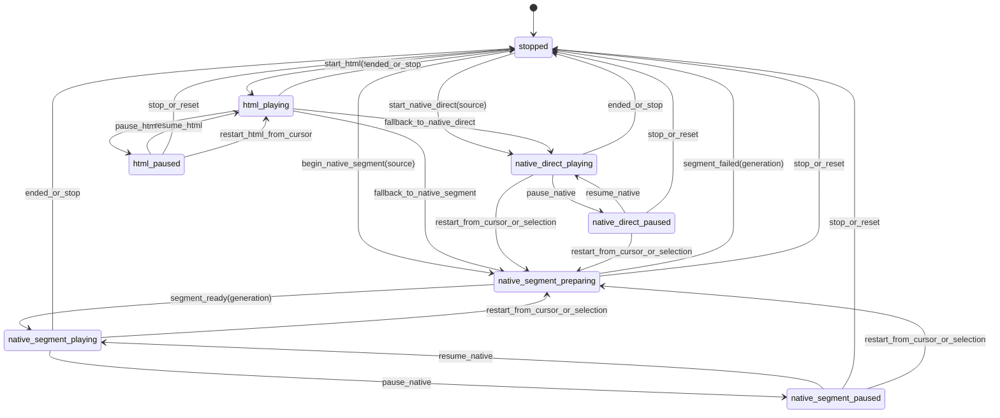

# Playback State Machine Concept Design

Date: 2026-06-18

Related audit: [Playback State Machine Risk Audit](2026-06-18-playback-state-machine-risks.md)

> **Superseded (2026-07-16).** This backend-mirror design is retained as
> historical context only. The implemented
> [playback/recording state-management mitigation plan](../plans/2026-07-16-playback-recording-state-management-mitigation-plan.md)
> makes the frontend HTML-audio transport the sole playback owner, moves
> multi-pass behavior into pure practice programs, and deletes the Python
> playback mirror and native editor-playback states described below.

## Purpose

This document proposes the conceptual backend playback state machine that should replace the remaining direct playback flag writes identified in the risk audit. It is not an implementation plan. It defines the invariants, state vocabulary, transition boundaries, and testing shape that an implementation plan should preserve.

The design is based on the current code in:

- `addon/anki_audio_quick_editor/editor_session_state.py`
- `addon/anki_audio_quick_editor/editor_playback.py`
- `addon/anki_audio_quick_editor/editor_playback_request.py`
- `addon/anki_audio_quick_editor/editor_runtime.py`
- `addon/anki_audio_quick_editor/editor_session.py`
- `settings_ui/src/editor-inline/playback-*.ts`
- `settings_ui/src/editor-inline/field-state.ts`

## Current Behavior To Preserve

The current behavior is mostly correct; the problem is that it is encoded as repeated field bundles.

- Plain playback is not an editor-busy operation.
- Native segment preparation is busy and must block processing and other commands that respect `is_busy()`.
- Starting native playback stops any previous editor playback, invalidates stale segment callbacks, and cleans the prior temporary segment.
- HTML playback is frontend-owned. The backend tracks it so stop, status, and lifecycle events remain coherent, but it does not render or play the audio.
- Post-edit playback must preserve the edit-result status until playback ends.
- Stale native segment worker callbacks must never start playback or retain temporary files.
- Session resets, media resets, processing starts, settings reloads, history restores, region deletes, and learner recording actions must stop editor playback before they mutate incompatible state.
- Stopping editor playback also needs to reset learner playback state in runtime-level stop paths.

## Core Problem

`PlaybackState` currently stores:

- `active`
- `paused`
- `preparing`
- `generation`
- `temp_path`
- `preserve_status`

Those fields describe both state and side-channel policy. They can represent valid states, but they can also represent invalid states because callers write them directly. For example, `active=True, paused=True, preparing=True` is easy to construct even though a preparing segment cannot be paused. Tests already create some impossible combinations as setup data because the state object does not prevent them.

The proposed fix is to make `PlaybackState` expose named transitions and derived projections. Callers should express intent, not set flag bundles.

## Proposed State Vocabulary

The backend should treat playback as one of these conceptual states:

| State | Meaning | Busy | Owns native audio | Has temp segment |
| --- | --- | --- | --- | --- |
| `stopped` | No editor playback is active. | No | No | No |
| `native_direct_playing` | Anki `av_player` is playing the source media directly. | No | Yes | No |
| `native_segment_preparing` | A worker is rendering a temporary segment for native playback. | Yes | Not yet | No |
| `native_segment_playing` | Anki `av_player` is playing a rendered temporary segment. | No | Yes | Yes |
| `native_direct_paused` | Direct source playback is paused via `av_player.toggle_pause()`. | No | Yes | No |
| `native_segment_paused` | Rendered segment playback is paused via `av_player.toggle_pause()`. | No | Yes | Yes |
| `html_playing` | Frontend audio/progress clock owns playback. | No | No | No |
| `html_paused` | Frontend audio/progress clock is paused. | No | No | No |

This vocabulary can be represented by an enum plus metadata, or by typed dataclasses. A narrow enum is enough for a first implementation if the existing public fields remain as compatibility projections.

## State Metadata

The state machine needs explicit metadata so booleans do not carry hidden meaning:

- `owner`: `none`, `native`, or `html`.
- `phase`: `stopped`, `preparing`, `playing`, or `paused`.
- `generation`: monotonically increasing token for invalidating native segment workers.
- `temp_path`: only set when the current native playback state owns a rendered segment.
- `status_policy`: `replace` or `preserve_until_end`.
- `source`: `user`, `chorusing`, or `post_edit`, retained for status messages and debugging.
- `field_index` and `cursor_ms` can remain session-level state, but transitions should receive them where they affect frontend projection.

The old booleans should become derived compatibility properties while migration is in progress:

- `active` is true for every non-stopped state, including preparing.
- `paused` is true only for `native_direct_paused`, `native_segment_paused`, and `html_paused`.
- `preparing` is true only for `native_segment_preparing`.
- `preserve_status` is true only when `status_policy == preserve_until_end`.

## Invariants

These invariants should be enforced by `PlaybackState` transitions and by debug assertions on `EditorSession`.

### State Shape

- `stopped` implies `active=False`, `paused=False`, `preparing=False`, `preserve_status=False`, and `temp_path=None` after cleanup.
- `preparing=True` implies `active=True`, `paused=False`, `owner=native`, and `temp_path=None`.
- `paused=True` implies `active=True` and `preparing=False`.
- `temp_path is not None` implies `owner=native`, a segment-backed state, and `phase=playing` or `phase=paused`.
- HTML states must never have `temp_path`.
- HTML states must never set `preparing=True`.
- Native direct playback must not have `temp_path`.
- Only `native_segment_preparing` is busy.

### Generation

- `generation` is a cancellation token, not a state counter that tests should depend on exactly.
- Starting segment preparation allocates a new generation and returns it to the caller.
- Stopping playback invalidates pending segment callbacks.
- Starting direct native playback, starting HTML playback, and pausing/resuming do not need to allocate a segment generation unless they are also invalidating an outstanding segment.
- A segment ready/failure callback is accepted only if its generation matches the current generation and the current state is `native_segment_preparing`.
- Accepted segment ready moves to `native_segment_playing` without allocating another generation.
- Accepted segment failure moves to `stopped` and clears busy state. It may leave `generation` unchanged because the terminal callback has consumed that generation.
- Rejected segment ready must delete the callback's temporary path and leave current state untouched.
- Rejected segment failure must leave current state untouched.

### Status Policy

- `status_policy=preserve_until_end` is set only from `source=post_edit`.
- Any stop or lifecycle reset clears `status_policy`.
- Segment failure should always show the error status, even if the preparation was requested by post-edit playback. Errors are more important than preserving the edit-result status.
- Normal playback progress/status messages are suppressed while `status_policy=preserve_until_end`.
- Playback-ended handling reads the policy before stop clears it, then decides whether to clear or preserve frontend status.

### Frontend Projection

- Backend state projects to frontend playback state as `playing`, `paused`, or `stopped`.
- `native_segment_preparing` projects as frontend `stopped` because audio is not yet audible and the UI is busy/preparing.
- `native_direct_playing`, `native_segment_playing`, and `html_playing` project as `playing`.
- `native_direct_paused`, `native_segment_paused`, and `html_paused` project as `paused`.
- Frontend region, repeat, clock mode, and HTML loop state remain frontend-owned.

### Cross-Domain Lifecycle

- Processing active and playback active remain mutually exclusive.
- Processing start must call a stop transition rather than clearing `active` and `paused` directly.
- Note load, media reset, settings reload, history restore, persistent undo restore, region delete, learner recording start, and learner recording playback start must use a runtime-level stop command.
- Runtime-level stop must include editor playback stop, native audio stop, temporary cleanup, and learner playback reset.
- Playback-local stop should be renamed conceptually to "stop editor playback only" if it remains, because it does not reset learner playback state.

## State Diagram

The implementation does not need every arrow as a separate public method. It does need named transition helpers that cover every arrow and enforce the same invariants.

## Transition API Shape

`PlaybackState` should expose a small transition API. Names can change during implementation, but the responsibilities should stay stable.

| Transition | Result | Notes |
| --- | --- | --- |
| `stop()` | `stopped` | Invalidates pending segment callbacks and clears status policy. Filesystem cleanup remains outside the state object. |
| `begin_native_direct(source)` | `native_direct_playing` | Clears pause/preparing/temp metadata and sets status policy from source. |
| `begin_native_segment_prepare(source)` | `native_segment_preparing` plus generation | Allocates generation, clears temp metadata, sets busy-preparing state. |
| `accept_native_segment_ready(generation, path)` | accepted boolean | On match, stores `temp_path` and moves to `native_segment_playing`; on stale, returns false so caller cleans `path`. |
| `accept_native_segment_failed(generation)` | accepted boolean | On match, clears preparing and active playback. |
| `pause_native()` | matching native paused state | Only valid when native playback is active and not preparing. |
| `resume_native()` | matching native playing state | Restores direct or segment playback based on the paused state. |
| `start_html(source)` | `html_playing` | Stops prior backend playback first when action is start. No temp segment. |
| `pause_html()` | `html_paused` | No native audio side effect. |
| `resume_html(source)` | `html_playing` | No generation change unless replacing a pending native segment. |
| `html_cursor_restart()` | `html_playing` | Used by `set_cursor_from_web` when frontend restarts HTML playback after cursor movement. |

The pause/resume design should not infer segment ownership from `temp_path` alone. The paused state itself should preserve whether playback was direct or segment-backed.

## Side Effects Boundary

`PlaybackState` should remain a pure state object. It should not call Anki, delete files, update Qt/webview state, or log breadcrumbs.

Side-effecting services should coordinate around transitions:

- `editor_playback.py` owns native `av_player` calls, segment rendering callbacks, playback status messages, and temporary segment cleanup decisions.
- `editor_playback_request.py` owns request normalization and routing HTML/native actions into transition calls.
- `editor_runtime.py` owns full runtime stop semantics: playback state stop, learner playback reset, native audio stop, and temp cleanup.
- Frontend modules own HTML audio clock, repeat loops, cursor progress, and playback region state.

This split keeps the state machine testable without Anki and keeps side effects explicit at call sites.

## Stop Semantics

The duplicate `stop_session_playback()` names should be separated conceptually:

- `stop_editor_playback_runtime(session)`:
  - Transition playback to stopped.
  - Reset learner playback state.
  - Stop native audio.
  - Clean temporary playback files.
  - Use this for lifecycle, processing, history, settings, media, note-load, region-delete, and learner-recording boundaries.

- `stop_editor_playback_for_playback_module(session, deps)` or a narrower private helper:
  - Transition playback to stopped.
  - Stop native audio.
  - Clean temporary playback files.
  - Use only if a playback-module local dependency wrapper is still useful.

The naming should make missing learner playback reset visible during review.

## HTML Versus Native Ownership

The backend should not treat HTML playback as a native audio operation. It should track HTML playback only to answer:

- Should the session be considered active?
- Should a stop or reset clear playback?
- Should playback-ended preserve or clear status?
- Should pause/resume requests project to frontend `paused` or `playing`?

HTML repeat loops, audio readiness, fallback to native, and cursor progress remain frontend-owned. Backend state should store `owner=html` rather than overloading `active=True, preparing=False`.

## Temporary Segment Lifecycle

Temporary segment file deletion should remain outside `PlaybackState`, but the state machine should make cleanup decisions obvious:

- `begin_native_segment_prepare()` clears any old `temp_path`; the caller must clean the old path before or after the transition.
- `accept_native_segment_ready()` stores the new `temp_path` only if the callback is current.
- A stale ready callback returns false, and the caller deletes the callback path immediately.
- `stop()` returns or exposes the old `temp_path` for cleanup, or the cleanup helper reads it before clearing it.
- No transition other than accepted segment ready may set `temp_path`.

An implementation can make cleanup safer by having `stop()` return a transition result such as `PlaybackTransition(cleanup_temp_path=old_path, invalidated_generation=True)`.

## Test Strategy

Tests should move from raw field arithmetic to transition outcomes.

Keep characterization tests for:

- `is_busy()` is true only for segment preparation and other non-playback async work.
- HTML playback start/pause/resume updates backend state without rendering a native segment.
- Native direct playback starts without segment rendering when cursor and region permit.
- Native selected or offset playback enters preparing, accepts current segment ready, and starts native playback.
- Stale segment ready is ignored and its temporary directory is removed.
- Segment failure clears busy/preparing and reports an error.
- Post-edit playback preserves status during normal playback and playback end.
- Runtime stop resets learner playback state.
- Processing, media reset, settings reload, region delete, history restore, and note load stop incompatible playback.

Avoid tests that require exact generation counts. Prefer:

- A new segment preparation returns a token greater than the previous token.
- Stop invalidates a captured token.
- A stale token is rejected.
- An accepted terminal callback changes state exactly once.

Add focused unit tests for `PlaybackState` transition methods before migrating callers. Then keep higher-level tests around side effects and frontend bridge projection.

## Migration Shape

A low-risk migration can keep the existing fields temporarily:

1. Add explicit transition methods to `PlaybackState` while retaining `active`, `paused`, `preparing`, `generation`, `temp_path`, and `preserve_status`.
2. Replace direct production writes with transition calls in the smallest coherent groups:
   - Native direct start and segment prepare/ready/failure.
   - HTML start/pause/resume and cursor restart.
   - Runtime stop and temp cleanup.
   - Processing/session reset paths.
   - Settings reload and media reset.
3. Add debug assertions for the invariants above.
4. Update tests to assert named transition outcomes instead of exact field bundles.
5. After call sites no longer write fields directly, decide whether to keep compatibility fields or replace them with enum/dataclass state plus derived properties.

## Open Design Decisions

- Whether `PlaybackState.stop()` should return the old `temp_path` for cleanup or leave cleanup as `cleanup_temp_playback(session)`.
- Whether native paused state should store a specific previous playing variant or infer it from `temp_path`.
- Whether `status_policy` should stay as a boolean projection or become a small enum immediately.
- Whether generic stops should always bump generation or only bump when a segment is preparing. Always bumping is simpler and safer; selective bumping reduces noisy tests but requires more care.

The safest first implementation is to always invalidate on stop, allocate a generation on segment prepare, and stop asserting exact generation values in tests.
