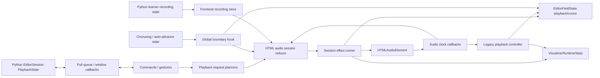

# Playback And Recording State Management Audit

Date: 2026-07-16

Baseline: commit `8f25fb39c0c0a3808ee950eb21f2edeca3a02b35` plus the current uncommitted working tree. The working tree already contains a large playback, observability, test-harness, and coverage refactor, so this document audits the code as it exists in the working tree rather than only the committed baseline.

Scope:

- inline-editor frontend state, playback, repeat, selection, chorusing, post-edit autoplay, and learner-recording playback;
- Python editor-session, bridge, post-edit, native recording, persistence, and analysis state;
- frontend unit/integration coverage, Python unit/component coverage, real-Anki E2E, and independent acoustic E2E;
- readiness for more advanced playback and recording modes.

This is an architecture audit, not an implementation change.

## Executive conclusion

The code is moving in the right direction, but it is not yet a clean foundation for additional playback or recording modes.

The best part is the typed `HtmlAudioSessionState` reducer. It gives browser playback explicit states, typed events/effects, exhaustive transition handling, and useful event-level logging. The independent PCM E2E layer is also unusually strong.

The main problem is that the reducer is not actually the sole playback model. Playback facts are copied across the reducer, `EditorFieldState`, `VisualizerRuntimeState`, DOM-owned runtime properties, Python `PlaybackState`, learner-recording stores, and the audio element. Repeat/chorusing behavior also bypasses the reducer through a global boundary callback and a legacy progress controller. Recording has no comparable state machine and its backend cannot cancel or dispose an active recorder.

Adding advanced modes now would multiply synchronization conditions across those owners. Before feature work, establish three explicit machines with narrow responsibilities:

1. a frontend **transport machine** that alone owns audible playback;
2. a backend **recorder machine** that alone owns microphone capture and finalization;
3. a pure **practice-program planner** that sequences passes, pauses, selections, prompts, recordings, and review without directly touching DOM, audio, or Python state.

No state-management library is required. Typed discriminated unions, pure reducers, one effect runner per machine, and schema-generated bridge messages are enough.

## Go/no-go recommendation

Do not build another advanced playback or recording mode directly on `playback-controller.ts`, `sourceBoundaryHandler`, `VisualizerElement.__aqe*` fields, or the current `LearnerRecordingState` bundle.

Feature work can begin safely after these foundation gates are met:

- one authoritative frontend transport state and one boundary path;
- attempt/source identity on every asynchronous media event;
- recorder `cancel()`/`dispose()` semantics exercised on note, source, and editor teardown;
- mode progression expressed as pure program decisions rather than controller callbacks;
- generated contracts for playback/recording commands and events;
- targeted integration and real-Anki tests for lifecycle races listed below.

## Current ownership map

The same conceptual playback session currently spans all of these owners:



The individual representations are:

| Owner | Current responsibility | Problem |
| --- | --- | --- |
| `HtmlAudioSessionState` | source, loading, starting, playing, paused, repeat wait, post-edit wait, failure | Good core model, but not authoritative outside its controller |
| `EditorFieldState.playback` | state, engine, clock, range, repeat, restart policy | Duplicates transport state and is used to gate timers and UI behavior |
| `VisualizerRuntimeState` | pass loop/reset, repeat wait, clock, durations, status preservation, viewport | Mixes presentation state with transport policy and timing |
| `VisualizerElement.__aqe*` | timers, playback plan/generation, chorusing state, render caches | Behavioral state remains attached to DOM lifetime |
| Python `PlaybackState` | active/paused/preparing/generation/temp/status policy | Legacy mirror of frontend HTML playback; several fields have no production writer |
| Python `LearnerRecordingState` | capture, analysis, media, plus learner-playback fields | Optional-field bundle permits invalid combinations and mixes capture with playback |
| frontend recording store | recording projection plus learner playback status | Independently changes learner playback while Python continues to publish its own copy |
| `HTMLAudioElement` | actual browser media lifecycle and current time | Async events are not bound to a unique play attempt |

## Strengths to preserve

### Typed, pure playback transitions

`html-audio-session-types.ts` and `html-audio-session-machine.ts` use a discriminated union and explicit event/effect types. The reducer is pure, exhaustive, and separates effects from decisions. This is the correct center of gravity for playback.

### One intended audible engine

Source and learner playback now target the same WebView `HTMLAudioElement`. Avoiding transparent native fallback is a good simplification and makes seeking, selection playback, repeat, and acoustic observation coherent.

### Explicit observability

Transition logs include from/to state, event facts, request context, and effects. Browser lifecycle logging and the independent addressable-audio oracle provide the right evidence when state and emitted sound disagree.

### Pure planning helpers

`playback-model.ts`, `selection-auto-advance.ts`, and `chorusing-state.ts` contain useful pure functions. These should become inputs to the new program planner instead of being discarded.

### Backend generation guards

Processing, post-edit, analysis, and learner recording use monotonically increasing generations to reject stale completions. The idea is sound even though token types and ownership should be unified.

### Recording adapter separation

`audio_recording.py` keeps Qt and Anki imports lazy, presents a small adapter protocol, and isolates WAV construction. The platform adapters already have focused unit coverage.

## Design findings

### P0-1: Playback has split authority and a legacy backend mirror

Evidence:

- `HtmlAudioSessionState` owns the browser lifecycle, but `html-audio-session-field-projection.ts` republishes status/range/cursor into `EditorFieldState`.
- repeat timers use `EditorFieldState.playback.state` and `repeat`, not only session state.
- `VisualizerRuntimeState` separately owns loop/reset/pass and repeat-wait facts.
- `handleHtmlPlaybackCommand()` starts source playback entirely in the frontend, but pause/resume also enqueue `aqe:play` for Python. Start and pause/resume therefore have different synchronization paths.
- Python `PlaybackState.preparing` is never set to `True` in production. Its generation and temporary path are retained from removed native-segment playback, and learner playback fields are not updated by the new frontend-owned playback path.

Impact:

- no single object answers “what is playing, why, over which range, and what happens next?”;
- new modes must update multiple stores in the right order;
- backend busy/status/reset decisions can observe a different playback state from the browser;
- tests can pass against one projection while another owner is stale.

Solution:

- make the frontend transport machine the only owner of HTML playback lifecycle, active source, cursor/pass, pause/repeat wait, and failure;
- make field and control state subscribers/projections of transport events, not peers that drive transport decisions;
- remove Python HTML playback flags, generations, temporary-path cleanup, and learner-playback mirrors once bridge compatibility is migrated;
- if Python needs diagnostics, publish a typed observational event; do not maintain a second state machine.

### P0-2: Advanced mode progression bypasses the playback reducer

Evidence:

- `html-audio-session-controller.ts` owns a process-global `sourceBoundaryHandler`.
- `actions-audio-clock.ts` installs `handleSelectedRepeatAutoAdvanceBoundary()` into that hook.
- the boundary handler reads selection state, split-button settings, chorusing state, and repeat counters, mutates selection/chorusing state, and may directly start a new playback request.
- `playback-controller.ts` retains a second boundary/repeat/manual-clock implementation and callback seam.

This is already the shape that future modes would copy: “on boundary, inspect several stores, mutate some UI state, and maybe restart audio.” It is hard to compose and hard to prove exhaustive.

Solution:

Introduce a pure `PlaybackProgram`/`PracticeProgram` planner:

```text
Program state + transport fact ->
  continue current pass
  wait(duration)
  play(pass)
  update selection/marker projection
  start recording(attempt spec)
  complete
  fail(reason)
```

The transport reducer owns media lifecycle only. At a boundary it asks the program for the next command. Repeat, selected repeat, chorusing, progressive suffix practice, prompt/response, and future modes become program variants with table-driven tests. Delete the global boundary hook after migration.

### P0-3: Asynchronous audio events lack attempt identity

Evidence:

- `PlayResolved` and `PlayRejected` are correlated by source filename only.
- `MetadataLoaded`, `AudioError`, `BoundaryReached`, and `ended` do not carry a source revision or play-attempt ID.
- a late promise/event for an older attempt using the same filename can be accepted by a newer session.
- the existing stale-play tests reconfigure to a different source; they do not cover same-filename replacement or repeated play attempts.

Filename is content metadata, not operation identity.

Solution:

- allocate opaque `SourceRevision` and `PlaybackAttemptId` values;
- include them in every async media event and timer callback;
- accept an event only when both source revision and attempt match current state;
- make timer handles owned by the attempt and cancel them on every terminal/replacement transition;
- log tokens for correlation, without using exact counter values as behavior.

### P0-4: Learner audio handlers leak and can execute more than once

`installLearnerAudioHandlers()` calls `addEventListener()` and also assigns the same newly created closure to `onended`/`onerror`. It is called during source configuration, play, and playback-state publication. `clearLearnerAudioHandler()` is a no-op.

Each configure/play cycle therefore accumulates additional listeners. Guards usually make later invocations no-ops after the first transition, but the lifecycle is still incorrect, memory grows with use, and future handler behavior can turn the duplicate delivery into duplicate effects.

Solution:

- install one stable set of audio-element handlers when the element/controller is created;
- handlers read the current attempt from the transport controller;
- never combine `addEventListener` and `on*` assignment for the same event;
- return and exercise an explicit disposer.

### P0-5: The recording backend has no cancellation or disposal contract

Evidence:

- `RecordingController` exposes only `start()` and successful `stop()`.
- note load and media reset call `clear_learner_recording_state()`, which drops `learner_recording_controller` without stopping it.
- the Qt `QAudioSource` is parent-owned and can continue capturing after the Python reference is cleared.
- there is no distinct abort path for source change, editor close, note switch, permission flow cancellation, or application shutdown.

Generation checks prevent a stale completion from mutating the new state, but they do not stop the external microphone side effect.

Solution:

- require `cancel(reason)` and idempotent `dispose()` on the recorder port;
- stop the device, disconnect reads/timers, discard or quarantine partial data, and resolve the attempt exactly once;
- make every editor/note/source teardown call cancellation before state reset;
- add a backend recorder reducer with explicit `idle`, `starting`, `recording`, `stopping`, `analyzing`, `ready`, `failed`, and `cancelled` states;
- make an accepted terminal callback consume the attempt so duplicate stop/completion callbacks are harmless.

### P1-1: There are two progress clocks and two boundary engines

The HTML session controller has its own animation frame, progress clock, repeat timer, and boundary dispatch. The legacy playback controller has another playback plan, animation frame, repeat timer, manual fallback, and boundary logic. Runtime state and `VisualizerElement` fields support both.

`htmlAudioProgressMs()` chooses the maximum of audio `currentTime` and elapsed wall time. During buffering or a stalled decoder, wall time can advance the UI to the boundary and stop/repeat audio that has not actually reached it.

Solution:

- use media `currentTime` as the authoritative boundary fact;
- wall-clock interpolation may smooth cursor paint between samples but must never complete a pass or advance a mode;
- keep `ended` as a corroborating full-source event, not a separate competing boundary policy;
- delete manual “playing” fallback for audible playback. A visual timer without sound is not playback;
- retain a separate preview clock only if it is explicitly named and cannot publish playing/audible state.

### P1-2: Recording state is a wide optional-field bundle, not a valid-state model

Python `LearnerRecordingState` contains capture lifecycle, source identity, output media, timing, playback, analysis, error, and graph settings in one frozen dataclass. Most fields are optional in every status. Impossible states such as `ready` without media/prosody or `idle` with a controller remain representable.

Frontend recording state normalizes another partial payload and independently updates `playbackStatus`. Python's learner playback fields have no production update path after playback moved to HTML.

Solution:

- separate `RecordingAttemptState` from the immutable `LearnerTake` result;
- use discriminated state variants with only valid metadata for each phase;
- remove playback fields from recorder state; learner playback is a normal transport source;
- identify takes independently from attempts so future multi-take/history/comparison modes do not overwrite one singleton;
- derive duration and media metadata from the finalized WAV header/probe, not only monotonic elapsed time.

### P1-3: Playback and recording bridge messages are ad hoc

The shared communication schema contains command names and configuration, but not the playback request, post-edit handshake, recording projection, source revision, or transport/recorder events.

Current communication uses mutable window queues, `window.__aqe*` callbacks, `Any`/dict decoding, `focus:<ord>`, and a pull callback from Python. Requests have no command ID and acknowledgements are implicit.

Solution:

- add schema-owned `TransportCommand`, `TransportObservation`, `RecorderCommand`, `RecorderSnapshot`, and `SourceChanged` messages;
- generate TypeScript and Python types/validators;
- include editor session, field, source revision, command/attempt ID, and version in each message;
- keep the WebView adapter thin: validate, dispatch, and serialize—no behavioral state in global queues;
- remove the asymmetric “start locally, pause/resume through Python” path.

### P1-4: Behavioral state still lives on DOM objects

Rule 33/34 improved the main field/control/recording/runtime stores, but the boundary is incomplete:

- `ChorusingState` lives in `visualizer.__aqeChorusingState`;
- playback plans, generations, animation/timer handles, and recording timers live in other `visualizer.__aqe*` fields;
- cleanup correctness depends on DOM controller lifetime;
- architecture guards enumerate selected dataset names and do not cover these object properties.

Solution:

- put chorusing/program state in a typed store keyed by stable session/field ID;
- keep timers and audio handles private to effect controllers, never in view elements;
- reserve DOM properties for render caches only;
- extend architecture tests to reject behavioral `__aqe*` writes outside named controller/test adapters.

### P1-5: Post-edit autoplay is a cross-layer protocol, not a transport command

The current path is:

1. frontend remembers repeat/status intent;
2. Python mutates media and stores pending post-edit state;
3. Python injects pending state into remounted controls;
4. frontend waits for graph/audio readiness;
5. frontend sends ready to Python;
6. Python asks frontend to play;
7. frontend starts the same HTML transport and Python later clears pending state.

Status preservation is also represented in frontend visualizer runtime state and Python playback state. Duplicate suppression is held in a process-global set cleared only with all sessions.

Solution:

- treat a successful edit as one typed `SourceChanged` event containing the new source revision and optional autoplay program;
- the frontend transport waits for its own source readiness and starts that program locally;
- acknowledgement, if required for diagnostics, reports the attempt result but does not control the transition;
- keep edit-result status ownership in the control/status reducer and express “preserve during autoplay” as derived view policy.

### P1-6: Module boundaries reflect migration history more than concepts

Examples:

- `html-audio-session-controller.ts` is 496 lines, immediately below the 500-line hard gate;
- `html-audio-session-machine.ts` is 420 lines;
- `playback-controller.ts` is 383 lines despite the new session controller;
- `post-edit-playback.ts` is 319 lines;
- recording action state/sync/lifecycle code and visualizer runtime add several hundred more lines.

Small wrapper modules coexist with two large orchestration centers and compatibility exports. The result is many names for the same operation (`startProgressClock`, source start, session start, playback action, field projection) rather than a small number of conceptual ports.

Solution:

Organize by responsibility:

```text
transport/
  model.ts             pure state/events/invariants
  reducer.ts           lifecycle transitions
  program.ts           pass/mode decisions
  controller.ts        serial event queue + effect dispatch
  html-audio-port.ts   only HTMLAudioElement access
  projection.ts        field/control view models

recorder/
  model.py             valid states and attempt/take IDs
  reducer.py           pure transitions
  service.py           effect runner and lifecycle cleanup
  ports.py             native/fake capture protocol

practice/
  programs.ts          repeat, chorusing, prompt/record/review planners
```

This is a conceptual target, not a requirement to create one file per name. Keep files cohesive and below the repository's 350-line soft limit.

### P2-1: Architecture documentation describes obsolete playback

`ARCHITECTURE.md` still says editor playback uses Anki's audio player. `docs/reviews/2026-06-18-playback-state-machine-design.md` centers native direct/segment states that no longer exist in production. The Electron extraction plan says to reuse current playback machines as a clean core, but this audit shows that mode orchestration and lifecycle are still entangled with the editor and DOM.

Solution:

- update architecture prose after the refactor, not before it;
- mark the June native-playback design superseded;
- make transport/recorder cleanup and source/attempt identity executable architecture rules;
- amend the extraction plan so transport cleanup is a prerequisite, not a copy-as-is step.

### P2-2: Architecture guards protect names and direct syntax, not ownership

Examples:

- Rule 33/34 block reads of enumerated dataset fields but do not cover `VisualizerElement.__aqe*` behavioral properties.
- the source-boundary frontend guard checks selected names/patterns while source boundary behavior still exists in `actions-audio-clock.ts` under different names and indirect calls.
- callback guards inspect direct source text and do not see state reads in called helpers.

These tests are useful ratchets but not evidence that there is one source of truth.

Solution:

- enforce allowed imports and state-owner APIs structurally;
- add violating canaries for indirect helper calls and DOM-property storage;
- prefer tests that prove all transport writes go through the reducer/controller over bans on selected spellings.

## Target architecture

### State hierarchy

```text
EditorRuntime
  fields                 source/graph/selection/quick settings only
  transport              current audible source and pass lifecycle
  recorder               backend-projected capture attempt lifecycle
  practiceProgram        mode-specific sequence and counters
  controls               busy/history/status view state
  viewport               visual-only timeline state
```

Current product behavior allows one audible playback at a time. Represent that as one root transport coordinator containing `fieldId` and `sourceId`, rather than a map of independently active field sessions plus “stop others” scans. If a future mode genuinely needs simultaneous lanes, add explicit lane IDs and a coordinator invariant; do not obtain concurrency accidentally from one audio element per field.

### Transport model

Suggested state shape:

```typescript
type TransportState =
  | { kind: "idle" }
  | { kind: "loading"; source: SourceRef; revision: SourceRevision; pending?: StartSpec }
  | { kind: "ready"; source: SourceRef; revision: SourceRevision; durationMs: number; cursorMs: number }
  | { kind: "starting"; source: SourceRef; revision: SourceRevision; attempt: PlaybackAttemptId; pass: Pass }
  | { kind: "playing"; source: SourceRef; revision: SourceRevision; attempt: PlaybackAttemptId; pass: Pass }
  | { kind: "paused"; source: SourceRef; revision: SourceRevision; attempt: PlaybackAttemptId; pass: Pass; cursorMs: number }
  | { kind: "waiting"; source: SourceRef; revision: SourceRevision; attempt: PlaybackAttemptId; next: ProgramCommand }
  | { kind: "failed"; source: SourceRef | null; revision: SourceRevision | null; failure: TransportFailure };
```

Important constraints:

- source kind (`target`, generated edit, learner take) is data, not a separate playback implementation;
- attempt identity is required on promise, timer, metadata, error, pause, ended, and boundary events;
- repeat/chorusing/prompt sequence lives in the program state, not booleans added to every transport state;
- progress paint is a projection; boundary decisions use media facts;
- effects execute serially so a nested synchronous error cannot partially skip an unrelated effect list.

### Recorder model

Suggested split:

```text
RecordingAttempt
  id, editorSessionId, fieldId, sourceRevision, startCursorMs, requested settings

RecorderState
  idle
  starting(attempt)
  recording(attempt, capture metadata)
  stopping(attempt)
  analyzing(attempt, finalized take)
  failed(attempt, typed failure)

LearnerTake
  id, sourceRevision, media asset, probed duration/format, startCursorMs, prosody result
```

`ready` belongs to the take collection, not to an active recorder device. This supports multiple takes and comparison modes without widening one singleton state.

### Practice program

A practice program coordinates transport and recorder commands but owns neither side effect. Examples:

- `Once(range)`
- `Repeat(range, gap, count | untilStopped)`
- `Chorusing(markers, repeatsPerSuffix, gap)`
- future `PromptRecordReview(promptPass, countdown, recordSpec, reviewSpec)`

Each program is a pure reducer. It receives facts such as `PassCompleted`, `WaitElapsed`, `RecordingStarted`, `RecordingFinalized`, `UserSkipped`, and `Cancelled`, then emits the next command. This keeps advanced modes out of the transport and recorder state cross-product.

## Test and coverage assessment

### What is already strong

- reducer tests cover source configuration, deferred metadata, play resolution/rejection, seek failure, pause/resume/stop, repeat wait, post-edit readiness, source clearing, runtime disposal, and an event transition matrix;
- jsdom integration covers hidden/full/selected playback, cursor movement, selection replacement/resize/clear, repeat pause, post-edit status, same-source loading, chorusing navigation, and processing interruption;
- real-Anki E2E covers browser playback, cursor/selection workflows, repeat, post-edit generated media, processing during playback, source replacement, codec failure, and multi-field behavior;
- addressable PCM E2E covers source prefix, selected region across WAV/MP3/OGG, bounded repeat with a real silence gap and terminal silence, M4A recovery, pause/reposition/resume, selection replacement, and transform-during-repeat;
- Python recording tests cover request validation, stale generation rejection, completion/failure, media persistence, analysis failure, Qt format/write paths, and macOS helper errors.

### Coverage policy problems

1. `vitest.config.ts` lowers the named floor for `html-audio-session-machine.ts` to 75% lines/statements and 70% branches, and for `playback-controller.ts` to 75% lines and 55% branches. Those are the highest-risk state/orchestration files. The thresholds are ratchets, not evidence of completeness.
2. Frontend thresholds are aggregate/glob thresholds rather than a required per-file branch floor for all transport/program modules.
3. Python coverage is 80% aggregate. Per-file risk floors do not include `editor_playback.py`, `editor_playback_request.py`, `editor_recording.py`, `editor_recording_state.py`, `audio_recording.py`, or recording analysis/request modules.
4. Architecture/test-policy coverage does not detect missing lifecycle semantics such as recorder cancellation or listener disposal.

### Missing high-value unit/reducer tests

- same filename, different source revision: stale `PlayResolved`, `PlayRejected`, metadata, error, ended, repeat timer, and progress frame must be ignored;
- two rapid play attempts for one source resolving/rejecting out of order;
- exact-once effect completion when a synchronous seek/error event re-enters the controller;
- media stall/buffering: wall time must not complete a pass;
- listener installation/disposal count over repeated source/learner playback cycles;
- recorder cancel before start, during recording, during delayed stop padding, during background write, and during analysis;
- double stop/cancel and late success/failure after cancellation;
- valid-state tests proving impossible recorder/take shapes cannot be constructed;
- practice-program tables for repeat counts, gaps, skip/cancel, marker changes, and terminal behavior.

### Missing frontend integration tests

- real `loadedmetadata` as the only duration source, with no graph duration shortcut;
- source replacement while `audio.play()` is still pending, including replacement with the same filename/revision change;
- source error/HEAD probe resolving after a newer source is configured;
- one active transport across two fields that reference the same filename;
- remount/dispose while starting, playing, paused, or repeat-waiting, with no remaining listeners/timers;
- learner take replacement while learner playback is starting or paused;
- mode cancellation while waiting to record or analyze.

### Missing real-Anki and acoustic E2E

- note switch/navigation must acoustically prove old playback becomes and remains silent;
- same-source remount/replacement must prove an older play promise/event cannot restart audio;
- learner-recording playback should use the real HTML media element and addressable PCM, not only the installed fake playback driver;
- record while switching note/editor/source should prove the fake/native recorder receives cancellation and no stale media/overlay is published;
- multiple-field arbitration should acoustically prove no overlap or old-source leak;
- long buffering/delayed metadata should prove no wall-clock boundary or phantom repeat;
- an opt-in macOS and Windows hardware lane should exercise actual permission, input-device selection, cancellation, stop, WAV probe, and device-loss reporting. The repository documents this lane but contains no executable hardware workflow.

The default E2E gate should continue to use deterministic fake recorders. Hardware tests complement it; they do not replace deterministic cancellation and stale-callback tests.

### Recommended coverage gates

After the refactor establishes the new files, add ratcheting per-file branch and line floors for:

- transport reducer and program planners: at least 95% lines/functions and 90% branches;
- transport controller/audio port: recorded per-file baseline with no decrease, then raise as lifecycle tests land;
- recorder reducer/state: at least 95% lines/functions and 90% branches;
- recorder service and native adapters: per-file floors plus explicit cancellation-path tests;
- bridge validators/adapters: 100% command/event variants decoded with positive and negative fixtures.

Mutation testing is especially useful for transition guards, attempt-token comparisons, repeat counters, and cancellation branches. Do not use coverage percentage as the only acceptance criterion.

## Test-first migration plan

### Phase 0: Freeze behavior and add missing lifecycle canaries

Before moving code:

- add same-source stale-attempt tests;
- add listener/disposer count tests;
- add recorder cancellation tests for note/source/editor teardown;
- add buffering/no-phantom-boundary tests;
- add acoustic note-switch silence and learner-playback tests.

Verification: focused tests must fail against the current lifecycle seams for the expected reason.

### Phase 1: Introduce attempt/source identity and exact cleanup

- add typed `SourceRevision`, `PlaybackAttemptId`, and `RecordingAttemptId` wrappers;
- thread them through reducers, timers, audio callbacks, and bridge logs;
- install audio handlers once and implement idempotent disposal;
- add recorder cancel/dispose to native and fake ports;
- keep existing UI APIs as a compatibility adapter.

Verification: new canaries pass; existing reducer, integration, E2E, and acoustic suites remain green.

### Phase 2: Make transport state authoritative

- move pass/range/repeat-wait facts from field and visualizer runtime state into transport/program state;
- make field/control playback values read-only projections;
- route pause/resume/start/stop through one frontend controller;
- remove the second boundary/clock path and manual audible fallback;
- replace `stopOtherPlayback()` scans with one coordinator invariant.

Verification: architecture tests prove transport writes have one owner; all cursor/selection/repeat acoustic tests pass.

### Phase 3: Extract practice programs

- move selected repeat and chorusing boundary behavior into pure programs;
- remove `sourceBoundaryHandler` and controller callbacks;
- add future-mode interfaces only when the first new mode requires them—do not build a generic DSL prematurely.

Verification: program transition tables plus existing chorusing/auto-advance integration and E2E.

### Phase 4: Replace recording state bundle

- introduce recorder reducer, attempt IDs, and take entities;
- separate capture, persistence, and prosody-analysis effects;
- remove learner playback from Python recorder state;
- support multiple takes in state only if required by the next requested mode.

Verification: adapter/unit tests, cancellation races, fake-recorder E2E, platform hardware lane, and real learner-playback acoustic E2E.

### Phase 5: Replace ad hoc bridge and remove legacy state

- add generated playback/recording contracts;
- replace window queues/pull callbacks with typed commands/events;
- remove Python legacy playback flags/temp state and obsolete tests;
- remove DOM behavioral properties and compatibility projections;
- simplify post-edit autoplay to a source-change program.

Verification: contract generation/checks, architecture rules, full QC, parallel E2E, then canonical serial E2E.

### Phase 6: Documentation and extraction readiness

- run the documentation-maintenance workflow and regenerate architecture archives;
- update `ARCHITECTURE.md`, `TESTING.md`, WebView docs, and observability docs;
- supersede the obsolete native-playback design;
- revise the Electron extraction plan to import the new transport/program/recorder contracts rather than the current editor orchestration.

## Success criteria

The foundation is ready for advanced modes when all of the following are true:

1. One reducer/controller owns every playback lifecycle write.
2. One recorder service owns every capture lifecycle write and external recorder handle.
3. Every async event carries source and attempt identity.
4. Every timer, listener, audio source, recorder, and analysis job has an idempotent disposer/cancel path.
5. Repeat and chorusing are pure program variants, with no global boundary callback.
6. DOM state is presentation/cache only.
7. Python does not mirror frontend HTML playback state.
8. Playback and recording bridge data is schema-generated and validated.
9. State-machine, integration, real-Anki, and acoustic tests cover the lifecycle gaps above.
10. Full QC and real-Anki E2E pass after the legacy paths are deleted, not merely while compatibility paths remain.

## Audit verification

The audit was verified against the current working tree with the repository workflows:

- `python3 scripts/dev.py check` — **passed**. This included config/schema and contract checks, frontend build, lint, type checking, security/dependency/dead-code checks, complexity and maintainability gates, architecture rules, configured risk-tier coverage floors, and Qodana.
- `python3 scripts/dev.py coverage` — **passed**. Aggregate Python coverage was 85.71% lines, 88.52% statements, and 72.64% branches.
- the frontend LCOV artifact produced by the QC run reported 93.46% lines, 85.91% branches, and 91.36% functions overall.
- `python3 scripts/dev.py test-e2e-parallel` — **failed in two shards**. The reported failures were `test_aac_full_repeat_stops_with_warning_when_browser_audio_rejects_after_graph` with 98 other tests passing in its shard, and `test_audible_transform_during_repeat_stops_old_audio_and_autoplays_new_source` with 41 other tests passing in its shard. The third shard passed. The concise parent output did not report the third shard's test count.
- both exact failing node IDs passed when rerun together with the recorded seed `648004614` (6 seconds and 9 seconds respectively). The initial failures are therefore order-, concurrency-, or timing-sensitive rather than isolated deterministic failures. The overall E2E gate remains non-green; the passing rerun does not erase that result.

Measured coverage reinforces the ownership finding:

| Module | Lines | Branches | Interpretation |
|---|---:|---:|---|
| frontend `html-audio-session-machine.ts` | 99.3% | 97.0% | The new reducer is thoroughly exercised. |
| frontend `html-audio-session-controller.ts` | 95.5% | 92.8% | The new effect runner is well exercised. |
| frontend legacy `playback-controller.ts` | 77.1% | 58.5% | The second boundary/progress path is both complex and weakly covered. |
| frontend `selection-auto-advance-controller.ts` | 92.0% | 61.1% | Mode progression has substantial untested branching. |
| backend `editor_playback.py` | 75.0% | 62.5% | The legacy playback mirror remains below the aggregate evidence level. |
| backend `editor_playback_request.py` | 69.0% | 50.0% | Frontend/backend synchronization branches are weakly covered. |
| backend `editor_recording.py` | 79.7% | 61.1% | Recorder orchestration has important untested lifecycle branches. |
| backend `audio_recording.py` | 100.0% | 100.0% | Low-level recording helpers are strong; the weakness is lifecycle orchestration. |

The two transient E2E failures are consistent with this audit's priorities. One occurred at browser-failure UI observation even though the last captured status already contained `AQE-PLAYBACK-002`; the other occurred at the acoustic source-replacement boundary during repeat. They are not proof of a single root cause, but they are concrete evidence that lifecycle/order behavior needs deterministic tests and explicit attempt ownership before advanced modes are added.
