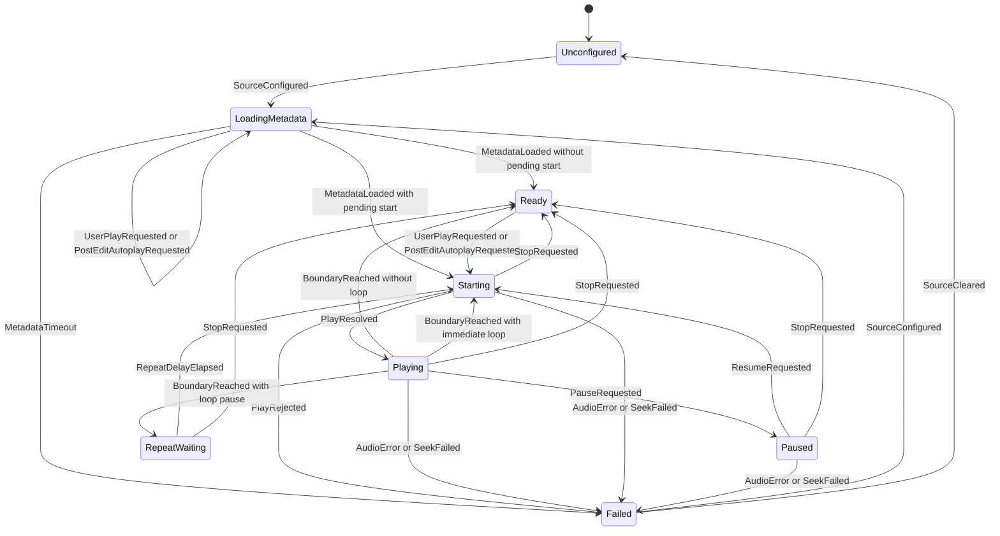
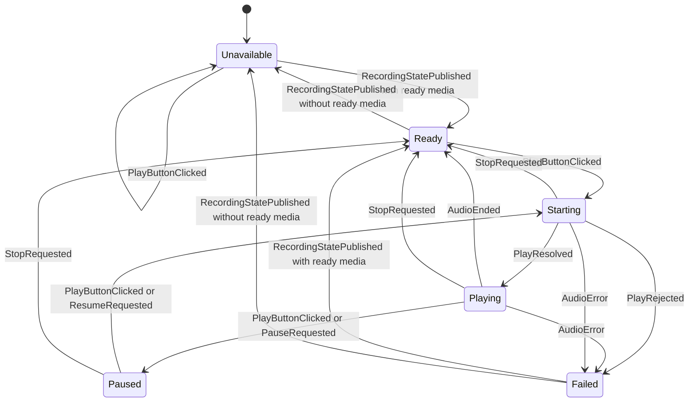

# HTML-Only Playback Implementation Plan

> **For agentic workers:** REQUIRED SUB-SKILL: Use superpowers:subagent-driven-development (recommended) or superpowers:executing-plans to implement this plan task-by-task. Steps use checkbox (`- [ ]`) syntax for tracking.

**Goal:** Remove native playback as a runtime path for editor source audio and learner recording playback. HTML audio becomes the only playback engine. Browser audio readiness controls wait, disable, or show a frontend warning instead of routing to Anki `av_player`.

**Architecture:** The editor webview owns playback through explicit finite state machines. Source audio uses one pure reducer for playback/readiness transitions and one thin effect runner around the existing per-field `.aqe-audio-clock` element. Learner recording playback uses a separate pure reducer keyed by field ordinal and recording media filename. Python continues to own source resolution, graph analysis, edit operations, recording capture, and publishing media filenames, but it no longer starts, pauses, resumes, or renders audio for playback.

**Tech Stack:** Python add-on modules under `addon/anki_audio_quick_editor/`, Svelte 5 and TypeScript under `settings_ui/src/editor-inline/`, Vitest frontend tests, pytest unit and architecture tests, Anki/Qt e2e tests through `scripts/dev.py`.

---

## Source Strategy

This implements the strategy from `docs/superpowers/plans/2026-06-19-gradual-removal-native-playback.md`.

The scoped meaning of "native playback" is:

- Anki `av_player` playback for editor source audio.
- Anki `av_player` playback for learner recording comparison audio.
- Temporary playback segment rendering that exists only to feed Anki playback.

This does not remove native microphone recording. Recording capture remains in Python and Qt/Anki where it is today.

## Current Findings

Source playback currently has two engines:

- HTML path: `settings_ui/src/editor-inline/playback-actions.ts`, `settings_ui/src/editor-inline/playback-controller.ts`, `settings_ui/src/editor-inline/audio-clock.ts`.
- User command/request planning path: `settings_ui/src/editor-inline/command-actions.ts`, `settings_ui/src/editor-inline/actions-playback.ts`, `settings_ui/src/editor-inline/actions-selection.ts`, and `settings_ui/src/editor-inline/chorusing-controller.ts`.
- Native path: `addon/anki_audio_quick_editor/editor_playback.py`, `addon/anki_audio_quick_editor/editor_playback_request.py`, and callback/dependency wiring.
- Transition behavior is currently spread across action handlers, audio element handlers, controller branches, post-edit readiness, and Python native fallback handling. The implementation must replace that with reducer-driven transitions.

The current engine selector still routes to native for hard browser failures and some no-graph/readiness cases:

- `settings_ui/src/editor-inline/playback-engine-decision.ts`
- `settings_ui/src/editor-inline/playback-html-fallback.ts`

Learner recording playback is still native-only:

- Frontend button dispatches `aqe:play-recording` through `settings_ui/src/editor-inline/command-actions.ts`.
- Bridge maps `CMD_PLAY_RECORDING` to Python in `addon/anki_audio_quick_editor/editor_bridge.py`.
- Python `play_learner_recording()` imports `aqt.sound.av_player` and `anki.sound.SoundOrVideoTag` in `addon/anki_audio_quick_editor/editor_recording.py`.
- Existing learner recording frontend state stores `mediaFilename`, `generation`, `playbackStatus`, and `startCursorMs`, but it does not store recording duration. HTML learner playback must extend that state from `recordingDurationMs` / `targetDurationMs` rather than inventing another Python payload.

HTML media URL encoding already exists and must be reused for learner recordings:

- `settings_ui/src/editor-inline/audio-clock.ts` exports `mediaUrlForFilename(filename)`.

## Invariants

- Editor playback never imports or calls `aqt.sound.av_player`, `av_player.play_tags`, `av_player.toggle_pause`, `av_player.stop_and_clear_queue`, or `anki.sound.SoundOrVideoTag`.
- `PlaybackRequest.engine` is either removed or treated as a legacy frontend-only compatibility field that cannot select native playback.
- A rejected `audio.play()` logs a browser playback failure and stops or warns. It does not enqueue a native fallback.
- Selected region playback, selected repeat playback, full-file playback, no-graph playback, post-edit autoplay, pause, and resume are all HTML-owned.
- Learner recording playback uses a media filename URL from `mediaUrlForFilename()`. It must not expose absolute local media paths to JavaScript.
- Browser audio transient states block or defer playback. They do not create a backend playback request.
- Browser audio hard failures are visible to the user and telemetry, but they do not fall back to native.
- Python may still stop recording sessions, update source metadata, render graphs, and publish frontend recording state.
- Native microphone recording remains allowed.
- During migration, successful HTML source playback may keep sending a backend state-sync request through `aqe:play` with `engine: "html"` until the backend state surface is reduced. A browser playback failure must not send `aqe:play`, and no state-sync request may start, pause, resume, or enqueue native audio.
- Intermediate architecture guards must pass in quarantine mode. A phase may run a deliberately failing local test immediately before its implementation, but it must not leave `scripts/dev.py check` or the targeted phase gate red.
- Playback states may only change through explicit state-machine events.
- DOM event handlers, Svelte components, bridge handlers, and timers may dispatch state-machine events and execute returned effects. They must not implement their own playback transition branches.
- Tests must cover the transition table directly before integration tests assert UI behavior.

## Canonical State Machine Design

The implementation must introduce two explicit finite state machines:

- Source audio playback machine for original field audio.
- Learner recording playback machine for "Play yours" comparison audio.

Both machines must be pure reducers. Reducers receive the current state plus an event and return the next state plus declarative effects. Effect runners execute audio element operations, timers, UI status updates, bridge notifications, and telemetry.

### Source Audio Playback Machine

Create `settings_ui/src/editor-inline/source-playback-machine.ts`.

State diagram:



Canonical helper types:

```ts
export type SourcePlaybackFailureReason =
  | "metadata_timeout"
  | "audio_play_rejected"
  | "audio_error"
  | "audio_seek_failed";

export interface SourcePlaybackRequest {
  ord: number;
  cursorMs: number;
  endMs: number;
  loop: boolean;
  regionMode: "full" | "selection";
  source: "user" | "post_edit" | "chorusing";
}

export interface PendingSourceStart {
  request: SourcePlaybackRequest;
  source: SourcePlaybackRequest["source"];
}
```

Canonical states:

```ts
export type SourcePlaybackState =
  | { kind: "unconfigured"; reason: "audio_element_missing" | "audio_src_missing"; cursorMs: number }
  | { kind: "loading_metadata"; cursorMs: number; pendingStart: PendingSourceStart | null; sourceFilename: string }
  | { kind: "ready"; cursorMs: number; durationMs: number; sourceFilename: string }
  | { kind: "starting"; request: SourcePlaybackRequest; durationMs: number; sourceFilename: string }
  | { kind: "playing"; request: SourcePlaybackRequest; durationMs: number; sourceFilename: string }
  | { kind: "paused"; request: SourcePlaybackRequest; pausedAtMs: number; durationMs: number; sourceFilename: string }
  | { kind: "repeat_waiting"; request: SourcePlaybackRequest; durationMs: number; resumeAtMs: number; sourceFilename: string }
  | { kind: "failed"; cursorMs: number; reason: SourcePlaybackFailureReason; sourceFilename: string | null };
```

Canonical events:

```ts
export type SourcePlaybackEvent =
  | { type: "AudioElementMissing" }
  | { type: "SourceCleared" }
  | { type: "SourceConfigured"; sourceFilename: string; cursorMs: number }
  | { type: "MetadataLoaded"; durationMs: number }
  | { type: "MetadataTimeout" }
  | { type: "UserPlayRequested"; request: SourcePlaybackRequest }
  | { type: "PostEditAutoplayRequested"; request: SourcePlaybackRequest }
  | { type: "PauseRequested"; cursorMs: number }
  | { type: "ResumeRequested" }
  | { type: "StopRequested"; cursorMs: number }
  | { type: "SeekSucceeded"; cursorMs: number }
  | { type: "SeekFailed"; reason: "audio_seek_failed"; cursorMs: number }
  | { type: "PlayResolved" }
  | { type: "PlayRejected"; reason: "audio_play_rejected"; cursorMs: number }
  | { type: "AudioError"; reason: "audio_error"; cursorMs: number }
  | { type: "BoundaryReached"; cursorMs: number }
  | { type: "RepeatDelayElapsed" }
  | { type: "RuntimeDisposed" };
```

Canonical effects:

```ts
export type SourcePlaybackEffect =
  | { type: "ConfigureAudioSource"; sourceFilename: string }
  | { type: "ProbeAudioMetadata" }
  | { type: "StartMetadataTimer"; timeoutMs: 5000 }
  | { type: "ClearMetadataTimer" }
  | { type: "SeekAudio"; cursorMs: number }
  | { type: "PlayAudio" }
  | { type: "PauseAudio" }
  | { type: "StopAudio" }
  | { type: "StartRepeatTimer"; pauseMs: number }
  | { type: "ClearRepeatTimer" }
  | { type: "PublishPlaybackState" }
  | { type: "ShowPlaybackStatus"; statusKey: string; kind?: "info" | "warning" | "error" }
  | { type: "LogPlaybackTelemetry"; event: string; data: Record<string, unknown> };
```

Required transition table:

| Current state | Event | Next state | Effects |
| --- | --- | --- | --- |
| any | `AudioElementMissing` | `unconfigured(audio_element_missing)` | publish state, warning telemetry |
| any | `SourceCleared` | `unconfigured(audio_src_missing)` | stop audio, clear metadata timer, clear repeat timer, publish state |
| any | `SourceConfigured` | `loading_metadata` | configure source, probe current metadata, start 5000ms metadata timer, publish state |
| `loading_metadata` | `UserPlayRequested` | `loading_metadata` with pending user start | publish disabled/loading state, log deferred start |
| `loading_metadata` | `PostEditAutoplayRequested` | `loading_metadata` with pending post-edit start | start/keep metadata timer, log deferred autoplay |
| `loading_metadata` | `MetadataLoaded` without pending start | `ready` | clear metadata timer, publish state |
| `loading_metadata` | `MetadataLoaded` with pending start | `starting` | clear metadata timer, seek audio, play audio, publish state |
| `loading_metadata` | `MetadataTimeout` | `failed(metadata_timeout)` | clear metadata timer, publish state, show browser audio warning |
| `ready` | `UserPlayRequested` | `starting` | seek audio, play audio, publish state |
| `ready` | `PostEditAutoplayRequested` | `starting` | seek audio, play audio, publish state |
| `starting` | `PlayResolved` | `playing` | publish state, playing status |
| `starting` | `PlayRejected` | `failed(audio_play_rejected)` | stop audio, publish state, show browser audio warning, log failure |
| `playing` | `PauseRequested` | `paused` | pause audio, publish state, paused status |
| `paused` | `ResumeRequested` | `starting` | seek audio, play audio, publish state |
| `playing` | `BoundaryReached` with loop disabled | `ready` | stop audio, publish state |
| `playing` | `BoundaryReached` with loop enabled and pause > 0 | `repeat_waiting` | stop audio, start repeat timer, publish state |
| `playing` | `BoundaryReached` with loop enabled and pause = 0 | `starting` | seek audio, play audio, publish state |
| `repeat_waiting` | `RepeatDelayElapsed` | `starting` | seek audio, play audio, publish state |
| `playing`, `paused`, `starting`, `repeat_waiting` | `StopRequested` | `ready` | stop audio, clear repeat timer, publish state |
| any configured state | `AudioError` or `SeekFailed` | `failed(reason)` | stop audio, clear timers, publish state, warning telemetry |
| any | `RuntimeDisposed` | `unconfigured(audio_src_missing)` | stop audio, clear timers |

This machine owns all source playback decisions. Files such as `playback-actions.ts`, `playback-controller.ts`, `audio-clock.ts`, and `post-edit-playback.ts` must not contain independent "if this state then play/pause/fallback" transition logic after the refactor. They may only translate UI/DOM events into `SourcePlaybackEvent` values and execute `SourcePlaybackEffect` values.

`ConfigureAudioSource` / `ProbeAudioMetadata` is required because browser metadata events are not guaranteed to fire after a source was already loaded by a previous render. The effect runner must dispatch `MetadataLoaded` immediately when the audio element already has metadata, and otherwise rely on `loadedmetadata` or the 5000ms timeout.

### Learner Recording Playback Machine

Create `settings_ui/src/editor-inline/learner-recording-playback-machine.ts`.

State diagram:



Canonical states:

```ts
export type LearnerRecordingPlaybackState =
  | { kind: "unavailable"; reason: "not_ready" | "media_missing" }
  | { kind: "ready"; mediaFilename: string; generation: number; durationMs: number; startCursorMs: number; cursorMs: number }
  | { kind: "starting"; mediaFilename: string; generation: number; durationMs: number; startCursorMs: number; cursorMs: number }
  | { kind: "playing"; mediaFilename: string; generation: number; durationMs: number; startCursorMs: number; startedAtMs: number }
  | { kind: "paused"; mediaFilename: string; generation: number; durationMs: number; startCursorMs: number; cursorMs: number }
  | { kind: "failed"; mediaFilename: string | null; generation: number | null; reason: "audio_play_rejected" | "audio_error" | "media_missing" };
```

Canonical events:

```ts
export type LearnerRecordingPlaybackEvent =
  | {
      type: "RecordingStatePublished";
      status: "idle" | "countdown" | "recording" | "stopping" | "analyzing" | "ready" | "failed";
      mediaFilename?: string | null;
      generation?: number | null;
      recordingDurationMs?: number | null;
      targetDurationMs?: number | null;
      startCursorMs?: number | null;
    }
  | { type: "PlayButtonClicked" }
  | { type: "PlayResolved"; nowMs: number }
  | { type: "PlayRejected"; reason: "audio_play_rejected" }
  | { type: "PauseRequested"; cursorMs: number }
  | { type: "ResumeRequested" }
  | { type: "AudioEnded" }
  | { type: "AudioError"; reason: "audio_error" }
  | { type: "StopRequested" }
  | { type: "RuntimeDisposed" };
```

Canonical effects:

```ts
export type LearnerRecordingPlaybackEffect =
  | { type: "ConfigureLearnerAudioSource"; mediaFilename: string }
  | { type: "SeekLearnerAudio"; cursorMs: number }
  | { type: "PlayLearnerAudio" }
  | { type: "PauseLearnerAudio" }
  | { type: "StopLearnerAudio" }
  | { type: "StartLearnerProgressFrame" }
  | { type: "ClearLearnerProgressFrame" }
  | { type: "PublishLearnerPlaybackState"; status: "stopped" | "playing" | "paused"; cursorMs?: number }
  | { type: "RenderLearnerPlaybackCursor"; cursorMs: number }
  | { type: "ShowPlaybackStatus"; statusKey: string; kind?: "info" | "warning" | "error" }
  | { type: "LogPlaybackTelemetry"; event: string; data: Record<string, unknown> };
```

Required transition table:

| Current state | Event | Next state | Effects |
| --- | --- | --- | --- |
| any | `RecordingStatePublished` with no ready media | `unavailable` | stop audio, publish learner playback status `stopped` |
| any | `RecordingStatePublished` with ready media | `ready` with `durationMs = recordingDurationMs ?? targetDurationMs ?? 0` and `startCursorMs` | configure learner audio source, publish learner playback status `stopped` |
| `unavailable` | `PlayButtonClicked` | `unavailable` | show missing recording warning, log ignored play |
| `ready` | `PlayButtonClicked` | `starting` | seek learner audio, play learner audio, publish `playing` intent |
| `starting` | `PlayResolved` | `playing` | publish learner playback status `playing` |
| `starting` | `PlayRejected` | `failed(audio_play_rejected)` | stop audio, publish `stopped`, show browser audio warning |
| `playing` | `PlayButtonClicked` or `PauseRequested` | `paused` | pause learner audio, publish `paused` |
| `paused` | `PlayButtonClicked` or `ResumeRequested` | `starting` | seek learner audio, play learner audio |
| `playing` | `AudioEnded` | `ready` | publish `stopped`, reset cursor |
| `playing`, `paused`, `starting` | `StopRequested` | `ready` | stop learner audio, publish `stopped` |
| any configured state | `AudioError` | `failed(audio_error)` | stop audio, publish `stopped`, warning telemetry |
| any | `RuntimeDisposed` | `unavailable(media_missing)` | stop audio |

This machine owns all "Play yours" behavior. Svelte button code may dispatch `PlayButtonClicked`, but it must not directly inspect playback status to decide whether to play, pause, resume, or stop.

## State Machine File Structure

- Create `settings_ui/src/editor-inline/source-playback-machine.ts`: pure source playback reducer, state/event/effect types, transition helper.
- Create `settings_ui/src/editor-inline/source-playback-controller.ts`: effect runner that owns source audio element operations, timers, status publication, and telemetry.
- Create `settings_ui/tests/source-playback-machine.test.ts`: direct transition-table coverage.
- Create `settings_ui/src/editor-inline/learner-recording-playback-machine.ts`: pure learner recording playback reducer, state/event/effect types, transition helper.
- Create `settings_ui/src/editor-inline/learner-recording-playback.ts`: effect runner and command adapter for learner recording HTML audio.
- Create `settings_ui/tests/learner-recording-playback-machine.test.ts`: direct transition-table coverage.
- Modify `settings_ui/src/editor-inline/actions-playback.ts`: build `SourcePlaybackRequest` values only; no engine branch or audio operation ownership.
- Modify `settings_ui/src/editor-inline/actions-selection.ts`: convert selection drag/resize playback restarts into source playback events.
- Modify `settings_ui/src/editor-inline/chorusing-controller.ts`: route chorusing start/pause/loop decisions through the source playback controller.
- Modify `settings_ui/src/editor-inline/playback-actions.ts`: translate user commands and post-edit autoplay into source playback events.
- Modify `settings_ui/src/editor-inline/playback-controller.ts`: remove transition branching that is duplicated by the state machine.
- Modify `settings_ui/src/editor-inline/audio-clock.ts`: translate audio element events into source playback events; keep source URL helpers.
- Modify `settings_ui/src/editor-inline/playback-telemetry.ts`: keep readiness/graph decision telemetry but stop reporting native as an engine outcome.
- Modify `settings_ui/src/editor-inline/command-actions.ts`: intercept `aqe:play-recording` and dispatch learner playback events.
- Modify `settings_ui/src/editor-inline/recording-state-store.ts`, `settings_ui/src/editor-inline/recording-actions-state.ts`, and `settings_ui/src/editor-inline/recording-actions-sync.ts`: store learner duration/start-offset and project learner state-machine state into existing controls.

## Implementation Steps

### Phase 0: Add Passing Quarantine Guards and Baseline Checks

- [x] Add `tests/test_architecture/test_rule37_no_native_editor_playback.py`.

  The initial rule is a quarantine guard, not the final no-native assertion. It scans production add-on Python files under `addon/anki_audio_quick_editor/` and fails on playback-only native APIs outside the current legacy playback modules:

  ```python
  LEGACY_NATIVE_PLAYBACK_ALLOWLIST = {
      "addon/anki_audio_quick_editor/editor_playback.py",
      "addon/anki_audio_quick_editor/editor_playback_request.py",
      "addon/anki_audio_quick_editor/editor_recording.py",
  }
  ```

  It fails on these patterns outside that allowlist:

  ```python
  BANNED_PATTERNS = (
      "from aqt.sound import av_player",
      "aqt.sound.av_player",
      "av_player.play_tags",
      "av_player.toggle_pause",
      "av_player.stop_and_clear_queue",
      "from anki.sound import SoundOrVideoTag",
      "SoundOrVideoTag(",
  )
  ```

  Keep the rule production-focused. Test mocks in `tests/_anki_test_mocks_environment.py`, e2e guards in `e2e/conftest.py`, and e2e helper cleanup may reference these names. Phase 9 removes the legacy allowlist entries after the implementation deletes those runtime paths.

- [x] Add a focused assertion to `e2e/conftest.py` or update the existing `_fail_on_unfaked_native_playback` fixture so unexpected `av_player.play_tags()` remains a hard failure for editor playback workflows after native paths are deleted. Keep existing e2e fakes only where a test is still characterizing legacy behavior during migration.

- [x] Add `tests/test_architecture/test_rule38_frontend_playback_state_machine_ownership.py`.

  The initial rule is also a quarantine guard. It scans `settings_ui/src/editor-inline/` and fails if new playback behavior is added outside the current known playback owner files. This keeps the blast radius fixed while the reducer/controller boundary is introduced.

  Initial legacy owner allowlist:

  ```python
  LEGACY_FRONTEND_PLAYBACK_OWNER_ALLOWLIST = {
      "settings_ui/src/editor-inline/actions-playback.ts",
      "settings_ui/src/editor-inline/actions-selection.ts",
      "settings_ui/src/editor-inline/audio-clock.ts",
      "settings_ui/src/editor-inline/chorusing-controller.ts",
      "settings_ui/src/editor-inline/playback-actions.ts",
      "settings_ui/src/editor-inline/playback-controller.ts",
      "settings_ui/src/editor-inline/playback-controller-frame.ts",
      "settings_ui/src/editor-inline/playback-controller-state.ts",
      "settings_ui/src/editor-inline/playback-html-fallback.ts",
  }
  ```

  Final ownership allowlist after migration:

  ```python
  STATE_TRANSITION_ALLOWED = {
      "settings_ui/src/editor-inline/source-playback-machine.ts",
      "settings_ui/src/editor-inline/learner-recording-playback-machine.ts",
  }

  SOURCE_AUDIO_OPERATION_ALLOWED = {
      "settings_ui/src/editor-inline/source-playback-controller.ts",
      "settings_ui/src/editor-inline/learner-recording-playback.ts",
  }
  ```

  Required banned patterns outside the current allowlist:

  ```python
  AUDIO_OPERATION_PATTERNS = (
      ".play()",
      ".pause()",
      ".load()",
      "currentTime =",
      "setTimeout(",
      "clearTimeout(",
  )

  TRANSITION_PATTERNS = (
      "playbackState ===",
      "playback.state ===",
      "learnerPlaybackStatus ===",
      "engine === \"native\"",
      "engine: \"native\"",
      "fallback_to_native",
  )
  ```

  Do not apply timer patterns to unrelated recording countdown or UI animation files. If a pattern is too broad, narrow the check to files that import playback modules or contain `aqe:play`, `audioClock`, `learnerPlayback`, `PlaybackState`, `PlaybackEngine`, `startEditorHtmlPlayback`, or `sendPlaybackRequest`. Do not remove the guard.

- [x] Run the guards in quarantine mode and confirm they pass before implementation:

  ```bash
  python3 scripts/dev.py test tests/test_architecture/test_rule37_no_native_editor_playback.py tests/test_architecture/test_rule38_frontend_playback_state_machine_ownership.py
  ```

  Expected result: pass, with native playback and scattered frontend ownership limited to the explicit legacy allowlists.

- [x] Run baseline tests that characterize current playback behavior before changing it:

  ```bash
  npm test -- playback-engine-decision.test.ts editor-inline.actions.playback.test.ts editor-inline.playback.integration.test.ts editor-inline.selection-playback.integration.test.ts editor-inline.selection-marker-shift.playback.integration.test.ts editor-inline.recording.integration.test.ts
  python3 scripts/dev.py test tests/test_editor_playback_state_playback.py tests/test_editor_recording.py
  ```

  Expected result: pass. If a baseline test fails before implementation, stop and either fix the existing failure or document that the failure is unrelated before continuing.

### Phase 1: Build Pure Playback State Machines First

- [x] Create `settings_ui/tests/source-playback-machine.test.ts`.

  Add direct reducer tests before wiring the reducer into UI code. Required test names:

  ```ts
  it("defers user play while metadata is loading");
  it("starts immediately when metadata is already available after source configuration");
  it("starts pending user playback after metadata loads");
  it("starts pending post-edit autoplay after metadata loads");
  it("fails without native fallback when metadata times out");
  it("moves ready to starting to playing for normal playback");
  it("pauses and resumes through explicit events");
  it("moves playing to repeat_waiting when a loop boundary is reached with a pause");
  it("starts the next loop when repeat delay elapses");
  it("fails without native fallback when audio.play is rejected");
  it("fails without native fallback on audio error or seek failure");
  it("clears timers and stops audio on runtime dispose");
  ```

- [x] Create `settings_ui/src/editor-inline/source-playback-machine.ts`.

  Implement `transitionSourcePlayback(state, event)` as a pure reducer. The exported API must be:

  ```ts
  export interface SourcePlaybackTransition {
    state: SourcePlaybackState;
    effects: SourcePlaybackEffect[];
  }

  export function transitionSourcePlayback(
    state: SourcePlaybackState,
    event: SourcePlaybackEvent,
  ): SourcePlaybackTransition;
  ```

  The implementation must use an exhaustive switch over `event.type` and cover every transition in the source playback transition table. The reducer must not read DOM, mutate stores, call bridge functions, create timers, or call `audio.play()`.

- [x] Run the source machine tests and confirm they pass:

  ```bash
  npm test -- source-playback-machine.test.ts
  ```

- [x] Create `settings_ui/tests/learner-recording-playback-machine.test.ts`.

  Add direct reducer tests before wiring the learner recording UI. Required test names:

  ```ts
  it("stays unavailable when play is clicked before a ready recording exists");
  it("moves to ready when Python publishes a ready recording with a media filename and duration");
  it("preserves the learner start cursor offset from the recording payload");
  it("moves ready to starting when play is clicked");
  it("moves starting to playing when browser play resolves");
  it("moves starting to failed without bridge fallback when browser play rejects");
  it("pauses playing audio through a play button click");
  it("resumes paused audio through a play button click");
  it("returns to ready when audio ends");
  it("stops current playback when a new recording generation is published");
  it("stops audio on runtime dispose");
  ```

- [x] Create `settings_ui/src/editor-inline/learner-recording-playback-machine.ts`.

  Implement `transitionLearnerRecordingPlayback(state, event)` as a pure reducer. The exported API must be:

  ```ts
  export interface LearnerRecordingPlaybackTransition {
    state: LearnerRecordingPlaybackState;
    effects: LearnerRecordingPlaybackEffect[];
  }

  export function transitionLearnerRecordingPlayback(
    state: LearnerRecordingPlaybackState,
    event: LearnerRecordingPlaybackEvent,
  ): LearnerRecordingPlaybackTransition;
  ```

  The implementation must use an exhaustive switch over `event.type` and cover every transition in the learner recording transition table. The reducer must not inspect buttons, call the bridge, create audio elements, or mutate recording stores.

- [x] Run both pure state-machine tests:

  ```bash
  npm test -- source-playback-machine.test.ts learner-recording-playback-machine.test.ts
  ```

### Phase 2: Make Source Playback Engine Selection HTML-Only and Wire the Source Controller

Status 2026-06-19: completed as a controlled adapter phase. Source playback engine selection is now HTML-only, native fallback dispatch was removed from source playback, browser `audio.play()` rejection stops/logs without sending `aqe:play`, and post-edit autoplay failures preserve the edit success status. Deeper ownership moves in `actions-playback.ts`, `actions-selection.ts`, `chorusing-controller.ts`, and `audio-clock.ts` remain deferred to the later frontend type/ownership collapse phases to keep this phase bounded and fully verified.

- [x] Create `settings_ui/src/editor-inline/source-playback-controller.ts`.

  This file owns effect execution returned by `transitionSourcePlayback(...)`:

  - `ConfigureAudioSource`
  - `ProbeAudioMetadata`
  - `SeekAudio`
  - `PlayAudio`
  - `PauseAudio`
  - `StopAudio`
  - `StartMetadataTimer`
  - `ClearMetadataTimer`
  - `StartRepeatTimer`
  - `ClearRepeatTimer`
  - `PublishPlaybackState`
  - `ShowPlaybackStatus`
  - `LogPlaybackTelemetry`

  `PublishPlaybackState` may temporarily call the existing backend state-sync path (`sendPlaybackRequest` / `aqe:play`) only after successful HTML start/resume and pause transitions, and only with `engine: "html"`. It must not send `aqe:play` after `PlayRejected`, `MetadataTimeout`, `AudioError`, or `SeekFailed`.

- [x] Update `settings_ui/src/editor-inline/playback-engine-decision.ts`.

  Prefer deleting this file after `source-playback-machine.ts` is wired. If keeping it temporarily makes the migration smaller, its target shape is:

  ```ts
  export interface PlaybackEngineDecision {
    engine: "html";
    reason: PlaybackEngineSelectionReason;
  }
  ```

  Keep reason values that explain readiness and graph state, but remove native routing reasons as engine outcomes. Rename native-specific reasons when useful:

  - `active_engine_native` removed.
  - `audio_readiness_failed` remains a hard browser failure reason but returns `{ engine: "html" }`.
  - `audio_clock_not_ready` and no-graph readiness reasons remain explanatory only.
  - `visualizer_missing` remains explanatory only.

- [x] Update `settings_ui/src/editor-inline/playback-actions.ts`.

  Replace local transition branches with event dispatch to `source-playback-controller.ts`. The file may build a `SourcePlaybackRequest`, but it must not decide the next state itself.

  Remove native fallback dispatch from `startEditorHtmlPlayback()`. Browser failures should dispatch `PlayRejected` / `AudioError` / `SeekFailed`; the source controller should stop HTML playback state, publish a warning status, and log telemetry. Do not call `sendPlaybackRequest({ ...request, engine: "native" })` anywhere.

- [ ] Update `settings_ui/src/editor-inline/actions-playback.ts`, `settings_ui/src/editor-inline/actions-selection.ts`, and `settings_ui/src/editor-inline/chorusing-controller.ts`.

  These files currently build playback requests, restart playback after selection marker changes, and manage chorusing loops. Keep that domain-specific request construction, but route the resulting source playback request into `source-playback-controller.ts` instead of calling `startEditorHtmlPlayback()` or branching on `request.engine`.

- [ ] Update `settings_ui/src/editor-inline/audio-clock.ts`.

  Keep `mediaUrlForFilename()` as the shared URL encoder. Convert `loadedmetadata`, `error`, `ended`, and seek failure notifications into `SourcePlaybackEvent` dispatches through the source playback controller. Audio-clock helpers may expose low-level element access for the controller, but they should not own playback state transitions.

- [x] Delete or inline `settings_ui/src/editor-inline/playback-html-fallback.ts` if it becomes unused.

  Its selected-repeat native fallback blocking logic becomes obsolete because all fallback to native is removed.

- [x] Update `playbackEngineFor()` in `settings_ui/src/editor-inline/playback-actions.ts` so it always reports `"html"` for source playback and still logs the readiness reason.

  No file outside `source-playback-controller.ts` should call source `audio.play()`, source `audio.pause()`, repeat timers, or metadata timeout timers after this phase.

- [x] Update frontend tests:

  - `settings_ui/tests/editor-inline.playback.integration.test.ts`
  - `settings_ui/tests/editor-inline.actions.playback.test.ts`
  - `settings_ui/tests/editor-inline.selection-playback.integration.test.ts`
  - `settings_ui/tests/editor-inline.selection-marker-shift.playback.integration.test.ts`
  - `settings_ui/tests/source-playback-machine.test.ts`
  - `settings_ui/tests/playback-engine-decision.test.ts`

  Replace fallback-to-native expectations with:

  - `audio.play()` rejection does not send `aqe:play`.
  - successful `audio.play()` still sends only an HTML backend state-sync request while Phase 4 has not removed backend state handling.
  - status/log telemetry records browser failure.
  - playback state returns to `stopped`.
  - selected repeat still shows the browser-audio warning.

- [x] Run:

  ```bash
  npm test -- playback-engine-decision.test.ts editor-inline.playback.integration.test.ts editor-inline.actions.playback.test.ts editor-inline.selection-playback.integration.test.ts editor-inline.selection-marker-shift.playback.integration.test.ts source-playback-machine.test.ts
  npm run typecheck
  ```

  Completed Phase 2 verification also included:

  ```bash
  python3 scripts/dev.py check
  python3 scripts/dev.py test-e2e-parallel
  ps -ef | rg -i "anki_audio/mpv|forvo_Vertrag|pytest-|ffplay|mpv" || true
  ```

### Phase 3: Collapse Frontend Playback Engine Types

- [ ] Update playback engine types in:

  - `settings_ui/src/editor-inline/types.ts`
  - `settings_ui/src/editor-inline/editor-playback-types.ts`
  - `settings_ui/src/editor-inline/playback-state.ts`
  - `settings_ui/src/editor-inline/playback-model.ts`
  - `settings_ui/src/editor-inline/playback-controller.ts`
  - `settings_ui/src/editor-inline/playback-controller-pass.ts`
  - `settings_ui/src/editor-inline/playback-telemetry.ts`
  - `settings_ui/src/editor-inline/actions-playback.ts`
  - `settings_ui/src/editor-inline/globals.d.ts`

- [ ] Replace `"html" | "native" | ""` with source-playback state that cannot select native.

  Preferred target:

  ```ts
  export type PlaybackEngine = "html" | "";
  ```

  If contract compatibility requires `engine?: "html" | "native" | ""` temporarily, parse `"native"` as `""` and never emit it from frontend code.

- [ ] Remove native progress clock mode from `startProgressClock()` and related pass/runtime state.

  `manual` clock mode may remain only for non-playback cursor rendering or test utilities if still needed after inspecting current behavior. It must not represent active playback when browser audio is unavailable, and it must not run after `PlayRejected`, `AudioError`, or `SeekFailed`.

- [ ] Update test-only graph state in `settings_ui/src/editor-inline/editor-playback-types.ts`.

  Target:

  ```ts
  playbackEngine: "html" | "";
  ```

- [ ] Update frontend tests that currently construct or assert native engine state:

  - `settings_ui/tests/playback-model.test.ts`
  - `settings_ui/tests/editor-inline.denoise.integration.test.ts`
  - `settings_ui/tests/editor-inline.playback.integration.test.ts`
  - `settings_ui/tests/editor-inline.actions.playback.test.ts`
  - `settings_ui/tests/playback-progress-clock.test.ts`

- [ ] Run:

  ```bash
  npm test -- playback-model.test.ts editor-inline.playback.integration.test.ts editor-inline.actions.playback.test.ts editor-inline.denoise.integration.test.ts
  npm run typecheck
  ```

### Phase 4: Reduce Python Source Playback Backend to State and Stop Handling

- [ ] Update `addon/anki_audio_quick_editor/editor_playback.py`.

  Keep functions that manage editor playback state, status, cursor updates, post-edit readiness, and frontend responses.

  Remove or rewrite functions that start native audio:

  - `start_playback_from_cursor()`
  - `playback_segment_ready()`
  - `playback_segment_failed()`
  - `toggle_native_pause_resume()`

- [ ] Update `play_with_request()` in `addon/anki_audio_quick_editor/editor_playback.py`.

  Target behavior:

  - Accept bridge playback payloads only as legacy state synchronization.
  - Apply `apply_html_playback_request(...)` for valid source playback requests.
  - Never call `deps.start_playback_from_cursor(...)`.
  - If a legacy native engine payload arrives, log and ignore it. Do not coerce it into an active HTML state because that could mark playback as running when the browser never started audio.

  Example target guard:

  ```python
  action, engine, cursor_ms, end_ms, region_mode, source = playback_request_values(
      session,
      request,
      field_index,
      deps,
  )
  if engine not in {"", "html"}:
      logger.info("ignoring legacy native playback request for field %s", field_index)
      return
  apply_html_playback_request(editor, session, field_index, action, cursor_ms, source, deps)
  ```

- [ ] Update `addon/anki_audio_quick_editor/editor_playback_request.py`.

  Remove native pause/resume behavior and any `av_player.toggle_pause()` usage. Change `playback_request_values()` so non-dict requests and missing `engine` values default to `"html"` for state sync, not `"native"`.

- [ ] Update dependency and callback wiring:

  - `addon/anki_audio_quick_editor/editor_callbacks.py`
  - `addon/anki_audio_quick_editor/editor_dependencies.py`
  - `addon/anki_audio_quick_editor/editor_deps_protocols.py`

  Remove native playback callback exports and dependency protocol entries that are no longer called.

- [ ] Update backend unit tests:

  - `tests/test_editor_playback_state_playback.py`
  - `tests/test_editor_playback_state_cursor.py`
  - `tests/test_editor_chorusing_playback.py`

  Replace native playback assertions with HTML state assertions:

  - `play_with_request()` does not call `av_player.play_tags()`.
  - malformed or missing-engine playback requests do not start native playback.
  - cursor updates during HTML playback remain state-only.
  - stop request clears playback state and does not call native audio.

- [ ] Run:

  ```bash
  python3 scripts/dev.py test tests/test_editor_playback_state_playback.py tests/test_editor_playback_state_cursor.py tests/test_editor_chorusing_playback.py
  python3 scripts/dev.py test tests/test_architecture/test_rule37_no_native_editor_playback.py tests/test_architecture/test_rule38_frontend_playback_state_machine_ownership.py
  ```

### Phase 5: Remove Playback Segment Rendering Surface

- [ ] Search all remaining production references:

  ```bash
  rg -n "render_playback_segment|playback_segment_ready|playback_segment_failed|start_playback_from_cursor|toggle_native_pause_resume" addon tests e2e settings_ui
  ```

- [ ] Remove playback-only segment rendering dependency entries from:

  - `addon/anki_audio_quick_editor/editor_deps_protocols.py`
  - `addon/anki_audio_quick_editor/editor_dependencies.py`
  - `addon/anki_audio_quick_editor/editor_callbacks.py`

- [ ] Keep audio rendering utilities only if another feature still uses them for non-playback workflows.

  If a function exists only to render a temporary playback segment, delete it with its tests. If the same lower-level rendering utility is shared with edit/export flows, leave that lower-level utility in place and remove only the playback adapter.

- [ ] Update or delete obsolete tests from:

  - `tests/test_editor_playback_state_playback.py`
  - any test whose only assertion is temporary native playback segment rendering

- [ ] Run:

  ```bash
  python3 scripts/dev.py test tests/test_editor_playback_state_playback.py
  python3 scripts/dev.py test tests/test_architecture/test_rule37_no_native_editor_playback.py tests/test_architecture/test_rule38_frontend_playback_state_machine_ownership.py
  ```

### Phase 6: Move Learner Recording Playback to HTML State Machine

- [ ] Update `settings_ui/src/editor-inline/recording-state-store.ts` and `settings_ui/tests/recording-state-store.test.ts`.

  Extend `LearnerRecordingFieldState` with:

  ```ts
  recordingDurationMs: number;
  targetDurationMs: number;
  ```

  Populate those values from `LearnerRecordingStatePayload.recordingDurationMs` and `targetDurationMs`. Keep `startCursorMs` as the alignment offset for visual cursor/rendering. Add tests that ready payloads preserve media filename, generation, recording duration, target duration, and start cursor; idle/failed payloads reset playback status to `stopped`.

- [ ] Add `settings_ui/src/editor-inline/learner-recording-playback.ts`.

  Responsibilities:

  - Execute effects returned by `transitionLearnerRecordingPlayback(...)`.
  - Read learner recording state from `recording-state-store.ts` / recording state projections only to build `LearnerRecordingPlaybackEvent` values.
  - Build `audio.src` from `mediaUrlForFilename(mediaFilename)`.
  - Maintain one `HTMLAudioElement` per field ordinal.
  - Use `recordingDurationMs ?? targetDurationMs ?? 0` as playback duration and `startCursorMs` as the visual offset when rendering learner playback progress.
  - Toggle play, pause, and resume only as reducer events/effects.
  - Own learner playback timers/animation frames needed to update the comparison cursor; do not use DOM `dataset` as behavior state.
  - Publish frontend recording playback state so existing controls show Play/Pause correctly.
  - Stop/reset when recording state changes generation, media filename changes, source field resets, or runtime disposes.
  - Log `recording.playback.html_started`, `recording.playback.html_paused`, `recording.playback.html_resumed`, `recording.playback.html_ended`, and `recording.playback.html_failed`.

  Target public API:

  ```ts
  export function toggleLearnerRecordingHtmlPlayback(ord: number): boolean;
  export function stopLearnerRecordingHtmlPlayback(ord: number): void;
  export function stopAllLearnerRecordingHtmlPlayback(): void;
  ```

- [ ] Update `settings_ui/src/editor-inline/command-actions.ts`.

  Intercept learner recording playback before bridge dispatch:

  ```ts
  if (command === "aqe:play-recording") {
    toggleLearnerRecordingHtmlPlayback(ord);
    return;
  }
  ```

- [ ] Reuse `mediaUrlForFilename()` from `settings_ui/src/editor-inline/audio-clock.ts`.

  Do not pass absolute recording paths to JavaScript. The existing Python frontend payload publishes `mediaFilename`, which is the correct browser media URL input.

- [ ] Update frontend recording state code as needed:

  - `settings_ui/src/editor-inline/recording-actions-state.ts`
  - `settings_ui/src/editor-inline/recording-actions-sync.ts`
  - `settings_ui/src/editor-inline/runtime.ts`
  - `settings_ui/src/editor-inline/window-contract.ts`

  Keep existing `window.__aqeSetLearnerRecordingState` as the Python-to-frontend state publication API.
  These files may project state-machine output into controls, but they must not decide play/pause/resume transitions directly.

- [ ] Add frontend tests, preferably in a new file:

  - `settings_ui/tests/editor-inline.learner-recording-playback.test.ts`
  - `settings_ui/tests/learner-recording-playback-machine.test.ts`

  Required cases:

  - No ready recording state: clicking Play yours does not call bridge and logs/shows missing recording state.
  - Ready recording state: clicking Play yours creates an HTML audio element with encoded media filename URL.
  - Ready recording state with `startCursorMs`: playback progress is rendered at `startCursorMs + audio.currentTime`.
  - Clicking while playing pauses HTML audio and updates `learnerPlaybackStatus` to `paused`.
  - Clicking while paused resumes HTML audio.
  - `ended` resets status to `stopped`.
  - `audio.play()` rejection sets status to `stopped`, logs failure, and does not call bridge.

- [ ] Run:

  ```bash
  npm test -- recording-state-store.test.ts learner-recording-playback-machine.test.ts editor-inline.learner-recording-playback.test.ts
  npm test -- editor-inline.playback.integration.test.ts editor-inline.recording.integration.test.ts
  npm run typecheck
  ```

### Phase 7: Delete Python Learner Recording Native Playback

- [ ] Update `addon/anki_audio_quick_editor/editor_recording.py`.

  Remove `play_learner_recording()` and private helpers that only support native playback:

  - `_schedule_learner_playback_finished()`
  - `_learner_playback_position_ms()` if unused after deletion

  Keep recording capture, completion, analysis, and frontend state publication.

- [ ] Update bridge and dependency contracts:

  - Remove `CMD_PLAY_RECORDING` handler mapping from `addon/anki_audio_quick_editor/editor_bridge.py`.
  - Remove `play_learner_recording` from `addon/anki_audio_quick_editor/editor_deps_protocols.py`.
  - Remove `play_learner_recording=callbacks.play_learner_recording` from `addon/anki_audio_quick_editor/editor_dependencies.py`.
  - Remove `_play_learner_recording` and related exports from `addon/anki_audio_quick_editor/editor_callbacks.py`.

- [ ] Keep `CMD_PLAY_RECORDING` in UI command definitions if it remains the frontend command identifier:

  - `addon/anki_audio_quick_editor/editor_actions.py`
  - `settings_ui/src/lib/editor-toolbar-buttons.ts`
  - `settings_ui/src/lib/editor-toolbar-command-slugs.ts`

  The command can remain visible and configurable while being handled entirely in frontend.

- [ ] Update `tests/test_editor_recording.py`.

  Replace native playback tests with backend state publication tests:

  - ready learner recording state includes `mediaFilename`.
  - missing recording media still publishes failed state.
  - Python does not expose absolute paths in frontend state.
  - no test expects `av_player.play_tags()` or `av_player.toggle_pause()`.

- [ ] Run:

  ```bash
  python3 scripts/dev.py test tests/test_editor_recording.py
  python3 scripts/dev.py test tests/test_architecture/test_rule37_no_native_editor_playback.py tests/test_architecture/test_rule38_frontend_playback_state_machine_ownership.py
  ```

### Phase 8: Update E2E Coverage to Assert HTML-Only Behavior

- [ ] Update `e2e/test_editor_playback_workflow.py`.

  Replace native no-graph expectations with HTML readiness behavior:

  - Play is disabled or deferred while metadata is loading.
  - Once metadata is ready, no-graph playback starts with `playbackEngine === "html"`.
  - No call to native playback recorder occurs.

- [ ] Update `e2e/test_editor_region_loop_graph_repeat_workflow.py`.

  Replace `test_aac_full_repeat_falls_back_to_native_when_browser_audio_rejects_after_graph` with:

  - browser rejection shows browser audio warning or stopped state.
  - no native fallback is recorded.
  - repeat remains available after a later successful HTML load.

- [ ] Update `e2e/test_editor_region_loop_playback_one_shot_workflow.py`.

  Replace native selected-region rendering assertions with HTML seeking assertions:

  - selected one-shot playback seeks to selected start.
  - playback stops at selected end.
  - no temporary rendered segment is requested.

- [ ] Update `e2e/test_editor_voice_recording_comparison_workflow.py`.

  Assert Play yours:

  - does not call Python `play_learner_recording`.
  - creates/uses browser audio with encoded `mediaFilename`.
  - toggles Play/Pause state through frontend learner playback state.

- [ ] Update or delete native recorder helpers in `e2e/editor_playback_helpers.py`.

  Keep a guard helper only if tests still need to assert that native playback was not called. Remove helper APIs that make native playback look like an accepted workflow.

- [ ] Run targeted e2e first:

  ```bash
  python3 scripts/dev.py test-e2e-parallel e2e/test_editor_playback_workflow.py e2e/test_editor_region_loop_graph_repeat_workflow.py e2e/test_editor_region_loop_playback_one_shot_workflow.py e2e/test_editor_voice_recording_comparison_workflow.py
  ```

  If `scripts/dev.py test-e2e-parallel` does not accept file arguments, run the closest supported pytest-backed e2e target or run the full command below.

- [ ] Run full parallel e2e:

  ```bash
  python3 scripts/dev.py test-e2e-parallel
  ```

### Phase 9: Remove Native Playback Contract Surface and Dead Code

- [ ] Search for all remaining native playback references:

  ```bash
  rg -n "native|av_player|SoundOrVideoTag|play_tags|toggle_pause|stop_and_clear_queue|render_playback_segment|start_playback_from_cursor|playback_segment_ready|playback_segment_failed" addon settings_ui/src tests e2e
  ```

  Expected result before cleanup: only documentation strings inside guard tests/e2e fixtures and intentionally failing legacy test names. Do not include `docs/` in this audit because the implementation plan itself describes the removed native path.

- [ ] Remove frontend references to native as a playback engine from:

  - `settings_ui/src/editor-inline/playback-actions.ts`
  - `settings_ui/src/editor-inline/playback-controller.ts`
  - `settings_ui/src/editor-inline/playback-state.ts`
  - `settings_ui/src/editor-inline/playback-model.ts`
  - `settings_ui/src/editor-inline/editor-playback-types.ts`
  - `settings_ui/src/editor-inline/types.ts`
  - `settings_ui/src/editor-inline/globals.d.ts`

- [ ] Remove or rewrite telemetry keys that imply native fallback is expected:

  - `playback.html_fallback_to_native`
  - `post-edit native playback request sent`
  - native engine selection reasons

  Replace with browser failure telemetry:

  - `playback.html_failed`
  - `playback.html_unavailable`
  - `recording.playback.html_failed`

- [ ] Update broad exception allowlist if needed:

  - `tests/test_architecture/broad_exception_allowlist_data.py`

  Native playback functions removed in this plan should not remain allowlisted.

- [ ] Tighten the Phase 0 architecture guards to their final form.

  - In `tests/test_architecture/test_rule37_no_native_editor_playback.py`, remove all entries from `LEGACY_NATIVE_PLAYBACK_ALLOWLIST`.
  - In `tests/test_architecture/test_rule38_frontend_playback_state_machine_ownership.py`, remove migrated files from `LEGACY_FRONTEND_PLAYBACK_OWNER_ALLOWLIST` until only the final machine/controller files own playback operations and transitions.
  - Run the two architecture tests immediately after tightening the allowlists.

- [ ] Run:

  ```bash
  npm run typecheck
  python3 scripts/dev.py test tests/test_architecture/test_rule37_no_native_editor_playback.py tests/test_architecture/test_rule38_frontend_playback_state_machine_ownership.py
  python3 scripts/dev.py test tests/test_architecture
  ```

### Phase 10: Final Verification Gate

- [ ] Run targeted frontend tests:

  ```bash
  npm test -- source-playback-machine.test.ts learner-recording-playback-machine.test.ts recording-state-store.test.ts editor-inline.actions.playback.test.ts editor-inline.playback.integration.test.ts editor-inline.post-edit-playback.integration.test.ts editor-inline.selection-playback.integration.test.ts editor-inline.selection-marker-shift.playback.integration.test.ts editor-inline.learner-recording-playback.test.ts playback-model.test.ts playback-progress-clock.test.ts
  ```

- [ ] Run frontend typecheck and lint:

  ```bash
  npm run typecheck
  npm run lint
  ```

- [ ] Run backend and architecture checks:

  ```bash
  python3 scripts/dev.py test tests/test_editor_playback_state_playback.py tests/test_editor_playback_state_cursor.py tests/test_editor_recording.py tests/test_architecture/test_rule37_no_native_editor_playback.py tests/test_architecture/test_rule38_frontend_playback_state_machine_ownership.py
  python3 scripts/dev.py check
  ```

- [ ] Run e2e:

  ```bash
  python3 scripts/dev.py test-e2e-parallel
  python3 scripts/dev.py test-e2e
  ```

- [ ] Final no-native audit:

  ```bash
  rg -n "from aqt.sound import av_player|from anki.sound import SoundOrVideoTag|av_player\\.play_tags|av_player\\.toggle_pause|av_player\\.stop_and_clear_queue|engine: \"native\"|engine === \"native\"|engine === 'native'" addon/anki_audio_quick_editor settings_ui/src
  ```

  Expected result: no production references. A separate scan of `tests` and `e2e` may still show explicit guard fixtures and Anki test mocks; no behavioral test should expect native playback as an accepted path.

## Commit Plan

Use small commits that preserve a working tree after each major phase:

1. `Add playback state-machine guardrails`
2. `Introduce explicit HTML playback state machines`
3. `Route source playback through the state machine`
4. `Move learner recording playback to browser audio state`
5. `Remove native playback backend surface`
6. `Update e2e coverage for HTML-only playback`

Each commit body should explain why native playback is being removed, why the state-machine boundary prevents hidden playback behavior, the user-visible impact when browser audio fails, and which verification commands were run. If full `check` or serial `test-e2e` has not been run for an intermediate commit, state that explicitly in the commit body.

## Rollback Plan

If browser audio proves insufficient during implementation, do not restore native playback ad hoc. Revert the specific phase commit and preserve the guard/test work that documents the failure. The decision point should be explicit because restoring native playback reintroduces two state machines and the temporary segment rendering path.
