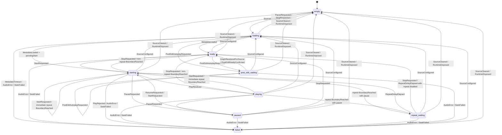

# HTML Audio Formal State Machine Implementation Plan

> **For agentic workers:** REQUIRED SUB-SKILL: Use superpowers:subagent-driven-development (recommended) or superpowers:executing-plans to implement this plan task-by-task. Steps use checkbox (`- [ ]`) syntax for tracking.

**Goal:** Make HTML audio session transition legality explicit, centralized, testable, and observable so future playback bugs cannot be hidden inside broad reducer guards.

**Architecture:** Keep `transitionHtmlAudioSession(...)` as the pure reducer and `html-audio-session-controller.ts` as the only runtime dispatch/store owner. Add a pure transition-policy table that declares admitted state/event pairs and allowed next-state kinds, then make reducer tests and runtime diagnostics check actual transitions against that policy. Tighten post-edit autoplay so active playback cannot be demoted back to `post_edit_waiting`; new post-edit media must enter through source configuration before post-edit readiness.

**Tech Stack:** Svelte 5 editor webview, TypeScript, Vitest, existing `scripts/dev.py` quality gates, Anki/Qt e2e for timing-sensitive playback verification.

---

## Current Problem

The session model already has finite state names and a pure reducer, but transition legality is encoded as imperative `switch` branches and inline guards. That means the reducer prevents arbitrary direct state mutation, but it only rejects transitions that the current guards explicitly reject.

The recent repeat bug happened because `PostEditAutoplayRequested` was admitted while the session was `starting`, and the branch returned `post_edit_waiting`. That was not a rogue mutation outside the reducer. It was an accidentally legal reducer edge.

The target is not a speculative rewrite. The target is a more formal contract:

- every state/event pair is either admitted or ignored
- every admitted state-changing transition has declared allowed next-state kinds
- ignored events stay as `noChange(state)`
- reducer behavior is checked against the declaration
- runtime logs warn if a future reducer edit produces an undeclared state change

## Source Documents

- Canonical observability contract: `docs/architecture/html-audio-observability.md`
- Current reducer: `settings_ui/src/editor-inline/html-audio-session-machine.ts`
- Current state/event/effect types: `settings_ui/src/editor-inline/html-audio-session-types.ts`
- Runtime dispatcher/effect runner: `settings_ui/src/editor-inline/html-audio-session-controller.ts`
- Existing reducer tests: `settings_ui/tests/html-audio-session-machine.test.ts`
- Existing post-edit repeat regression: `settings_ui/tests/html-audio-session-post-edit-repeat.test.ts`
- Architecture guardrails: `settings_ui/tests/frontend-architecture.test.ts`

## Target File Structure

- Create: `settings_ui/src/editor-inline/html-audio-session-transition-policy.ts`
  - Pure transition policy: state kinds, event types, admitted pairs, allowed next-state kinds, and query helpers.

- Create: `settings_ui/tests/html-audio-session-transition-policy.test.ts`
  - Matrix tests comparing the reducer against the declared transition policy.
  - Explicit regression for active post-edit autoplay being ignored rather than demoted.

- Modify: `settings_ui/src/editor-inline/html-audio-session-machine.ts`
  - Import the policy.
  - Reject non-admitted state/event pairs before event-specific logic.
  - Tighten `PostEditAutoplayRequested` active-state behavior.

- Modify: `settings_ui/src/editor-inline/html-audio-session-controller.ts`
  - Warn when an actual state-changing transition is not declared by the policy.

- Modify: `settings_ui/tests/frontend-architecture.test.ts`
  - Enforce that production code invokes `transitionHtmlAudioSession(...)` only through the controller.
  - Enforce that session state storage stays inside the controller.

- Create: `docs/architecture/html-audio-session-state-machine.md`
  - Human-readable state diagram and transition-policy explanation.

- Modify: `docs/architecture/README.md`
  - Link to the formal state-machine document.

---

### Task 1: Add The Pure Transition Policy

**Files:**

- Create: `settings_ui/src/editor-inline/html-audio-session-transition-policy.ts`

- [ ] **Step 1: Create the transition policy module**

Create `settings_ui/src/editor-inline/html-audio-session-transition-policy.ts`:

```typescript
import type { HtmlAudioSessionEvent, HtmlAudioSessionState } from "./html-audio-session-types.js";

export type HtmlAudioSessionStateKind = HtmlAudioSessionState["kind"];
export type HtmlAudioSessionEventType = HtmlAudioSessionEvent["type"];

export interface HtmlAudioTransitionRule {
  from: HtmlAudioSessionStateKind;
  event: HtmlAudioSessionEventType;
  to: readonly HtmlAudioSessionStateKind[];
  note: string;
}

export const HTML_AUDIO_SESSION_STATE_KINDS = [
  "empty",
  "loading",
  "ready",
  "starting",
  "playing",
  "paused",
  "repeat_waiting",
  "post_edit_waiting",
  "failed",
] as const satisfies readonly HtmlAudioSessionStateKind[];

export const HTML_AUDIO_SESSION_EVENT_TYPES = [
  "SourceConfigured",
  "SourceCleared",
  "MetadataLoaded",
  "MetadataTimeout",
  "StartRequested",
  "PostEditAutoplayRequested",
  "GraphRenderedForSource",
  "PostEditReadyConfirmed",
  "PlayResolved",
  "PlayRejected",
  "SeekFailed",
  "PauseRequested",
  "ResumeRequested",
  "StopRequested",
  "BoundaryReached",
  "RepeatDelayElapsed",
  "AudioError",
  "RuntimeDisposed",
] as const satisfies readonly HtmlAudioSessionEventType[];

export const HTML_AUDIO_SESSION_TRANSITION_RULES = [
  rule("empty", "SourceConfigured", ["loading"], "configure a source"),
  rule("empty", "SourceCleared", ["empty"], "idempotent clear"),
  rule("empty", "RuntimeDisposed", ["empty"], "idempotent dispose"),

  rule("loading", "SourceConfigured", ["loading"], "replace source while metadata is loading"),
  rule("loading", "MetadataLoaded", ["ready", "starting"], "metadata may satisfy pending start"),
  rule("loading", "MetadataTimeout", ["failed"], "metadata failed to arrive"),
  rule("loading", "StartRequested", ["loading"], "defer start until metadata"),
  rule("loading", "PostEditAutoplayRequested", ["post_edit_waiting"], "wait for post-edit readiness"),
  rule("loading", "PauseRequested", ["empty"], "cancel loading playback"),
  rule("loading", "StopRequested", ["empty"], "cancel loading playback"),
  rule("loading", "SeekFailed", ["failed"], "seek failure while source exists"),
  rule("loading", "AudioError", ["failed"], "audio element failure"),
  rule("loading", "SourceCleared", ["empty"], "clear source"),
  rule("loading", "RuntimeDisposed", ["empty"], "dispose runtime"),

  rule("ready", "SourceConfigured", ["loading"], "replace source"),
  rule("ready", "StartRequested", ["starting"], "start ready source"),
  rule("ready", "PostEditAutoplayRequested", ["post_edit_waiting"], "prepare post-edit autoplay"),
  rule("ready", "PauseRequested", ["ready"], "pause audio element without lifecycle change"),
  rule("ready", "StopRequested", ["ready"], "stop already stopped session"),
  rule("ready", "BoundaryReached", ["ready", "starting", "repeat_waiting"], "late boundary event with explicit request"),
  rule("ready", "SeekFailed", ["failed"], "seek failure while source exists"),
  rule("ready", "AudioError", ["failed"], "audio element failure"),
  rule("ready", "SourceCleared", ["empty"], "clear source"),
  rule("ready", "RuntimeDisposed", ["empty"], "dispose runtime"),

  rule("starting", "SourceConfigured", ["loading"], "replace source while play is pending"),
  rule("starting", "StartRequested", ["starting"], "restart from a new request"),
  rule("starting", "PlayResolved", ["playing"], "browser play promise resolved"),
  rule("starting", "PlayRejected", ["failed"], "browser play promise rejected"),
  rule("starting", "SeekFailed", ["failed"], "seek failed while starting"),
  rule("starting", "PauseRequested", ["paused"], "pause pending playback"),
  rule("starting", "StopRequested", ["ready"], "stop pending playback"),
  rule("starting", "BoundaryReached", ["ready", "starting", "repeat_waiting"], "boundary while play is pending"),
  rule("starting", "AudioError", ["failed"], "audio element failure"),
  rule("starting", "SourceCleared", ["empty"], "clear source"),
  rule("starting", "RuntimeDisposed", ["empty"], "dispose runtime"),

  rule("playing", "SourceConfigured", ["loading"], "replace source while playing"),
  rule("playing", "StartRequested", ["starting"], "restart from a new request"),
  rule("playing", "SeekFailed", ["failed"], "seek failed while playing"),
  rule("playing", "PauseRequested", ["paused"], "pause playback"),
  rule("playing", "StopRequested", ["ready"], "stop playback"),
  rule("playing", "BoundaryReached", ["ready", "starting", "repeat_waiting"], "complete or repeat at boundary"),
  rule("playing", "AudioError", ["failed"], "audio element failure"),
  rule("playing", "SourceCleared", ["empty"], "clear source"),
  rule("playing", "RuntimeDisposed", ["empty"], "dispose runtime"),

  rule("paused", "SourceConfigured", ["loading"], "replace source while paused"),
  rule("paused", "StartRequested", ["starting"], "start a new request while paused"),
  rule("paused", "SeekFailed", ["failed"], "seek failed while paused"),
  rule("paused", "ResumeRequested", ["starting"], "resume paused playback"),
  rule("paused", "StopRequested", ["ready"], "stop paused playback"),
  rule("paused", "AudioError", ["failed"], "audio element failure"),
  rule("paused", "SourceCleared", ["empty"], "clear source"),
  rule("paused", "RuntimeDisposed", ["empty"], "dispose runtime"),

  rule("repeat_waiting", "SourceConfigured", ["loading"], "replace source during repeat pause"),
  rule("repeat_waiting", "StartRequested", ["starting"], "start a new request during repeat pause"),
  rule("repeat_waiting", "SeekFailed", ["failed"], "seek failed during repeat pause"),
  rule("repeat_waiting", "StopRequested", ["ready"], "stop repeat pause"),
  rule("repeat_waiting", "RepeatDelayElapsed", ["ready", "starting"], "resume or finish repeat pause"),
  rule("repeat_waiting", "AudioError", ["failed"], "audio element failure"),
  rule("repeat_waiting", "SourceCleared", ["empty"], "clear source"),
  rule("repeat_waiting", "RuntimeDisposed", ["empty"], "dispose runtime"),

  rule("post_edit_waiting", "SourceConfigured", ["loading"], "replace source before post-edit readiness"),
  rule("post_edit_waiting", "PostEditAutoplayRequested", ["post_edit_waiting"], "refresh same post-edit wait"),
  rule("post_edit_waiting", "GraphRenderedForSource", ["ready"], "graph provides post-edit readiness"),
  rule("post_edit_waiting", "PostEditReadyConfirmed", ["ready"], "audio readiness confirmed"),
  rule("post_edit_waiting", "SeekFailed", ["failed"], "seek failed while post-edit waits"),
  rule("post_edit_waiting", "AudioError", ["failed"], "audio element failure"),
  rule("post_edit_waiting", "SourceCleared", ["empty"], "clear source"),
  rule("post_edit_waiting", "RuntimeDisposed", ["empty"], "dispose runtime"),

  rule("failed", "SourceConfigured", ["loading"], "recover by configuring source"),
  rule("failed", "SourceCleared", ["empty"], "clear failed source"),
  rule("failed", "RuntimeDisposed", ["empty"], "dispose runtime"),
] as const satisfies readonly HtmlAudioTransitionRule[];

export function htmlAudioEventAdmittedForState(
  stateKind: HtmlAudioSessionStateKind,
  eventType: HtmlAudioSessionEventType,
): boolean {
  return HTML_AUDIO_SESSION_TRANSITION_RULES.some(
    (rule) => rule.from === stateKind && rule.event === eventType,
  );
}

export function htmlAudioTransitionIsDeclared(
  from: HtmlAudioSessionStateKind,
  event: HtmlAudioSessionEventType,
  to: HtmlAudioSessionStateKind,
): boolean {
  const declared = HTML_AUDIO_SESSION_TRANSITION_RULES.filter(
    (rule) => rule.from === from && rule.event === event,
  );
  if (declared.length === 0) return from === to;
  return declared.some((rule) => rule.to.includes(to));
}

function rule(
  from: HtmlAudioSessionStateKind,
  event: HtmlAudioSessionEventType,
  to: readonly HtmlAudioSessionStateKind[],
  note: string,
): HtmlAudioTransitionRule {
  return { from, event, to, note };
}
```

- [ ] **Step 2: Run targeted typecheck and expect unused-module safety**

Run:

```bash
python3 scripts/dev.py test-svelte
```

Expected: PASS or fail only because the new module is not imported yet by tests. If the command fails due a TypeScript type mismatch in the policy table, fix the literal state/event names before continuing.

- [ ] **Step 3: Commit the pure policy**

```bash
git add settings_ui/src/editor-inline/html-audio-session-transition-policy.ts
git commit -m "Declare HTML audio transition policy" -m "The reducer already owns session state changes, but allowed edges were hidden in imperative guards. Add a pure transition policy table first so later reducer changes can be checked against an explicit source of truth."
```

---

### Task 2: Add Matrix Tests Against The Declared Policy

**Files:**

- Create: `settings_ui/tests/html-audio-session-transition-policy.test.ts`
- Modify: `settings_ui/tests/html-audio-session-post-edit-repeat.test.ts`

- [ ] **Step 1: Add policy matrix tests**

Create `settings_ui/tests/html-audio-session-transition-policy.test.ts`:

```typescript
import { describe, expect, it } from "vitest";

import {
  initialHtmlAudioSessionState,
  transitionHtmlAudioSession,
  type HtmlAudioSessionEvent,
  type HtmlAudioSessionState,
} from "../src/editor-inline/html-audio-session-machine.js";
import {
  HTML_AUDIO_SESSION_EVENT_TYPES,
  HTML_AUDIO_SESSION_STATE_KINDS,
  HTML_AUDIO_SESSION_TRANSITION_RULES,
  htmlAudioEventAdmittedForState,
  htmlAudioTransitionIsDeclared,
} from "../src/editor-inline/html-audio-session-transition-policy.js";

const source = { kind: "source" as const, sourceFilename: "clip one.mp3" };
const request = {
  cursorMs: 0,
  endMs: 1000,
  loop: false,
  ord: 0,
  regionMode: "full" as const,
  source: "user" as const,
};
const postEditRequest = { ...request, source: "post_edit" as const };
const postEditIntent = {
  fieldOrd: 0,
  generation: 1,
  requireGraphRedraw: true,
  sourceFilename: "clip one.mp3",
  sourceKind: "generated_edit" as const,
};

describe("html audio session transition policy", () => {
  it.each(HTML_AUDIO_SESSION_TRANSITION_RULES)(
    "declares reducer output for $from + $event",
    (rule) => {
      const state = stateFixture(rule.from);
      const event = eventFixture(rule.event);
      const transition = transitionHtmlAudioSession(state, event);

      expect(rule.to).toContain(transition.state.kind);
      expect(htmlAudioTransitionIsDeclared(state.kind, event.type, transition.state.kind)).toBe(true);
    },
  );

  it("keeps undeclared state/event pairs as no-change transitions", () => {
    const failures = HTML_AUDIO_SESSION_STATE_KINDS.flatMap((stateKind) => {
      const state = stateFixture(stateKind);
      return HTML_AUDIO_SESSION_EVENT_TYPES
        .filter((eventType) => !htmlAudioEventAdmittedForState(stateKind, eventType))
        .map((eventType) => {
          const transition = transitionHtmlAudioSession(state, eventFixture(eventType));
          return transition.state === state && transition.effects.length === 0
            ? null
            : `${stateKind} + ${eventType} -> ${transition.state.kind}`;
        })
        .filter((failure): failure is string => failure !== null);
    });

    expect(failures).toEqual([]);
  });

  it("does not allow active post-edit autoplay to demote playback back to waiting", () => {
    const state: HtmlAudioSessionState = {
      kind: "starting",
      ord: 0,
      source,
      request: postEditRequest,
      durationMs: 1000,
    };

    const transition = transitionHtmlAudioSession(state, {
      intent: postEditIntent,
      request: { ...postEditRequest, endMs: 900 },
      type: "PostEditAutoplayRequested",
    });

    expect(transition).toEqual({ state, effects: [] });
  });
});

function stateFixture(kind: HtmlAudioSessionState["kind"]): HtmlAudioSessionState {
  switch (kind) {
    case "empty":
      return initialHtmlAudioSessionState(0);
    case "loading":
      return { kind, ord: 0, source, cursorMs: 0, pendingStart: null };
    case "ready":
      return { kind, ord: 0, source, durationMs: 1000, cursorMs: 0 };
    case "starting":
      return { kind, ord: 0, source, request, durationMs: 1000 };
    case "playing":
      return { kind, ord: 0, source, request, durationMs: 1000, startedAtMs: 10 };
    case "paused":
      return { kind, ord: 0, source, request, durationMs: 1000, pausedAtMs: 250 };
    case "repeat_waiting":
      return { kind, ord: 0, source, request: { ...request, loop: true }, durationMs: 1000, resumeAtMs: 0 };
    case "post_edit_waiting":
      return {
        kind,
        ord: 0,
        source,
        postEdit: postEditIntent,
        request: postEditRequest,
        cursorMs: 0,
        graphDurationMs: null,
        readyDispatched: false,
      };
    case "failed":
      return { kind, ord: 0, source, cursorMs: 0, reason: "audio_error" };
  }
}

function eventFixture(type: HtmlAudioSessionEvent["type"]): HtmlAudioSessionEvent {
  switch (type) {
    case "SourceConfigured":
      return { cursorMs: 0, source, type };
    case "SourceCleared":
      return { type };
    case "MetadataLoaded":
      return { durationMs: 1000, type };
    case "MetadataTimeout":
      return { type };
    case "StartRequested":
      return { request, type };
    case "PostEditAutoplayRequested":
      return { intent: postEditIntent, request: postEditRequest, type };
    case "GraphRenderedForSource":
    case "PostEditReadyConfirmed":
      return { durationMs: 1000, sourceFilename: source.sourceFilename, type };
    case "PlayResolved":
      return { nowMs: 100, sourceFilename: source.sourceFilename, type };
    case "PlayRejected":
      return { reason: "audio_play_rejected", sourceFilename: source.sourceFilename, type };
    case "SeekFailed":
      return { cursorMs: 0, reason: "audio_seek_failed", type };
    case "PauseRequested":
      return { cursorMs: 0, type };
    case "ResumeRequested":
      return { type };
    case "StopRequested":
      return { cursorMs: 0, type };
    case "BoundaryReached":
      return { cursorMs: 1000, request, resetCursorMs: 0, type };
    case "RepeatDelayElapsed":
      return { type };
    case "AudioError":
      return { cursorMs: 0, reason: "audio_error", type };
    case "RuntimeDisposed":
      return { type };
  }
}
```

- [ ] **Step 2: Run the new test and verify it fails before reducer changes**

Run:

```bash
npm --prefix settings_ui test -- html-audio-session-transition-policy.test.ts
```

Expected: FAIL with at least one undeclared state/event pair involving `PostEditAutoplayRequested` from an active state.

- [ ] **Step 3: Keep the existing post-edit repeat regression**

Open `settings_ui/tests/html-audio-session-post-edit-repeat.test.ts` and keep the existing test:

```typescript
it("keeps starting when duplicate ready checks repeat before play resolves", () => {
  // Existing regression stays. It proves same-request active post-edit autoplay is ignored.
});
```

Do not merge this test into the matrix test. The matrix test proves transition legality; this regression documents the real timing bug.

- [ ] **Step 4: Commit the failing matrix tests**

```bash
git add settings_ui/tests/html-audio-session-transition-policy.test.ts settings_ui/tests/html-audio-session-post-edit-repeat.test.ts
git commit -m "Test HTML audio transition policy" -m "The post-edit repeat bug showed that broad reducer guards can admit illegal edges. Add matrix tests against the declared policy and keep the timing-specific post-edit regression separate so transition legality and bug history are both visible."
```

---

### Task 3: Tighten Active Post-Edit Autoplay Semantics

**Files:**

- Modify: `settings_ui/src/editor-inline/html-audio-session-machine.ts`
- Test: `settings_ui/tests/html-audio-session-transition-policy.test.ts`
- Test: `settings_ui/tests/html-audio-session-post-edit-repeat.test.ts`

- [ ] **Step 1: Reject active post-edit autoplay before building `post_edit_waiting`**

In `settings_ui/src/editor-inline/html-audio-session-machine.ts`, replace the current `PostEditAutoplayRequested` state-kind admission block with this shape:

```typescript
    case "PostEditAutoplayRequested":
      if (
        state.kind === "starting" ||
        state.kind === "playing" ||
        state.kind === "paused" ||
        state.kind === "repeat_waiting"
      ) {
        return noChange(state);
      }
      if (
        state.kind !== "loading" &&
        state.kind !== "ready" &&
        state.kind !== "post_edit_waiting"
      ) {
        return noChange(state);
      }
      if (event.intent.sourceFilename !== state.source.sourceFilename) {
        return noChange(state);
      }
      return {
        state: {
          kind: "post_edit_waiting",
          ord: state.ord,
          source: state.source,
          postEdit: event.intent,
          request: event.request,
          cursorMs: currentCursorMs(state),
          graphDurationMs: null,
          readyDispatched: false,
        },
        effects: [],
      };
```

Remove `isDuplicateActivePostEditAutoplay(...)` if no other code uses it after this change.

- [ ] **Step 2: Run targeted reducer tests**

Run:

```bash
npm --prefix settings_ui test -- html-audio-session-transition-policy.test.ts html-audio-session-post-edit-repeat.test.ts html-audio-session-machine.test.ts
```

Expected: PASS.

- [ ] **Step 3: Run frontend validation**

Run:

```bash
python3 scripts/dev.py test-svelte
```

Expected: PASS.

- [ ] **Step 4: Commit the semantic tightening**

```bash
git add settings_ui/src/editor-inline/html-audio-session-machine.ts settings_ui/tests/html-audio-session-transition-policy.test.ts settings_ui/tests/html-audio-session-post-edit-repeat.test.ts
git commit -m "Forbid active post-edit autoplay demotion" -m "Post-edit readiness should not be able to move active playback back to a waiting state. Require generated media to enter through source configuration and make active post-edit autoplay requests no-change transitions so pending browser play promises remain authoritative."
```

---

### Task 4: Make The Reducer Consult The Policy First

**Files:**

- Modify: `settings_ui/src/editor-inline/html-audio-session-machine.ts`
- Test: `settings_ui/tests/html-audio-session-transition-policy.test.ts`

- [ ] **Step 1: Import the event-admission helper**

Add this import to `settings_ui/src/editor-inline/html-audio-session-machine.ts`:

```typescript
import { htmlAudioEventAdmittedForState } from "./html-audio-session-transition-policy.js";
```

- [ ] **Step 2: Add an early admission gate**

At the top of `transitionHtmlAudioSession(...)`, before the `switch`, add:

```typescript
  if (!htmlAudioEventAdmittedForState(state.kind, event.type)) {
    return noChange(state);
  }
```

The function should begin like this:

```typescript
export function transitionHtmlAudioSession(
  state: HtmlAudioSessionState,
  event: HtmlAudioSessionEvent,
): HtmlAudioSessionTransition {
  if (!htmlAudioEventAdmittedForState(state.kind, event.type)) {
    return noChange(state);
  }

  switch (event.type) {
```

- [ ] **Step 3: Keep data guards inside event branches**

Do not remove source filename, pending-start, repeat, or request guards. The policy table admits a state/event pair; event branches still decide data-dependent outcomes.

Examples that must remain data-guarded:

```typescript
if (state.kind !== "starting" || state.source.sourceFilename !== event.sourceFilename) {
  return noChange(state);
}
```

```typescript
if (event.intent.sourceFilename !== state.source.sourceFilename) {
  return noChange(state);
}
```

- [ ] **Step 4: Run targeted tests**

Run:

```bash
npm --prefix settings_ui test -- html-audio-session-transition-policy.test.ts html-audio-session-machine.test.ts html-audio-session-post-edit-repeat.test.ts
```

Expected: PASS.

- [ ] **Step 5: Commit the policy gate**

```bash
git add settings_ui/src/editor-inline/html-audio-session-machine.ts
git commit -m "Gate HTML audio reducer by transition policy" -m "Allowed state/event pairs should be visible in one table instead of scattered only through reducer branches. Add a pure policy gate while keeping data-dependent guards in the reducer for source, request, and repeat details."
```

---

### Task 5: Add Runtime Warnings For Undeclared State Changes

**Files:**

- Modify: `settings_ui/src/editor-inline/html-audio-session-controller.ts`
- Test: `settings_ui/tests/editor-inline.html-audio-session.integration.test.ts`

- [ ] **Step 1: Import transition declaration checker**

In `settings_ui/src/editor-inline/html-audio-session-controller.ts`, add:

```typescript
import { htmlAudioTransitionIsDeclared } from "./html-audio-session-transition-policy.js";
```

- [ ] **Step 2: Warn after reducer transition and before effect execution**

Inside `dispatchHtmlAudioSessionEvent(...)`, after the existing transition log, add:

```typescript
  if (!htmlAudioTransitionIsDeclared(current.kind, event.type, transition.state.kind)) {
    logger.warn("html_audio_session.undeclared_transition", {
      event: htmlAudioSessionEventSummary(event),
      from: htmlAudioSessionStateSummary(current),
      ord,
      to: htmlAudioSessionStateSummary(transition.state),
    });
  }
```

The final function shape should be:

```typescript
export function dispatchHtmlAudioSessionEvent(ord: number, event: HtmlAudioSessionEvent): void {
  const current = readHtmlAudioSessionState(ord);
  const transition = transitionHtmlAudioSession(current, event);
  sessionStates.set(ord, transition.state);
  logger.debug("html_audio_session.transition", {
    effects: transition.effects.map((effect) => effect.type),
    event: htmlAudioSessionEventSummary(event),
    from: htmlAudioSessionStateSummary(current),
    ord,
    to: htmlAudioSessionStateSummary(transition.state),
  });
  if (!htmlAudioTransitionIsDeclared(current.kind, event.type, transition.state.kind)) {
    logger.warn("html_audio_session.undeclared_transition", {
      event: htmlAudioSessionEventSummary(event),
      from: htmlAudioSessionStateSummary(current),
      ord,
      to: htmlAudioSessionStateSummary(transition.state),
    });
  }
  const expectedState = transition.state;
  for (const effect of transition.effects) {
    executeHtmlAudioSessionEffect(ord, effect);
    if (readHtmlAudioSessionState(ord) !== expectedState) {
      break;
    }
  }
}
```

- [ ] **Step 3: Add an integration test that normal transitions do not warn**

In `settings_ui/tests/editor-inline.html-audio-session.integration.test.ts`, add a test using the existing logger/mock pattern in that file. If the file does not currently mock logger calls, add a focused test in `settings_ui/tests/html-audio-session-transition-policy.test.ts` for `htmlAudioTransitionIsDeclared(...)` instead of testing logger plumbing.

Use this assertion shape when logger spying exists:

```typescript
expect(logger.warn).not.toHaveBeenCalledWith(
  "html_audio_session.undeclared_transition",
  expect.anything(),
);
```

- [ ] **Step 4: Run targeted integration tests**

Run:

```bash
npm --prefix settings_ui test -- editor-inline.html-audio-session.integration.test.ts html-audio-session-transition-policy.test.ts
```

Expected: PASS.

- [ ] **Step 5: Commit runtime warning**

```bash
git add settings_ui/src/editor-inline/html-audio-session-controller.ts settings_ui/tests/editor-inline.html-audio-session.integration.test.ts settings_ui/tests/html-audio-session-transition-policy.test.ts
git commit -m "Warn on undeclared HTML audio transitions" -m "The reducer policy should catch illegal edges in tests, but production logs should also expose impossible state changes if a future branch edits the reducer incorrectly. Add a warning tied to the canonical transition policy without changing runtime behavior."
```

---

### Task 6: Add Architecture Guardrails For Transition Ownership

**Files:**

- Modify: `settings_ui/tests/frontend-architecture.test.ts`

- [ ] **Step 1: Add a failing architecture test**

In `settings_ui/tests/frontend-architecture.test.ts`, after `keeps HTML audio session model files pure`, add:

```typescript
  it("keeps HTML audio transition execution centralized", () => {
    const offenders = productionFiles().flatMap((path) => {
      const relPath = toRelPath(path);
      const source = withoutComments(readFileSync(path, "utf-8"));
      const transitionImport = /transitionHtmlAudioSession/.test(source);
      const sessionStateWrite = /sessionStates\.set/.test(source);
      const messages: string[] = [];

      if (
        transitionImport &&
        relPath !== "src/editor-inline/html-audio-session-controller.ts" &&
        relPath !== "src/editor-inline/html-audio-session-machine.ts"
      ) {
        messages.push(`${relPath}: transitionHtmlAudioSession`);
      }
      if (sessionStateWrite && relPath !== "src/editor-inline/html-audio-session-controller.ts") {
        messages.push(`${relPath}: sessionStates.set`);
      }

      return messages;
    });

    expect(offenders).toEqual([]);
  });
```

- [ ] **Step 2: Run the architecture test**

Run:

```bash
npm --prefix settings_ui test -- frontend-architecture.test.ts
```

Expected: PASS. If it fails, move any production transition call through `dispatchHtmlAudioSessionEvent(...)` instead of widening the allowlist.

- [ ] **Step 3: Commit guardrails**

```bash
git add settings_ui/tests/frontend-architecture.test.ts
git commit -m "Guard HTML audio transition ownership" -m "A formal reducer only helps if production code enters it through one dispatcher and one state store. Add frontend architecture checks so future modules cannot bypass the controller or create a second session-state authority."
```

---

### Task 7: Document The Formal State Machine

**Files:**

- Create: `docs/architecture/html-audio-session-state-machine.md`
- Modify: `docs/architecture/README.md`

- [ ] **Step 1: Create the architecture document**

Create `docs/architecture/html-audio-session-state-machine.md`:

```markdown
# HTML Audio Session State Machine

This is the canonical design document for HTML audio session transition
legality. Observability requirements live in
[`html-audio-observability.md`](html-audio-observability.md).

## Source Of Truth

The pure reducer is `settings_ui/src/editor-inline/html-audio-session-machine.ts`.
The declared transition policy is
`settings_ui/src/editor-inline/html-audio-session-transition-policy.ts`.

Production code should not call the reducer directly. It should dispatch
`HtmlAudioSessionEvent` through `dispatchHtmlAudioSessionEvent(...)` in
`settings_ui/src/editor-inline/html-audio-session-controller.ts`.

## State Kinds

- `empty`: no configured browser audio source.
- `loading`: source configured, metadata not yet resolved.
- `ready`: source and duration are known, playback is stopped.
- `starting`: a browser `audio.play()` call is pending.
- `playing`: browser playback is active and progress frames may run.
- `paused`: playback is paused with a resumable request.
- `repeat_waiting`: playback is paused during a configured repeat delay.
- `post_edit_waiting`: post-edit autoplay is waiting for graph or audio readiness.
- `failed`: source exists or recently existed, but browser playback failed.

## Diagram



## Important Invariant

`PostEditAutoplayRequested` is not a playback interrupt. It may move `loading` or
`ready` into `post_edit_waiting`, and it may refresh `post_edit_waiting`, but it
must not move `starting`, `playing`, `paused`, or `repeat_waiting` back to
`post_edit_waiting`.

If a transform creates new media while playback is active, the new media must be
represented by `SourceConfigured` first. Post-edit readiness then applies to the
new configured source.

## Test Contract

- `settings_ui/tests/html-audio-session-transition-policy.test.ts` checks the
  reducer against the declared policy.
- `settings_ui/tests/html-audio-session-machine.test.ts` checks important
  concrete reducer behavior and effects.
- `settings_ui/tests/html-audio-session-post-edit-repeat.test.ts` preserves the
  timing regression where duplicate post-edit readiness arrived before
  `PlayResolved`.
- `settings_ui/tests/frontend-architecture.test.ts` prevents production code
  from bypassing the central dispatcher.
```

- [ ] **Step 2: Link from architecture README**

Add a row to `docs/architecture/README.md`:

```markdown
| `html-audio-session-state-machine.md` | Markdown | Canonical HTML audio session state machine and transition policy |
```

- [ ] **Step 3: Verify Markdown links and whitespace**

Run:

```bash
git diff --check
test -f docs/architecture/html-audio-session-state-machine.md
test -f docs/architecture/html-audio-observability.md
```

Expected: all commands exit `0`.

- [ ] **Step 4: Commit documentation**

```bash
git add docs/architecture/html-audio-session-state-machine.md docs/architecture/README.md
git commit -m "Document HTML audio state machine policy" -m "The formal transition table should have one human-readable companion document. Add a canonical state-machine reference and point architecture readers to it while keeping observability details in the existing observability contract."
```

---

### Task 8: Full Verification

**Files:**

- No code changes expected.

- [ ] **Step 1: Run frontend validation**

Run:

```bash
python3 scripts/dev.py test-svelte
```

Expected: PASS.

- [ ] **Step 2: Run repository check**

Run:

```bash
python3 scripts/dev.py check
```

Expected: PASS. Existing warning-only line-count output may appear, but the command must exit `0`.

- [ ] **Step 3: Run targeted real-media e2e**

Run:

```bash
python3 scripts/dev.py test-e2e e2e/test_editor_real_media_transform_stress_workflow.py
```

Expected: PASS. This confirms the policy tightening did not regress transform/repeat timing.

- [ ] **Step 4: Run full e2e**

Run:

```bash
python3 scripts/dev.py test-e2e-parallel
```

Expected: PASS.

- [ ] **Step 5: Commit verification note if any test-only updates were needed**

If verification required changes, commit them with a message that states which gate failed and why the fix belongs to this formalization work:

```bash
git add <changed-files>
git commit -m "Verify formal HTML audio transitions" -m "Formal transition policy changes must preserve real browser playback timing. Update only the tests or code needed by the failed verification gate and record the full check/e2e status in this commit body."
```

If no files changed during verification, do not create an empty commit.

---

## Self-Review

- Spec coverage: the plan centralizes admitted state/event pairs, tests reducer output against the policy, blocks active post-edit demotion, adds runtime warnings, adds architecture guardrails, and documents the state machine.
- Placeholder scan: the plan does not require unnamed future work; each code-changing task includes concrete paths, code snippets, commands, and expected results.
- Type consistency: state kinds and event names match `HtmlAudioSessionState["kind"]` and `HtmlAudioSessionEvent["type"]` in `settings_ui/src/editor-inline/html-audio-session-types.ts`.

## Execution Notes

Commit after each task. Do not squash the failing-test commits into implementation commits until the branch is ready for final cleanup; the red/green history is useful for this work.

The only expected behavioral tightening is that `PostEditAutoplayRequested` from active playback states becomes `noChange`. If any e2e fails because a real transform depends on active `PostEditAutoplayRequested -> post_edit_waiting`, fix the caller to dispatch `SourceConfigured` for the new generated source before post-edit readiness. Do not re-allow active demotion.
